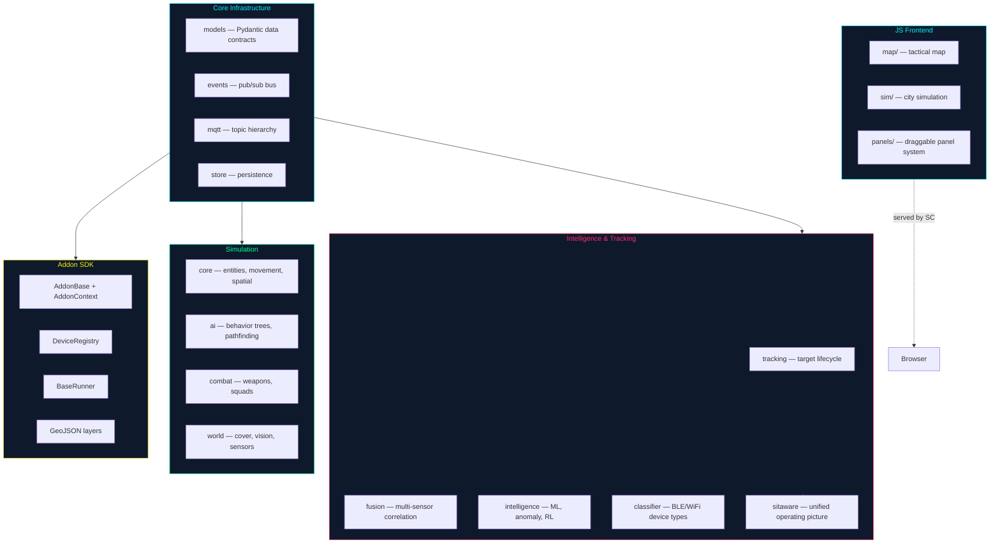

# tritium-lib

Shared Python + JavaScript library for the [Tritium](https://github.com/Valpatel/tritium) system. Everything that more than one submodule needs lives here: data models, target tracking, sensor fusion, simulation engine, addon SDK, and frontend components.

This is the foundation. The Command Center, edge firmware, and addons all import from `tritium_lib`.

Copyright 2026 Matthew Valancy / Valpatel Software LLC / AGPL-3.0

## How it fits together



---

## Install

```bash
pip install -e .                    # Core (models, events, MQTT, auth, tracking)
pip install -e ".[full]"            # All optional deps
```

## What's inside

### Core infrastructure

The data contracts that define every entity in the system. Devices, sightings, targets, alerts, dossiers, camera detections, mesh nodes — all Pydantic v2 models that enforce type safety across the stack.

Plus: event bus (pub/sub), MQTT topic builder, JWT auth, persistent stores, and configuration.

### Target tracking & intelligence

The core value of Tritium. The `tracking` package manages the lifecycle of every detected entity — from first sighting through correlation, fusion, and long-term dossier building. The `fusion` engine correlates detections across different sensor types (BLE + camera + WiFi → one target). The `intelligence` package adds anomaly detection, acoustic classification, and reinforcement learning metrics.

The `sitaware` package is the capstone — it pulls everything together into a unified operating picture with threat assessment, zone monitoring, and commander briefings.

### Simulation engine

A full tactical simulation for testing and training without hardware. IDM car-following, MOBIL lane changes, Bezier intersection turns, Epstein protest/riot emergence, pedestrian ORCA, NPC daily routines, weather, combat, and squad AI. This exercises the same tracking and fusion pipelines that real sensors use.

### Addon SDK

Base classes for building new sensor integrations: `AddonBase`, `AddonContext`, `DeviceRegistry`, `BaseRunner`, GeoJSON layer helpers. An addon built against this SDK can run inside the Command Center, as a standalone app, or headless on a Raspberry Pi.

### JavaScript frontend

Vanilla ES modules (no build step) shared across the system: tactical map with MapLibre GL, city simulation (IDM, MOBIL, pedestrians, protest), draggable panel system, event bus, reactive store, WebSocket client, and cyberpunk CSS themes.

## Architecture

```
tritium-lib/
├── src/tritium_lib/           Python packages
│   ├── models/                Pydantic v2 data contracts — THE source of truth
│   ├── tracking/              Target tracker, correlator, geofence, Kalman, dossiers
│   ├── fusion/                Multi-sensor target fusion
│   ├── intelligence/          Anomaly, acoustic, RL metrics, pattern learning
│   ├── sitaware/              Capstone — unified operating picture
│   ├── sim_engine/            Tactical simulation (AI, combat, physics, world)
│   ├── sdk/                   Addon SDK (AddonBase, DeviceRegistry, BaseRunner)
│   ├── classifier/            BLE/WiFi device type classification
│   ├── graph/                 KuzuDB entity-relationship storage
│   ├── ontology/              Semantic type system for entities and relationships
│   ├── cot/                   Cursor on Target codec (TAK/ATAK interop)
│   ├── mqtt/                  MQTT topic hierarchy builder
│   ├── events/                Thread-safe + async pub/sub
│   ├── auth/                  JWT + API key management
│   ├── store/                 Persistent data stores
│   ├── geo/                   Coordinate transforms, haversine, camera projection
│   ├── signals/               RF signal processing
│   ├── protocols/             Radio protocol parsers (ADS-B, AIS, BLE, WiFi)
│   ├── inference/             Local LLM fleet client (llama-server)
│   ├── ...                    Plus: alerting, evidence, fleet, indoor, mission,
│   │                          monitoring, notifications, pipeline, privacy,
│   │                          recording, reporting, rules, scenarios, tactical,
│   │                          synthetic, and more
│   └── data/                  JSON lookup databases (BLE, WiFi, OUI fingerprints)
├── web/                       Shared JS/CSS frontend library
│   ├── map/                   Tactical map (MapLibre GL, effects, asset types, 3D units)
│   ├── sim/                   City simulation (IDM, MOBIL, pedestrians, protest, weather)
│   ├── panels/                Draggable/resizable panel system
│   ├── css/                   Cyberpunk themes
│   └── *.js                   EventBus, ReactiveStore, WebSocket, utils
└── tests/                     Test suite
```

## Standalone demos

Self-contained demos, each with its own HTTP server and cyberpunk UI:

| Demo | Command | What it shows |
|------|---------|---------------|
| Tracking | `python -m tritium_lib.tracking.demos.tracking_demo` | Target tracking — BLE/WiFi/camera fusion, correlation, geofencing |
| Intelligence | `python -m tritium_lib.intelligence.demos.pipeline_demo` | Anomaly detection, acoustic classification, threat assessment |
| Sitaware | `python -m tritium_lib.sitaware.demos.sitaware_demo` | Full operating picture — all subsystems feeding one view |
| Game Server | `python -m tritium_lib.sim_engine.demos.game_server` | 3D game with combat, city, economy, weather via WebSocket |
| City Sim | `python -m tritium_lib.sim_engine.demos.demo_city` | Traffic, pedestrians, daily routines |
| Graph | `python -m tritium_lib.graph.demos.graph_demo` | Entity-relationship storage and visualization |
| CoT/TAK | `python -m tritium_lib.cot.demos.cot_demo` | MIL-STD Cursor on Target — ATAK interop |
| Auth | `python -m tritium_lib.auth.demos.auth_demo` | JWT login, API keys, RBAC |

Plus demos for MQTT, firmware OTA, SDR, notifications, RF propagation, steering AI, and more.

## Quick start examples

### MQTT topics

```python
from tritium_lib.mqtt import TritiumTopics

topics = TritiumTopics(site_id="home")
topics.edge_heartbeat("esp32-001")
# -> "tritium/home/edge/esp32-001/heartbeat"
```

### Target tracking

```python
from tritium_lib.tracking import TargetTracker

tracker = TargetTracker()
tracker.update_from_ble({"mac": "AA:BB:CC:DD:EE:FF", "rssi": -65,
                          "name": "Phone", "observer_id": "node-1"})
targets = tracker.get_all()
# -> [TrackedTarget(target_id='ble_aabbccddeeff', ...)]
```

### Write an addon

```python
from tritium_lib.sdk import AddonBase, AddonContext

class MyAddon(AddonBase):
    name = "my-sensor"
    version = "0.1.0"

    async def start(self, ctx: AddonContext):
        ctx.mqtt.subscribe("tritium/+/my-sensor/#", self.on_message)

    async def on_message(self, topic, payload):
        ctx.events.publish("my-sensor.reading", payload)

    async def stop(self):
        pass
```

### Headless runner

```python
from tritium_lib.sdk import BaseRunner

class MyRunner(BaseRunner):
    """Standalone mode for Raspberry Pi deployment."""
    async def run(self):
        while True:
            reading = await self.collect()
            await self.publish(reading)
```

## How to extend it

**New data type?** Add a Pydantic model to `models/`. All consumers see it immediately.

**New sensor integration?** Build an addon using the SDK. See [tritium-addons](https://github.com/Valpatel/tritium-addons) for examples.

**New intelligence?** Add a module to `intelligence/` that subscribes to the event bus and publishes enrichments.

**New map feature?** Add a JS module to `web/map/` — it's vanilla ES modules, no build step.

**New simulation behavior?** Add to `sim_engine/` — the same models and events that real sensors use.

## Tests

```bash
pytest tests/                          # Run all tests
pytest tests/ -x --tb=short           # Stop on first failure
pytest tests/ -k "tracking"           # Pattern match
```

## Used by

- **[tritium-sc](https://github.com/Valpatel/tritium-sc)** — Command Center
- **[tritium-edge](https://github.com/Valpatel/tritium-edge)** — ESP32-S3 firmware + fleet server
- **[tritium-addons](https://github.com/Valpatel/tritium-addons)** — Sensor addons

## License
AGPL-3.0 — Copyright 2026 Matthew Valancy / Valpatel Software LLC
