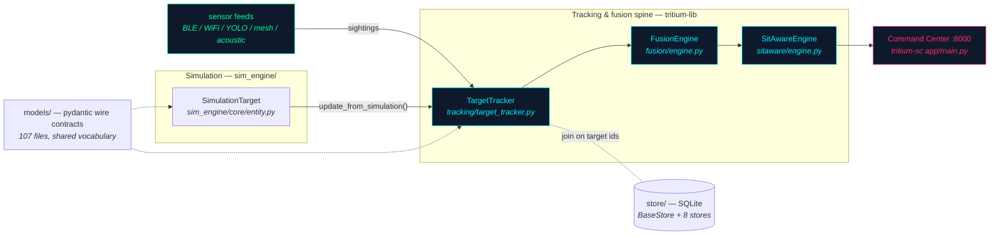

# tritium_lib — the whole library on one page

**Where you are:** `tritium-lib/src/tritium_lib/` — the 54 shared Python
packages (52 with code, 2 asset dirs) that every Tritium service builds on.

**Parent:** [`../../CLAUDE.md`](../../CLAUDE.md) (tritium-lib) · for the
tritium root see `CLAUDE.md` in the parent repo.

## What this library is

tritium-sc is the app; **this library is the reusable components** — the
data models, tracking/fusion engines, simulation engine, geo math, and
operations tooling that the Command Center, the edge ROS2 nodes, and
out-of-tree addons all import. The core install is deliberately tiny:
`pydantic`, `pydantic-settings`, `pyjwt` (`pyproject.toml:10-14`).
Everything heavier — paho-mqtt, kuzu, scikit-learn, rasterio, opencv —
lives behind optional extras (`mqtt`, `graph`, `routing`, `ml`,
`testing`, `geospatial`). No web framework anywhere in the package tree;
`fastapi` appears only inside `*/demos/` files and the `testing` extra.

The operational heart is one pipeline, and it is wired for real: sensor
and simulation entities flow into `TargetTracker`, `FusionEngine`
correlates identities across sensors, and `SitAwareEngine` composes the
unified operating picture the Command Center serves to operators.
tritium-sc constructs exactly this chain at startup
(`app/main.py:2115` FusionEngine, `app/main.py:2349` SitAwareEngine —
the capstone is a must-start component there, failure is surfaced in
`/api/health`).



Simulation and production feed the *same* tracker through the same
method — that is the north star made concrete: the game exercises the
production pipeline.

## How to read the tables

The **Wired where** column is measured, not aspirational: counts are
`grep -r "from tritium_lib.<pkg>" tritium-sc/src tritium-sc/plugins`
import sites as of 2026-07-11. "lib-internal" means other tritium_lib
packages import it but no service does; "tests only" means the only
callers today are this repo's test suite. Both are honest states, not
insults — but don't confuse them with production wiring.

## The spine + core plumbing (Core family)

`models/` is the shared vocabulary — 107 pydantic-v2 files defining the
SC↔edge wire contract (`Device`, `Command`, `BleDevice`, and recent
arrivals `hits.py` — `RegisterHitCommand`/`HitReport`/`HealthTracker`,
where the robot owns its own health authority — and `quadruped.py` /
`fire_control.py` for the robot-dog track). Note `TrackedTarget` itself
lives in `tracking/`, not here.

| Package | What it does | Wired where |
|---------|-------------|-------------|
| [`models/`](models/README.md) | Pydantic v2 wire contracts, the semantic layer (107 files) | everywhere: sc (59), edge ROS2+server (17), addons |
| [`store/`](store/README.md) | `BaseStore` + 8 SQLite stores + in-memory `EmbodimentRegistry` — where facts survive restarts | sc (25), edge server (3) |
| [`events/`](events/README.md) | `EventBus` / `AsyncEventBus` / `QueueEventBus`, MQTT-style wildcards | sc `engine/comms/event_bus.py` + lib-internal |
| [`mqtt/`](mqtt/README.md) | The topic grammar: flat `tritium/devices/{id}/{type}` + site-scoped `tritium/{site}/{domain}/{id}/{data}` builders/parsers | tests only — sc/edge speak these topics but build strings themselves |
| [`auth/`](auth/README.md) | HS256 JWTs (PyJWT), hashed API keys, role ACLs | tests only |
| [`config/`](config/README.md) | `TritiumBaseSettings` — kwargs > `TRITIUM_*` env > `.env` > `~/.tritium/config.toml` | tests only |
| [`sdk/`](sdk/README.md) | Apache-2.0 addon SDK: `AddonBase`, typed addon interfaces, manifests, transports. Deliberately imports nothing else in the lib | addons (16), sc (3) |
| `protocols/` | Pure-Python radio parsers: BLE adverts, WiFi probes, AIS, ADS-B Mode S, Meshtastic, NMEA | tests only |
| [`cot/`](cot/README.md) | Cursor-on-Target XML encode/parse (stdlib ElementTree) | tests only — sc mirrors it in `engine/comms/cot.py` |
| [`web/`](web/README.md) | Server-side HTML/CSS string generation (cyberpunk theme, dashboard components), framework-free | no external consumer found |
| [`testing/`](testing/README.md) | OpenCV screenshot analysis, flicker/blank detection, ESP32 `DeviceAPI` automation | edge `tools/ui_test.py`, lib tests |
| [`data/`](data/README.md) | 11 static JSON fingerprint tables (OUI, BLE company IDs, Apple Continuity) | `classifier/` (lib-internal) |
| [`conf/`](conf/README.md) | One example config: `llm-fleet.conf.example` (no code) | reference only |
| [`nodes/`](nodes/README.md) | Abstract `SensorNode` hardware interface (camera/PTZ/mic/speaker) | no consumer (SC has a near-identical twin it subclasses) |
| `js/` | **Orphaned** second copy of the browser city-sim JS — see honesty notes below | none |

## Tracking, fusion, and intelligence (Intelligence family)

The spine classes live here. `TargetTracker`
(`tracking/target_tracker.py:286`) maintains the unified `TrackedTarget`
registry — unique IDs (`ble_{mac}`, `det_{class}_{n}`, …), correlation,
Kalman prediction, geofencing, dossiers. Recently landed:
`health`/`max_health` on `TrackedTarget` (`target_tracker.py:207-208`,
`None` = "does not report health"), fed by robot telemetry per the
`models/hits.py` authority contract.

| Package | What it does | Wired where |
|---------|-------------|-------------|
| [`tracking/`](tracking/README.md) | `TargetTracker`, `TrackedTarget`, correlator, geofences, heatmaps, dossiers (31 files) | sc (58) |
| [`fusion/`](fusion/README.md) | `FusionEngine` — composes tracking+intelligence into correlated `FusedTarget` identities across BLE/WiFi/camera/acoustic/mesh/ADS-B | sc `app/main.py:2115` at startup |
| [`sitaware/`](sitaware/README.md) | Capstone `SitAwareEngine`: one thread-safe `OperatingPicture` over fusion, alerting, anomaly, analytics, health, incident, mission | sc `app/main.py:2349`, must-start |
| [`intelligence/`](intelligence/README.md) | Correlation scorers (static + learned), anomaly detectors, behavior profiling, trajectory prediction, SQLite `ModelRegistry` (45 files) | sc (28) |
| [`classifier/`](classifier/README.md) | BLE/WiFi device-type classification from fingerprints; MAC-randomization detection | sc (2) + `tracking/` |
| [`inference/`](inference/README.md) | `LLMFleet`/`OllamaFleet` host pools, llama-server/ollama chat clients, `ModelRouter` | sc (12), e.g. `app/main.py:245` |
| [`ontology/`](ontology/README.md) | In-memory `OntologyRegistry` + `TRITIUM_ONTOLOGY` schema — pure pydantic, **zero graph-db dependency** | sc `/api/v1/ontology` router |
| [`perception/`](perception/README.md) | Camera frame pipeline: quality/motion gates, YOLO (ultralytics or ONNX) with classical fallback, ground-plane projection | **LIVE** — sc `frame_detection.py` + Amy + edge ROS2 |
| [`analytics/`](analytics/README.md) | Sliding-window statistics over tracking events (rates, trends, top-N) | `sitaware/` (lib-internal → transitively live) |
| [`pipeline/`](pipeline/README.md) | Config-driven stage chaining (Ingest→Tracking→Fusion→Alerting→Reporting) wrapping the real engines | no consumer (shelfware; tests only) |

## Simulation (Simulation family)

`sim_engine/` is the largest package in the library (188 files,
~87k LOC): a pure-Python tactical simulation with **no rendering
dependency**. `World` (`sim_engine/world/_world.py:127`) ticks
everything; `SimulationTarget` (`core/entity.py:524`) is the entity
type that flows into the same `TargetTracker` production uses.
Subpackages: `ai/` (steering, pathfinding, behavior trees, squads),
`behavior/`, `combat/`, `core/`, `effects/`, `game/` (game modes,
riot/bloc dynamics), `physics/`, `unit_types/`, `world/` (terrain,
procedural city, vision/sensor models).

| Package | What it does | Wired where |
|---------|-------------|-------------|
| [`sim_engine/`](sim_engine/README.md) | The tactical simulation engine (`World`, `Scenario`, units, combat, weather, EW) | sc (86) — heaviest lib consumer |
| [`synthetic/`](synthetic/README.md) | Synthetic data generators: stateless record generators (SIM Lab-wired) + EventBus stream publishers (test/demo only) | sc `sim_synthetic` (4 routes) |
| [`scenarios/`](scenarios/README.md) | 5 predefined surveillance scenarios (airport, border, campus…) + `ScenarioPlayer` | sc `sim_scenarios` (24 routes) |
| [`recording/`](recording/README.md) | JSONL event `Recorder`/`Player`/`Session` + retention sweep; feeds sc's AAR battle recordings | sc AAR + `sim_recordings` (2 routes) |

## Geo & signals (Geo/Signals family)

| Package | What it does | Wired where |
|---------|-------------|-------------|
| [`geo/`](geo/README.md) | Lat/lng ↔ local ENU meters, WGS84/UTM/MGRS, camera-pixel-to-ground; `gis/` fetchers+cache; **`scene3d.py`** — DEM heightfield + building extrusion + road ribbons + water fills for the map→Isaac 3D twin (no USD dep) | sc (57) |
| [`planning/`](planning/README.md) | Open-source baseline route planner: GIS-derived `Costmap` + deterministic A* + hierarchical planning (the advanced flow-field planner is intentionally elsewhere, private) | sc (6) |
| [`signals/`](signals/README.md) | RSSI Kalman + path-loss distance, RF fingerprinting, spectrum classification, CSI occupancy, GCC-PHAT TDOA | sc `sim_signals` router |
| [`sdr/`](sdr/README.md) | `SDRDevice` ABC + fully-working `SimulatedSDR`, `SpectrumAnalyzer`, Mode-S IQ synthesis (no hardware backends here) | sc (2) |
| `indoor/` | WiFi/BLE RSSI fingerprint k-NN positioning, zone clustering, floor plans | sc `indoor_positioning` plugin |

## Operations (Operations family)

Fleet-and-mission tooling. Much of this family is pure logic with state
fed in by callers, exercised today mainly through `sitaware/`
composition and the SIM Lab routers — the table is candid about which.

| Package | What it does | Wired where |
|---------|-------------|-------------|
| [`fleet/`](fleet/README.md) | `FleetManager`: registration, heartbeat staleness, groups, priority command queue (pure logic, no I/O) | sc `ota_broadcast.py` — **dormant hook**, see honesty notes |
| [`firmware/`](firmware/README.md) | esptool-based ESP32 flashing; `MeshtasticFlasher` downloads + flashes official releases | sc firmware router, addons |
| [`monitoring/`](monitoring/README.md) | Pluggable health checks → `SystemStatus`; metrics collectors (no Prometheus) | `sitaware/`, `scheduler/` |
| [`alerting/`](alerting/README.md) | `AlertEngine` rules over bus events (geofence, escalation, loitering) → notify/log/escalate | `sitaware/`, `incident/`, `mission/` |
| [`notifications/`](notifications/README.md) | Thread-safe in-memory notification manager with broadcast callback | `alerting/` (lib-internal) |
| [`mission/`](mission/README.md) | `MissionPlanner` lifecycle (planning→active→completed), objectives, briefs; `defense.py` key-terrain placement | `sitaware/` (lib-internal) |
| [`rules/`](rules/README.md) | JSON-serializable IF-THEN engine over tracking state with combinators | sc `sim_rules` router |
| [`incident/`](incident/README.md) | Incident state machines (detected→…→resolved) with timelines, resources, alert auto-create | `sitaware/` (transitive to prod; no CRUD UI) |
| [`scheduler/`](scheduler/README.md) | Thread-based interval/cron/one-shot scheduler + task queue; 4 builtin operator tasks (disabled by default) | sc `sim_scheduler` (7 routes) |
| [`reporting/`](reporting/README.md) | `SitRepGenerator` — situation/daily/incident reports from tracker+events (text/HTML/JSON) | sc `sim_reporting` (3 routes) |
| [`threat_intel/`](threat_intel/README.md) | Minimal STIX 2.1: indicator feeds, watchlist matching, `to_stix`/`from_stix` | sc `sim_threat_intel` (7 routes) |
| [`audit/`](audit/README.md) | Standalone SQLite compliance trail (deliberately separate from `store.AuditStore`) | no runtime consumer — SC audits via `store.AuditStore`; the one `visualization/` ref is `TYPE_CHECKING`-only |
| [`privacy/`](privacy/README.md) | GDPR tooling: retention purges, anonymization, consent, privacy zones | no external consumer (shelfware) |
| [`federation/`](federation/README.md) | Multi-site trust levels + share policies (transport explicitly NOT included) | dormant hook — sc `federation_status.py` reads a manager nothing sets |
| [`comms/`](comms/README.md) | Piper TTS `Speaker` via PipeWire — despite the name, TTS only | **LIVE** — sc Amy voice (`amy/router.py:252`, `commander.py:1916`, `routers/tts.py:22`) |
| [`actions/`](actions/README.md) | Regex parser extracting Lua-style action calls from LLM output (Amy embodied actions) + formation math | no external consumer (SC's `engine/actions/` is the live twin) |
| [`visualization/`](visualization/README.md) | Renderer-agnostic chart/timeline/heatmap structures → Vega-Lite JSON or SVG strings | no external consumer (shelfware) |

## Shelfware & deprecated (Aspirational family)

| Package | Status |
|---------|--------|
| [`graph/`](graph/README.md) | **SHELFWARE — DO NOT BUILD AGAINST** (its own docstring, `graph/__init__.py:3-7`). Embedded KuzuDB property graph; not wired to any live API. `/api/v1/ontology/*` is served by the in-memory `ontology/` package, not this. |
| [`data_exchange/`](data_exchange/README.md) | **DEPRECATED** by its own docstring (`__init__.py:7-16`) — JSON/CSV/GeoJSON import/export kept only until integration tests are rewritten. |

## Honesty notes (measured 2026-07-11)

- **`js/` is NOT orphaned — it is the demos' browser-module tree.**
  Earlier notes (and CLAUDE.md's older "distribution copy" claim) said it
  had zero consumers; a 2026-07-11 confirming sweep DISPROVED that. It is
  reached via the git-tracked symlink `sim_engine/demos/js -> ../../js`
  (mode 120000) and consumed at runtime by two demos: `city3d-clean.html`
  imports `./js/sim/core/city-builder.js`, `world.js`, `weather.js`; and
  `city3d/inspect.js` imports `../js/sim/identity.js` (`inspect.js` is
  loaded by `city3d.html`, the demo `serve_city3d.py` serves on :8888).
  Deleting `js/` breaks the symlink and both demos, so the delete-or-wire
  ruling resolved to **KEEP**. Two facts from the old note remain true: it
  IS textually diverged from `web/sim/`, and it correctly carries no
  `__init__.py`/`package-data` (`pyproject.toml:76-78` ships only JSON)
  because it is browser JS served over HTTP, not importable Python —
  wheels exclude it by design, not by neglect. The repo-root
  [`web/`](../../web/README.md) tree (mounted by sc at `/lib/`,
  `app/main.py:2786-2789`) is SEPARATE and serves sc's frontend/tests; the
  two coexist for different consumers. Optional future cleanup =
  consolidate the two trees (a relocate that preserves the demos), never a
  deletion.
- **`fleet/` has one consumer and it's broken:** sc
  `app/routers/ota_broadcast.py:169` imports `FleetService`, a class
  that does not exist anywhere in this library (the real API is
  `FleetManager.list_devices`, `fleet/__init__.py:431,547`). The
  `except` swallows the `ImportError`, so OTA broadcast silently always
  takes its wildcard fallback. Routed to the main loop.
- **Two `DossierStore` classes** share a name: `store/dossiers.py:151`
  (SQLite, the real one) and `tracking/dossier.py:62` (in-memory).
  Check your import.
- "Tests only" packages are not dead — they are the reference
  implementations of the wire (e.g. `mqtt/` defines the topic grammar
  the whole system speaks) — but no service imports them at runtime.

## Two quick tastes (execution-verified)

```python
from tritium_lib.mqtt import TritiumTopics

topics = TritiumTopics(site_id="home")
topics.edge_heartbeat("esp32-001")   # → "tritium/home/edge/esp32-001/heartbeat"
topics.camera_detections("cam-01")   # → "tritium/home/cameras/cam-01/detections"
topics.robot_command("rover-01")     # → "tritium/home/robots/rover-01/command"
topics.all_edge()                    # → "tritium/home/edge/+/#"
```

```python
from tritium_lib.events import EventBus

bus = EventBus()
bus.subscribe("device.#", lambda e: print(e.topic, e.data))
bus.publish("device.heartbeat", {"id": "esp32-001"})
```

## Where a newcomer starts

1. Read [`models/`](models/README.md) — the vocabulary everything else
   speaks.
2. Read [`tracking/`](tracking/README.md) and skim
   `tracking/target_tracker.py` — the class the whole system feeds.
3. Open [`store/README.md`](store/README.md) — who durably writes and
   reads what, with a runtime-true consumer map.
4. Then follow your interest: simulation →
   [`sim_engine/`](sim_engine/README.md); robots →
   `models/quadruped.py` + `models/hits.py` and
   `tritium-sc/docs/EMBODIMENTS.md`; maps →
   [`geo/`](geo/README.md) + [`planning/`](planning/README.md).

## Consumers (measured)

- **tritium-sc** — the heavy user: `sim_engine`, `models`, `tracking`,
  `geo`, `intelligence`, `store`, `perception`, `inference` lead the
  import counts; the spine is constructed in `app/main.py`.
- **tritium-edge** — `ros2/tritium_quadruped` imports `models`
  (gait/fire-control/hits contracts); the fleet server imports `models`
  + `store`; `tools/ui_test.py` uses `testing`.
- **tritium-addons** — imports `sdk` (16 sites) + `models` + `firmware`.

```bash
pytest tests/          # the full lib suite
pytest tests/ -k mqtt  # one package's slice
```
