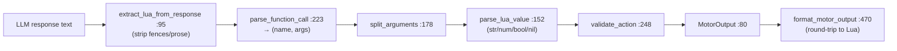

# tritium_lib.actions

**Turn an LLM's text into a validated motor command.** A dependency-free
parser that pulls Lua-style function calls (`move(0.5, -0.2)`,
`look(pan, tilt)`, `say("hi")`) out of a language-model response, validates
the arguments, and returns a structured `MotorOutput` — plus a little
formation-geometry helper for placing a squad.

**Where you are:** `tritium-lib/src/tritium_lib/actions/`
**Parent:** [`../`](../) — the tritium-lib package map

> **Status: lib-side dual / shelfware (verified 2026-07-11).** The **live**
> Lua-action path is SC's own `engine/actions/` (`lua_motor.py`,
> `formation_actions.py`, used by Amy + the `graphlings` plugin). This lib
> package is a parallel, framework-free extraction that **nothing imports yet**
> — see "How it's consumed."

## What it's for

When a stand-in driver (or a Graphling) is embodied by an LLM, the model emits
text; the body needs numbers. This package is the thin, deterministic layer
between them: extract the action call from prose that may be wrapped in
markdown/code fences, parse Lua literals (strings, numbers, booleans, `nil`),
validate the action against a known set, and hand back a normalized
`MotorOutput`. It imports nothing outside the stdlib, so it drops cleanly into
any embodiment stack.

## How it works

Separately, `formation.py` is pure trig: given a leader pose and a formation
name, compute each follower's offset — used to place a squad on the field.

## Files

| Object | Where | What it does |
|--------|-------|--------------|
| `MotorOutput` | `lua_parser.py:80` | The parsed result dataclass (action + params). |
| `extract_lua_from_response` | `lua_parser.py:95` | Strip markdown/prose, isolate the Lua call. |
| `parse_function_call` | `lua_parser.py:223` | `name(args…)` → `(name, [values])`. |
| `split_arguments` / `parse_lua_value` | `lua_parser.py:178` / `:152` | Tokenise args respecting quotes/parens; coerce each Lua literal to a Python value. |
| `validate_action` | `lua_parser.py:248` | Range/type check a parsed action; returns an error string or `None`. |
| `parse_motor_output` / `format_motor_output` | `lua_parser.py:425` / `:470` | End-to-end response→`MotorOutput`, and the inverse for round-tripping. |
| `compute_formation_offsets` / `compute_scatter_positions` / `is_within_rally_radius` | `formation.py:43` / `:100` / `:131` | Squad-placement geometry (line/wedge/column offsets, scatter, rally check). |

## How it's consumed (verified 2026-07-11)

**No consumer anywhere.** A dated grep for `from tritium_lib.actions` /
`import tritium_lib.actions` across sc/edge/addons: **0 hits.** Tests only
(`tests/actions/test_lua_parser.py`, `tests/actions/test_formation.py`).

The reason is a live SC twin: `tritium-sc/src/engine/actions/` implements the
same job (`lua_motor.py`, `lua_multi.py`, `formation_actions.py`) and is what
Amy (`amy/brain/thinking.py`, `amy/router.py`), the sim's LLM fallback
(`engine/simulation/llm_fallback.py`), and the `graphlings` plugin
(`plugins/graphlings/motor.py`) actually call. The symbol names collide
(`MotorOutput`, formation helpers) but the imports resolve to the SC package,
not this one. Adopting the lib copy in SC (or retiring it) is a code decision —
recorded so the two `MotorOutput`s aren't conflated.

## Related

- `tritium-sc/src/engine/actions/` — the **live** Lua-action twin SC subclasses/uses
- [../sim_engine/behavior/](../sim_engine/behavior/) — where a stand-in's decisions become motor intent
- `tritium-sc/docs/EMBODIMENTS.md` — the perception-in/action-out boundary an LLM driver plugs into
