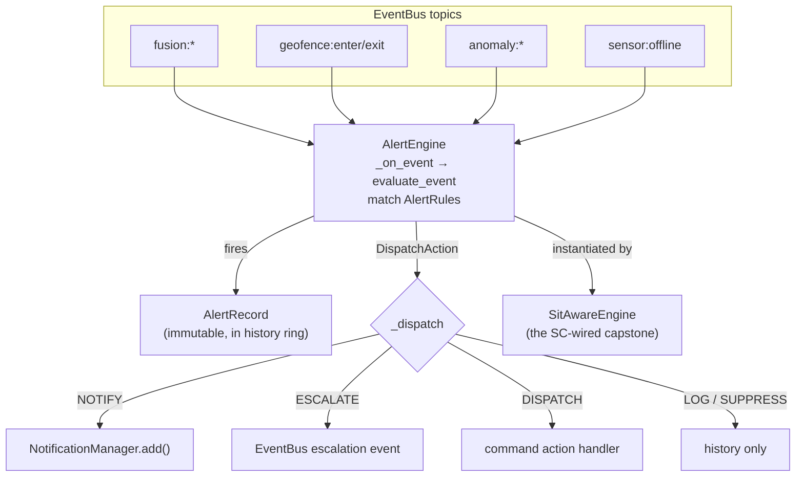

# tritium_lib.alerting

The rules-driven alert engine: subscribe to the sensor-fusion event
stream, match incoming events against `AlertRule`s, and dispatch a
response — notify, log, escalate, or command. This is the "something
happened, decide what to do about it" layer that sits between raw fusion
events and the operator's notification feed.

**Where you are:** `tritium-lib/src/tritium_lib/alerting/`

## What it's for

Fusion, geofence, and anomaly engines emit a firehose of events. Most are
noise. `AlertEngine` is the standing policy that decides which ones become
alerts and what happens next. It ships with sensible built-in rules
(perimeter breach, threat escalation, sensor loss, loitering) so a fresh
system alerts on day one, and it lets operators add/enable/disable/retarget
rules at runtime. Each fired alert becomes an immutable `AlertRecord` in a
bounded history ring, so you get an auditable trail, not just a toast.

Distinct from `tritium_lib.rules`: **alerting** turns events into
notifications; **rules** executes arbitrary IF-THEN automation actions.
Different job, different engine.

## How it works

## Files

| File | What's in it |
|------|--------------|
| `__init__.py` | The whole engine. `AlertEngine`, the `AlertRecord` frozen dataclass, the `DispatchAction` enum, `_builtin_rules()`, the `_EVENT_TRIGGER_MAP` topic→trigger table, and the `_dispatch_*` handlers. `AlertRule`/`AlertTrigger`/`AlertCondition`/`DEFAULT_ALERT_RULES` are **re-exported from `models.alert_rules`** (imported at `__init__.py:54`), not defined here. |

## Core objects & typed actions (Palantir lens)

- **Objects:** `AlertRule` (condition + trigger + severity + action, from
  `models.alert_rules`), `AlertRecord` (what fired, immutable).
- **Links:** rule→trigger (`_EVENT_TRIGGER_MAP` maps EventBus topics to
  `AlertTrigger`), record→notification (`AlertRecord.notification_id`),
  record→target/zone/device (ids on the record).
- **Typed actions (`DispatchAction`, `alerting/__init__.py:73`):**
  `NOTIFY` · `LOG` · `ESCALATE` · `DISPATCH` · `SUPPRESS`. Custom handlers
  register via `register_action_handler(action, fn)`.
- **Lifecycle:** `start()` subscribes to the bus; `stop()` unsubscribes;
  `evaluate_event(topic, data)` runs one event through synchronously.
  Readouts: `get_history()`, `get_stats()`, `get_rule_stats()`.

## Built-in rules

`geofence_entry` · `threat_level_change` · `sensor_offline` ·
`target_loitering` (see `_builtin_rules()` at `__init__.py:158`), loaded
automatically unless constructed with `load_defaults=False`.

## How it's consumed (verified 2026-07-11)

**Reaches production transitively through the SitAware capstone** — no SC
module imports `tritium_lib.alerting` directly.

- `tritium_lib/sitaware/engine.py:26,336` — `SitAwareEngine` imports
  `AlertEngine`/`AlertRecord` and instantiates `self._alerting =
  AlertEngine(event_bus=...)`. SC wires the capstone at
  `tritium-sc/src/app/main.py:2402` (`SitAwareEngine(...).start()` →
  `app.state.sitaware_engine`, with an `is_running()` self-test), so the
  alert engine is live whenever the capstone comes up.
- Also imported lib-internally by `incident/__init__.py` (incident
  correlation) and `pipeline/__init__.py` (TYPE_CHECKING + runtime path)
  and referenced by `mission/__init__.py`.
- SC's `alerts-panel.js` renders the feed and names "the SitAware
  AlertEngine" — matching the wiring above.
- The optional `notification_manager` arg links to
  `tritium_lib.notifications`; when omitted (as in the SitAware default
  construction) `NOTIFY` dispatch degrades gracefully.

2 dedicated test files, plus coverage via the sitaware/incident suites.

## Related

- [../sitaware/](../sitaware/) — the capstone that instantiates and drives this
- [../notifications/](../notifications/) — `NOTIFY` dispatch target
- [../rules/](../rules/) — the sibling IF-THEN action engine (not alerts)
- [../incident/](../incident/) — consumes `AlertRecord`s into incidents
- [../models/](../models/) — `models.alert_rules` where `AlertRule` actually lives
