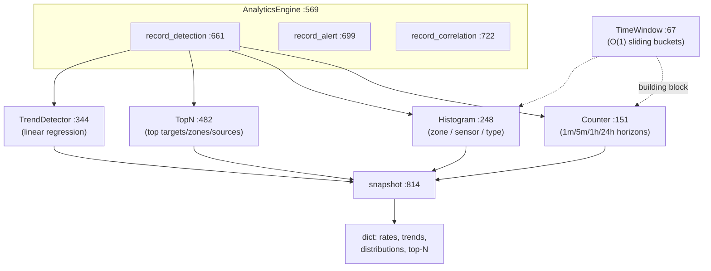

# tritium_lib.analytics

**Live statistics over the tracking firehose, in O(1) memory.** Ingest
detections, alerts, and correlations; ask back rates, trends, distributions,
and top-N — all over sliding time windows that never grow with event volume.
No per-event lists, no linear scans, thread-safe.

**Where you are:** `tritium-lib/src/tritium_lib/analytics/`
**Parent:** [`../`](../) — the tritium-lib package map

## What it's for

The situational-awareness capstone needs a running pulse of the system: how
many detections per minute, is the alert rate trending up, which zones/sensors
are hottest, what's the correlation success rate. This package provides the
counting primitives and a single `AnalyticsEngine` that composes them, so the
capstone doesn't hand-roll bucketed counters.

Every window uses **amortised O(1) bucketed counters** with lazy eviction
(`engine.py:97` `_evict`) — the memory cost is bounded by the bucket count, not
the event count, which matters when thousands of sightings land per minute.

## How it works

Each building block is independently useful: `TimeWindow` (raw sliding count),
`Counter` (multi-horizon rates), `Histogram` (categorical distribution over a
window), `TrendDetector` (least-squares slope → `TrendResult`), `TopN`
(windowed leaderboard). `AnalyticsEngine` wires one of each per concern and
exposes `detection_rate`/`alert_rate`/`correlation_success_rate`,
`zone_activity`/`sensor_utilization`/`target_type_distribution`,
`detection_trend`/`alert_trend`, `top_targets`/`top_zones`/`top_sources`, and a
single `snapshot()` dict.

## Files

Single-module package (`engine.py`, ~880 lines):

| Object | Where | What it does |
|--------|-------|--------------|
| `TimeWindow` | `engine.py:67` | O(1) sliding time window; `add`/`count`/`rate_per_second`/`rate_per_minute`. |
| `Counter` | `engine.py:151` | Multi-horizon counter (1min/5min/1hr/24hr) of one event kind. |
| `Histogram` | `engine.py:248` | Windowed categorical distribution; `record`/`distribution`/`percentages`. |
| `TrendDetector` / `TrendResult` | `engine.py:344` / `:333` | Linear-regression slope over bucketed data → direction + confidence. |
| `TopN` | `engine.py:482` | Windowed top-N by activity; `record`/`top`. |
| `AnalyticsEngine` | `engine.py:569` | The orchestrator that composes all of the above and answers the higher-level queries + `snapshot`. |

## How it's consumed (verified 2026-07-11)

**Lib-internal — reachable in production via the SitAware capstone.** A dated
grep for `from tritium_lib.analytics` across sc/edge/addons finds **zero direct
importers**; the sole real consumer is the capstone engine:

- `tritium-lib/src/tritium_lib/sitaware/engine.py:27` imports `AnalyticsEngine`
  and drives it from the fusion path — `record_detection` (`engine.py:481`),
  `record_correlation` (`:509`), `record_alert` (`:555,:582`), and folds
  `snapshot()` into the `OperatingPicture` (`:704,:870`).
- SC mounts that capstone (`SitAwareEngine`, `tritium-sc/src/app/main.py`,
  must-start), so the analytics numbers surface through `/api/sitaware/*`.

> Drift guard: `models/__init__.py:347` `from .analytics import ...` is
> **`tritium_lib.models.analytics`** (a Pydantic-model module), **not** this
> package — an easy false positive. The only importer of *this* `analytics`
> package is `sitaware/engine.py`.

## Related

- [../sitaware/](../sitaware/) — the sole consumer; folds `snapshot()` into the operating picture
- [../tracking/](../tracking/) — where the detections/correlations these stats count originate
- [../monitoring/](../monitoring/) — the sibling: `MetricsCollector` does p50/p95/p99 latency; this does event rates/trends
