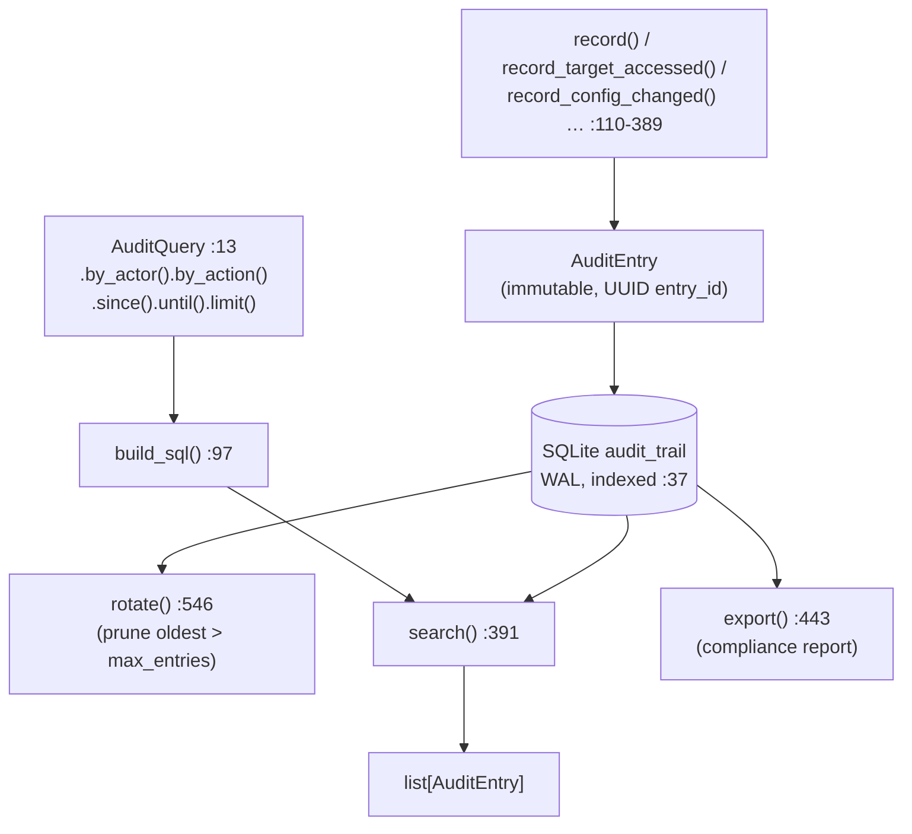

# tritium_lib.audit

**A compliance-and-forensics audit trail: who did what, when, to which
target.** A high-level API over a self-contained SQLite log — typed action
helpers, a fluent query builder, immutable UUID-keyed entries, automatic
rotation, and export for compliance reports.

**Where you are:** `tritium-lib/src/tritium_lib/audit/`
**Parent:** [`../`](../) — the tritium-lib package map

> **Status: parallel table / shelfware (verified 2026-07-11).** This is a
> *second*, richer audit implementation that no runtime code currently uses.
> The **live** audit path is `tritium_lib.store.AuditStore`
> (`store/audit_log.py:102`), wired into SC by `app/audit_middleware.py`
> (which logs every HTTP request). `AuditTrail` is deliberately separate — its
> own `audit_trail` table, not a wrapper of `AuditStore` (its own docstring
> says so, `trail.py:6-8`). See "How it's consumed" for the honest wiring.

## What it's for

When Tritium tracks people, an operator's actions on that data are themselves
sensitive: viewing a dossier, deleting a target, changing config, exporting
data, a failed login. `AuditTrail` gives those actions a durable, queryable,
compliance-oriented home with a vocabulary of pre-typed actions (target /
zone / alert / config / auth / system / sensor / plugin / data categories) so
callers record intent, not raw strings, and a 7-year default retention lands
in the retention policy (`privacy/retention.py`).

## How it works

## Files

| Object | Where | What it does |
|--------|-------|--------------|
| `AuditTrail` | `trail.py:60` | The engine. `record()` (`:110`) + 13 typed helpers (`record_target_accessed` `:171`, `record_config_changed` `:291`, `record_auth_failed` `:331`, `record_data_purged` `:369`, …); `search`/`count`/`get_by_id`/`export`/`rotate`/`get_stats`. SQLite + WAL, auto-rotation. |
| `AuditEntry` / `AuditSeverity` | `entry.py:25` / `:15` | Immutable frozen record (actor, action, resource, detail, severity, ip, metadata) with `to_dict`; severity enum DEBUG…CRITICAL. |
| `AuditAction` | `actions.py:11` | The controlled vocabulary — ~30 str-enum members grouped target/zone/alert/report/config/auth/system/sensor/plugin/data. |
| `AuditQuery` | `query.py:13` | Fluent, chainable filter builder → parameterised SQL (`by_actor`/`by_action`/`with_severity`/`since`/`until`/`from_ip`/`containing`/`limit`/`offset`). |

## How it's consumed (verified 2026-07-11)

**No runtime consumer.** Dated grep for `from tritium_lib.audit` /
`tritium_lib.audit.` across sc/edge/addons: **0 importers.** The one lib
reference is **type-hint only** — `visualization/integrations.py:23` imports
`AuditTrail` inside an `if TYPE_CHECKING:` block for the `timeline_from_audit_trail`
signature (`:114`), and `visualization` is itself shelfware. Tests exercise it
(4 lib test files).

Why it's unused: SC already audits via the simpler `store.AuditStore` +
`audit_middleware.py`, so this parallel trail has never been wired in. To adopt
it you'd point the middleware (or a dedicated operator-action logger) at
`AuditTrail` and gain the typed helpers + query builder + rotation — a code
decision, documented in both directions so callers don't conflate the two
audit systems. (Same finding recorded in DOCS-MAP iter-5.)

## Related

- [../store/](../store/) — `AuditStore` (`store/audit_log.py:102`), the **live** audit path this one parallels
- [../privacy/](../privacy/) — `RetentionPolicy` sets the 7-year `audit_trail` retention default
- [../visualization/](../visualization/) — `timeline_from_audit_trail` renders a trail as a `Timeline` (the sole, type-only reference)
