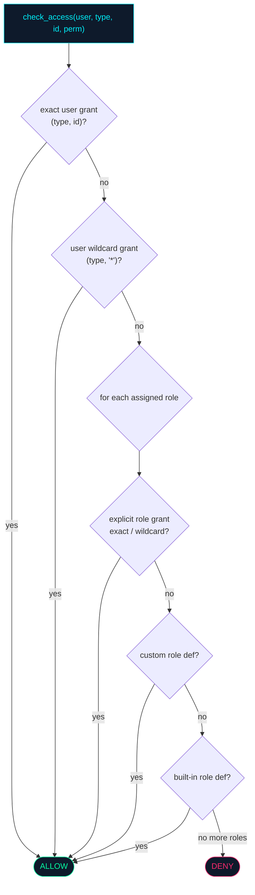

# tritium_lib.auth — shared JWT / API-key / ACL primitives

**Where you are:** `tritium-lib/src/tritium_lib/auth/` — portable
authentication and authorization building blocks, framework-free, importable
by any Tritium service.

**Parent:** [`../README.md`](../README.md) ·
[`../../../CLAUDE.md`](../../../CLAUDE.md)

## What this package is

Two files, no framework dependency:

- **`jwt.py`** — HS256 tokens (`create_token` / `decode_token`) with a
  `TokenType` enum (`ACCESS` / `REFRESH` / `DEVICE`), and API-key helpers:
  `generate_api_key()` (a `tritium_` prefix + 40 hex chars),
  `hash_api_key()` (SHA-256, store the hash not the key), and
  `validate_api_key()` — which uses `hmac.compare_digest` for
  **constant-time** comparison against timing attacks (`jwt.py:90-98`). The
  same secret validates a token issued by either sc or edge.
- **`acl.py`** — an in-memory, thread-safe `ACLManager` with optional JSON
  persistence. Permissions (`READ` / `WRITE` / `ADMIN` / `OPERATE`) are
  granted on typed `ResourceType`s (`TARGET` / `ZONE` / `CAMERA` / `REPORT` /
  `INVESTIGATION`), to either a user or a role, on a specific resource id or
  the `"*"` wildcard. Three `BUILTIN_ROLES` ship: `admin` (all perms),
  `operator` (`READ` + `OPERATE`), `viewer` (`READ`).

## `check_access` — the resolution order

`ACLManager.check_access` is deny-by-default and resolves in a fixed order
(`acl.py:215-268`):

Grants are additive (`grant` unions permissions into an existing entry);
`save()`/`load()` round-trip the whole state to JSON.

## Read this before you wire against it

**As of 2026-07-11 nothing in tritium-sc, tritium-edge, or tritium-addons
imports this package** (DATED grep of `tritium_lib.auth` across all three —
zero code hits; the only reference is a table row in
`tritium-edge/docs/INTEGRATION.md`). Both apps ship their **own** auth
surfaces instead:

- tritium-sc: `src/app/auth.py` + `src/app/routers/auth.py`
- tritium-edge fleet server: `server/app/auth/`

So `tritium_lib.auth` is a **designed, tested, but not-yet-adopted** shared
primitive — exercised only by the lib test suite. This is worth stating
plainly (the shelfware lesson): it is ready to consolidate the two app auth
surfaces onto one shared implementation, but that consolidation has not
happened. Don't document it as "the auth the system uses" — it isn't yet.

## Ontology lens

The ACL is a typed-action authorization matrix: `(principal) → [permission]
→ (ResourceType, resource_id)`. It is the natural gate in front of the
[`../store/`](../store/) typed actions (`merge_dossiers`,
`update_classification`, …) — decisions about *who may act* expressed as
data, complementing the `AuditStore`'s record of *who did act*.

## Tests

`tests/test_auth.py`, `tests/test_jwt.py`, `tests/test_auth_jwt_extended.py`,
`tests/test_acl.py`, `tests/test_auth_demo.py` — token lifecycle, API-key
hashing/validation, and the full ACL resolution order.

## Related

- Durable record of actions taken: [`../store/`](../store/) (`AuditStore`)
- App auth surfaces that could adopt this: `tritium-sc/src/app/auth.py`,
  `tritium-edge/server/app/auth/`
