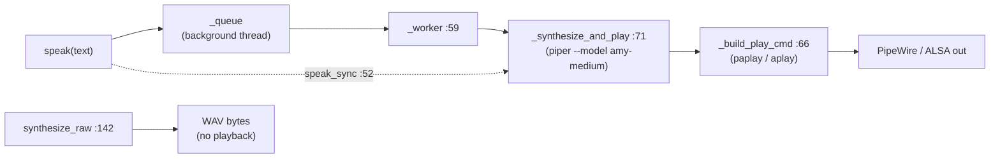

# tritium_lib.comms

**Give the machine a voice.** One class — a Piper text-to-speech `Speaker`
that speaks locally through PipeWire/ALSA, off the request thread, with
graceful degradation when the model or player binary is missing. This is the
package behind Amy talking out loud.

**Where you are:** `tritium-lib/src/tritium_lib/comms/`
**Parent:** [`../`](../) — the tritium-lib package map

## What it's for

Amy (the command-center assistant) and the TTS router need to turn a string
into audible speech on the operator's box without blocking the web request
that produced it. `Speaker` wraps the offline [Piper](https://github.com/rhasspy/piper)
neural TTS binary: enqueue text, a background worker synthesizes a WAV and
pipes it to the system player, and the caller returns immediately.

Despite the plural name, this package is **TTS only** today — no chat, radio,
or messaging transport lives here (that drift was corrected in the package map,
iter-6). The name is aspirational headroom, not a promise.

## How it works

`speak()` is fire-and-forget (enqueue, return); `speak_sync()` blocks until the
audio finishes; `synthesize_raw()` returns WAV bytes for a caller that wants to
stream them elsewhere (the TTS HTTP route does this). `available()` reports
whether the Piper binary + voice model are present so callers can degrade to
text silently.

## Files

Single-module package (`speaker.py`, ~160 lines):

| Object | Where | What it does |
|--------|-------|--------------|
| `Speaker` | `speaker.py:23` | The TTS engine. `speak()` (`:49`, async enqueue), `speak_sync()` (`:52`), `synthesize_raw()` (`:142`, WAV bytes), `play_raw()` (`:158`), `available` (`:41`), `playback_device` (`:45`), `shutdown()` (`:55`). Private `_worker`/`_synthesize_and_play`/`_build_play_cmd` do the thread + subprocess work. |
| `DEFAULT_PIPER_DIR` | `speaker.py:18` | `~/models/piper` — where the binary + `en_US-amy-medium.onnx` voice live by default. |
| `DEFAULT_PIPER_BIN` | `speaker.py:19` | `<dir>/piper` — the Piper executable path. |

## How it's consumed (verified 2026-07-11)

**LIVE — this is the real voice path.** `tritium_lib.comms.speaker.Speaker` is
imported by three production SC sites (dated grep):

- `tritium-sc/src/amy/router.py:252` — Amy speaks responses.
- `tritium-sc/src/amy/commander.py:1916` — the commander persona voices alerts.
- `tritium-sc/src/app/routers/tts.py:22` — the `/tts` HTTP endpoint pulls
  `Speaker`, `DEFAULT_PIPER_DIR`, `DEFAULT_PIPER_BIN` for on-demand synthesis.

There is **no SC-local Speaker twin** — unlike most of the utility tail, the
library class is the one production actually runs. It degrades cleanly: if the
Piper binary/voice is absent, `available` is `False` and callers skip audio.

Fun + production: the sim narrates battles out loud (fun), and the exact same
`Speaker` would voice a real deployed unit's operator console (production).

## Related

- `tritium-sc/src/app/routers/tts.py` — the live HTTP consumer
- [../inference/](../inference/) — the LLM side that generates the text Amy speaks
- [../sim_engine/game/](../sim_engine/game/) — battle narration is a caller of Amy's voice
