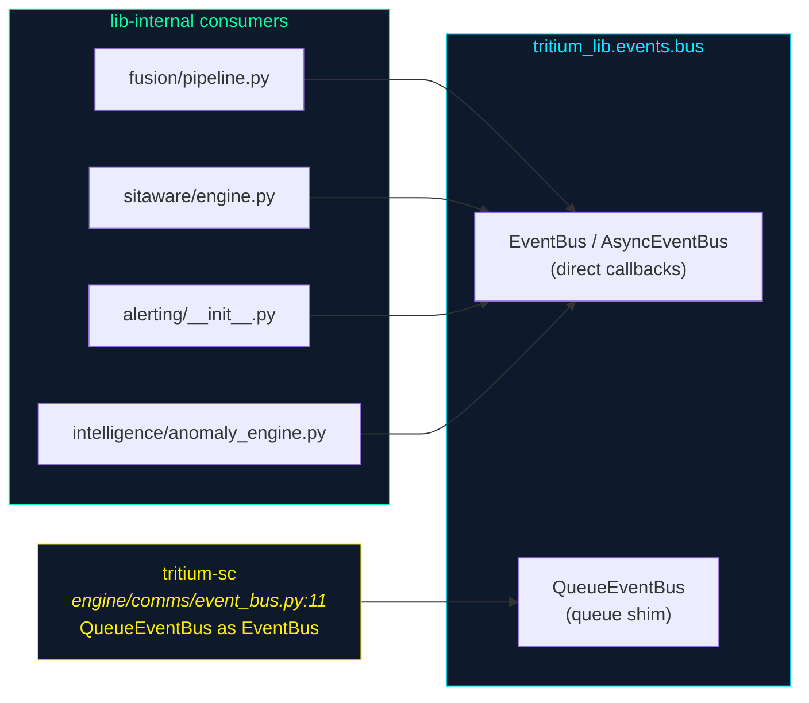

# tritium_lib.events — in-process pub/sub

**Where you are:** `tritium-lib/src/tritium_lib/events/` — the thread-safe
event bus components pass facts to each other *inside one process*, before
anything touches a network.

**Parent:** [`../README.md`](../README.md) ·
[`../../../CLAUDE.md`](../../../CLAUDE.md)

## What this package is

One file — `bus.py` — with three bus variants for three call styles. All
share the same wildcard topic grammar; the difference is only how a
subscriber is invoked.

| Class | Dispatch | Subscriber shape | Used by |
|-------|----------|------------------|---------|
| `EventBus` | synchronous, `threading.Lock` | `Callable[[Event], None]` | lib intelligence (`fusion`, `sitaware`, `alerting`, `anomaly_engine`) |
| `AsyncEventBus` | `await`s each subscriber; `publish_concurrent()` fans out with `asyncio.gather` | `Callable[[Event], Coroutine]` | asyncio contexts within lib |
| `QueueEventBus` | pushes plain dicts into per-subscriber `queue.Queue(maxsize=1000)` | a `Queue` you drain | **tritium-sc** (`engine/comms/event_bus.py`) |

`Event` is a 4-field dataclass: `topic`, `data`, `source`, `timestamp`
(`bus.py:25-31`).

## The topic grammar (identical across variants)

Matching is dotted-segment, MQTT-style (`bus.py:226-237`):

- `device.heartbeat` — exact
- `device.*` — one wildcard segment
- `device.#` — everything under `device`

Opt-in features, all backward-compatible and off by default:

- **history** — `EventBus(history_size=N)` retains the last N events *per
  topic* so a late subscriber can `replay_history(topic, cb)` and catch up.
- **priority** — higher-priority subscribers are called first
  (`_match` sorts descending, `bus.py:222-223`).
- **filter** — a `filter_fn(event) -> bool` predicate gates delivery.

**Failure isolation is a deliberate property:** `publish` wraps every
subscriber call in `try/except: pass` (`bus.py:206-209`, `bus.py:365-368`) —
one bad subscriber can never break the bus for the others. Filters that raise
are treated as "don't deliver," not as errors.

## Who consumes it (DATED 2026-07-11)

Every edge is a verified import: `sitaware/engine.py:28` pulls both
`EventBus` and `QueueEventBus`; `fusion/pipeline.py:51`, `alerting/__init__.py:19`,
and `intelligence/anomaly_engine.py:27` take `EventBus`. On the SC side,
`engine/comms/event_bus.py:11` does `from tritium_lib.events.bus import
QueueEventBus as EventBus` — the shim the `QueueEventBus` docstring was
written for (`bus.py:410-417`: *"the API originally used by tritium-sc's
engine.comms.event_bus … kept here in tritium-lib so that SC can shim to
it."* — accurate as of this sweep).

## In-process, not the wire

This is **not** MQTT. For cross-process fan-out over a broker, topics are
built with [`../mqtt/`](../mqtt/) and carried by the SC MQTT bridge / edge
HAL. `events` is the fast path *within* a running service; a subscriber that
needs to reach another process re-publishes onto MQTT itself.

## Ontology lens

Events are observations-and-decisions-as-data in flight: a `topic` is a typed
channel, `Event.source` records *who* said it, and `history` makes the recent
past queryable — the same "decisions are data" posture the
[`../store/`](../store/) `AuditStore`/`EventStore` take for durable facts,
here for the live in-memory moment.

## Tests

`tests/test_event_bus*.py` cover wildcard matching, priority ordering,
filters, history/replay, and the queue-overflow drop-oldest behavior.

## Related

- Cross-process transport: [`../mqtt/`](../mqtt/) topic conventions
- Durable event record: [`../store/`](../store/) (`EventStore`, `AuditStore`)
- SC shim: `tritium-sc/src/engine/comms/event_bus.py`
