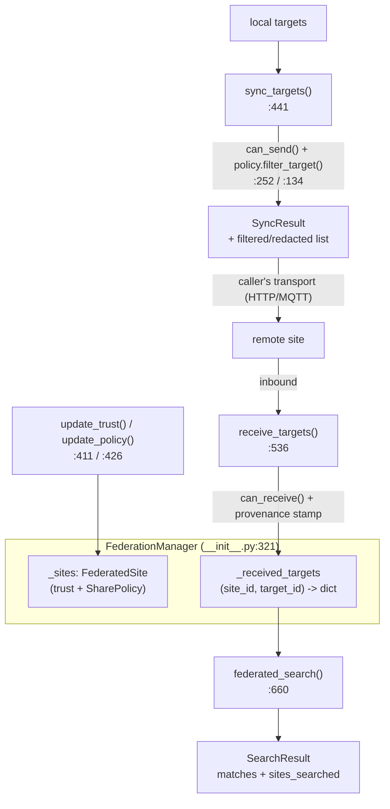

# tritium_lib.federation

**Share targets between Tritium sites, on your terms.** A multi-site
federation data model + policy engine: register remote instances, assign each
a trust level and a fine-grained share policy, then sync targets outbound
(filtered + redacted), ingest targets inbound (validated), and search across
everything you've received. Transport-agnostic by design — pure data model +
logic, no HTTP/MQTT wire code.

**Where you are:** `tritium-lib/src/tritium_lib/federation/`
**Parent:** [`../`](../) — the tritium-lib package map

## What it's for

Two Tritium deployments (HQ East and HQ West, or a fixed site and a mobile
unit) want to share a tactical picture without oversharing. Federation lets
each side declare, per peer:

- a coarse **`TrustLevel`** — `FULL` (both ways), `LIMITED` (positions only,
  identifiers redacted), `RECEIVE_ONLY` (take, don't give), `BLOCKED`; and
- a fine **`SharePolicy`** — which categories, which classifications/alliances,
  a min confidence, a per-sync cap, and whether to strip `identifiers` /
  `dossier_id`.

`sync_targets()` returns the filtered list for the caller to send over
*their* chosen transport; `receive_targets()` stores what a peer sent, keyed by
`(site_id, target_id)`, re-redacting for `LIMITED` peers. `federated_search()`
queries the received pool.

## How it works

## Files

Single-module package (`__init__.py`, ~920 lines):

| Object | Where | What it does |
|--------|-------|--------------|
| `TrustLevel` / `ShareCategory` | `:68` / `:79` | The coarse trust enum (4 levels) and shareable-category enum (targets/alerts/zones/dossiers/events). |
| `SharePolicy` | `:93` | Fine-grained outbound control: category set, classification/alliance allowlists, `min_confidence`, `max_targets_per_sync`, `redact_identifiers`/`redact_dossier_ids`. `filter_target()` (`:134`) applies them and returns the redacted dict or `None`. |
| `default_policy_for_trust` | `:171` | Derives a sensible `SharePolicy` from a `TrustLevel` (FULL=everything, LIMITED=targets+alerts redacted, RECEIVE_ONLY/BLOCKED=empty). |
| `FederatedSite` | `:204` | A registered peer: `site_id`, `url`, `name`, `trust_level`, `share_policy`, `enabled`, `last_seen`. `can_send()`/`can_receive()` (`:252`/`:263`) resolve trust+enabled to a boolean. |
| `SyncResult` / `SearchResult` | `:277` / `:301` | Operation outcomes with processed/accepted/rejected counts and `success`; `SyncResult._outbound_targets` carries the filtered list (via `get_outbound_targets`). |
| `FederationManager` | `:321` | The registry + coordinator: `add_site`/`remove_site`/`list_sites`, `update_trust`/`update_policy`, `sync_targets` (`:441`), `receive_targets` (`:536`), `sync_alerts` (`:606`), `federated_search` (`:660`), received-pool management (`get_received_targets`, `clear_received_targets`, `purge_stale_targets` `:802`), `get_sync_log`, `get_stats`, `export_config`. |

Module-level `sync_targets`/`receive_targets`/`federated_search` convenience
wrappers take a manager as the first arg.

## Core objects & typed actions (Palantir lens)

- **Objects:** `FederatedSite` (a peer deployment), `SharePolicy` (a data-flow
  contract), `SyncResult`/`SearchResult` (operation records), the received-target
  pool (a provenance-stamped cache).
- **Links:** a received target links to its `_source_site_id`; a `SharePolicy`
  links a peer to exactly what may flow to it; the sync log links each operation
  to a site + direction.
- **Typed actions:** `add_site` · `update_trust`/`update_policy` · `sync_targets`
  (outbound, filtered) · `receive_targets` (inbound, validated) · `federated_search`
  · `purge_stale_targets`.

## How it's consumed (verified 2026-07-11)

**Dormant hook** — the same pattern as `fleet.FleetManager` (iter-14). Built +
tested (**85 tests**, `tests/test_federation_manager.py`), but reaches the app
only through a hook nothing populates:

- `tritium-sc/src/app/routers/federation_status.py` mounts
  **`GET /api/federation/status`** and reads a manager from
  `app.state.federation_manager` (or a `federation` plugin's `.federation_manager`,
  `:24-38`). The response is **duck-typed exactly on this class** —
  `fm.local_site_id`, `fm.local_site_name`, `fm.site_count`, and `fm._received_targets`
  (`:63-66`) — so it was clearly written against this package.
- **But nothing constructs or registers one.** Dated grep finds **no
  `from tritium_lib.federation` import and no `FederationManager(` call anywhere
  in `tritium-sc/src`** (nor edge/addons), and no code sets
  `app.state.federation_manager`. So `_get_federation()` always returns `None`
  and the route always answers `{"status": "stopped", "available": false}`.
- Note there is **no live `FederationManager` twin** in SC (unlike `nodes`) —
  the hook simply waits for this lib class to be wired in. To make the route
  live: construct a `FederationManager`, register peers, and set it on
  `app.state.federation_manager` (fun + production: one federated tactical
  picture across sites). Routed below — a wire-up, not a docs fix.

## Related

- [../tracking/](../tracking/) — the `TrackedTarget` dicts federation syncs
- [../fleet/](../fleet/) — the sibling in-memory registry with the same "dormant `app.state` hook" status
- [../store/](../store/) — federation keeps its received pool in memory (not a store); a persistent variant would live there
- `tritium-sc/src/app/routers/federation_status.py` — the dormant SC hook
