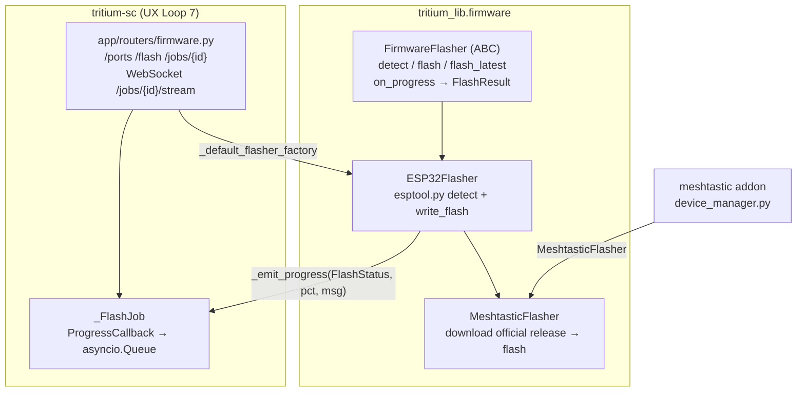

# tritium_lib.firmware

Serial/USB firmware flashing — a small abstract flasher hierarchy over
`esptool.py` that turns "plug in a board" into "flash it and stream
progress". This is the **local-cable** half of UX Loop 7 (Flash
Firmware); the over-the-air half lives in the `ota_broadcast` SC router
and the MQTT `hal_ota` edge HAL, not here.

**Where you are:** `tritium-lib/src/tritium_lib/firmware/`

## What it's for

You have a Waveshare ESP32-S3 (or a Meshtastic radio) on the end of a USB
cable and you want to flash it from the Command Center without leaving the
browser. This package is the driver: it detects the chip, flashes a `.bin`
(or downloads the latest official Meshtastic release first), and emits
progress callbacks the SC `firmware` router relays to a WebSocket. Pure
subprocess orchestration around `esptool` — no SC/FastAPI imports, so it
stays reusable and testable.

## How it works

## Files

| File | What's in it |
|------|--------------|
| `base.py` | `FirmwareFlasher` (ABC) with abstract `detect()`/`flash()`, concrete `flash_latest()`/`download_firmware()`, `on_progress()`/`_emit_progress()` callback plumbing, and `find_serial_ports()`. Plus the `FlashStatus` enum and `DeviceDetection`/`FlashResult` dataclasses. |
| `esp32.py` | `ESP32Flasher` — locates `esptool` (`_find_esptool`), auto-detects the port, runs blocking `esptool` in an executor, parses chip/MAC from `detect`, and flashes/erases. Works for any ESP32/S2/S3/C3. |
| `meshtastic_flasher.py` | `MeshtasticFlasher(ESP32Flasher)` — the large one (~32 KB). Talks to the Meshtastic GitHub releases API, picks the right board asset, downloads + unzips, parses the firmware's `*.json` offset map, and flashes. Also `flash_with_meshtastic_cli()` and `get_available_versions()`. |
| `demos/firmware_demo.py` | Standalone runnable demo. |

## Public API (the flasher contract)

| Method | Purpose |
|--------|---------|
| `on_progress(cb)` | Register a `ProgressCallback(FlashStatus, pct, msg)` — how SC streams to the UI |
| `await detect()` | Return a `DeviceDetection` (board, chip, MAC, current firmware) — abstract |
| `await flash(path, **kw)` | Flash a local `.bin`, emitting progress — abstract |
| `await flash_latest(**kw)` | Fetch the newest official firmware, then flash (Meshtastic) |
| `await download_firmware(...)` | Download without flashing |
| `find_serial_ports()` | Enumerate candidate serial ports (static) |

`FlashStatus`: `DETECTING · ERASING · WRITING · VERIFYING · DONE · ERROR`
(exact members in `base.py:23`). `FlashResult` / `DeviceDetection` both
carry `to_dict()` for JSON transport.

## How it's consumed (verified 2026-07-11)

The **only** package in the Operations family that is directly imported by
production SC/addon code — the rest reach the app transitively (see
sibling READMEs).

- `tritium-sc/src/app/routers/firmware.py:50,57` — imports `ESP32Flasher`,
  `MeshtasticFlasher`, `FirmwareFlasher`, `FlashStatus`. This router is UX
  Loop 7: `GET /ports`, `POST /flash` (spawns a `_FlashJob`),
  `GET /jobs/{id}`, `GET /jobs/{id}/events`, and the live
  `WebSocket /jobs/{id}/stream`. `_default_flasher_factory` picks the
  subclass by device string.
- `tritium-addons/meshtastic/.../device_manager.py:1176` — lazy-imports
  `MeshtasticFlasher` to flash mesh radios.
- **Not** the same as `tritium_lib.models.firmware` (`FirmwareMeta`,
  `OTAJob`, `OTAStatus`) — those are OTA-over-MQTT job *models*, a
  different module. (Grep 2026-07-11: those models are currently unused by
  non-test SC code; `ota_broadcast` hand-rolls its payloads.)

6 test files exercise this package (`tests/**firmware**`).

## Related

- [../../../../tritium-sc/src/app/routers/firmware.py](../../../../tritium-sc/src/app/routers/firmware.py) — the UX Loop 7 router
- [../../../../tritium-sc/src/app/routers/ota_broadcast.py](../../../../tritium-sc/src/app/routers/ota_broadcast.py) — the over-the-air counterpart (MQTT, not serial)
- [../models/](../models/) — `models.firmware` OTA job models (distinct from this flasher)
- [../fleet/](../fleet/) — device registry the OTA side targets
