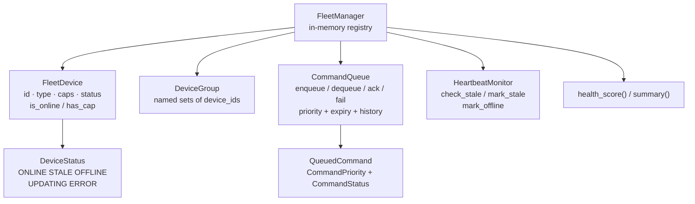

# tritium_lib.fleet

Pure-logic fleet device management: register edge nodes, take their
heartbeats, group them, queue commands, and notice when they go stale.
No network I/O — you feed it heartbeats and read back state. One file,
~24 KB, heavily tested, and deliberately self-contained (`FleetDevice`
lives here, not in `models`).

**Where you are:** `tritium-lib/src/tritium_lib/fleet/`

## What it's for

A fleet is a bag of ESP32 nodes, cameras, and sensors that phone home.
`FleetManager` is the in-memory registry that answers "who's out there,
which are online, what can they do, and what have I told them to do."
The design goal is a clean, transport-free core: MQTT/REST callers on the
outside translate wire messages into `register()` / `heartbeat()` calls
and read `list_devices()` back out. That keeps the fleet logic unit-
testable and reusable across SC and the edge fleet-server.

## How it works

## Files

| File | What's in it |
|------|--------------|
| `__init__.py` | The whole package. `FleetManager` (register/heartbeat/group/command/health) plus its parts: `FleetDevice`, `DeviceStatus`, `DeviceGroup`, `CommandQueue` + `QueuedCommand` + `CommandPriority`/`CommandStatus`, `HeartbeatMonitor` + `StaleDevice`. |

## Core objects & typed actions (Palantir lens)

- **Objects:** `FleetDevice` (the unit), `DeviceGroup` (a named set),
  `QueuedCommand` (an instruction with priority/expiry/status).
- **Links:** device→group (`assign_to_group`), command→device
  (`enqueue(device_id, ...)`), device→status (heartbeat drives the state
  machine `ONLINE → STALE → OFFLINE`).
- **Typed actions:** `register` / `unregister` / `heartbeat` /
  `enqueue`+`ack`/`fail` / `mark_stale`+`mark_offline` /
  `create_group`+`assign_to_group`. Each mutates registry state; nothing
  reaches the network.
- **Decisions as data:** `health_score()` (fleet-wide float) and
  `summary()` (counts by status) are the readouts a dashboard renders.

## How it's consumed (verified 2026-07-11)

Honest status: **lib-internal + tests, plus one dormant courtesy hook in
SC.** No SC/edge/addon module imports `tritium_lib.fleet` directly.

- SC's `app/routers/ota_broadcast.py:150-161` calls
  `state.fleet_manager.list_devices()` **if** an attribute
  `app.state.fleet_manager` is present — the "canonical FleetManager"
  branch, honored first. But grep finds **no code that sets
  `app.state.fleet_manager`**, so this branch is currently dormant. The
  active path is tier 2: the live `fleet_dashboard` plugin's own MQTT
  heartbeat registry (`plugin.get_devices()`), then an MQTT wildcard
  fallback. So OTA targeting works — it just isn't going through this
  package yet.
- SC has its own unrelated `VirtualFleetManager`
  (`engine/comms/virtual_fleet.py`) for zero-hardware sim nodes — a
  different class, not this one.
- Do not confuse with `tritium_lib.inference.fleet` (`LLMFleet`,
  `OllamaFleet`) — that's an LLM-host pool, same word, unrelated.

10 test files cover this package. It is a well-built, ready-to-wire
registry whose SC integration point exists but is unpopulated — a clean
candidate to actually mount on `app.state.fleet_manager` and make the OTA
tier-1 path live.

## Related

- [../../../../tritium-sc/src/app/routers/ota_broadcast.py](../../../../tritium-sc/src/app/routers/ota_broadcast.py) — the dormant `fleet_manager` hook + live fleet_dashboard fallback
- [../../../../tritium-sc/plugins/fleet_dashboard/](../../../../tritium-sc/plugins/fleet_dashboard/) — the actual live device registry today
- [../firmware/](../firmware/) — flashing the devices this manages
- [../monitoring/](../monitoring/) — health checks (`HeartbeatMonitor` here is fleet-specific; `monitoring` is pipeline-wide)
