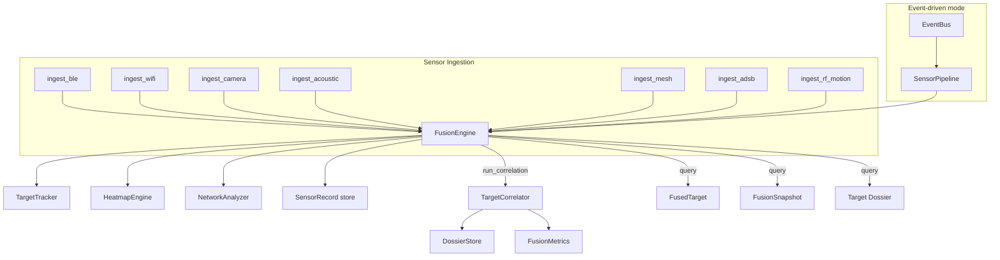

# tritium_lib.fusion

Multi-sensor fusion engine -- combines BLE, WiFi, camera, acoustic, mesh, ADS-B, and RF motion into correlated target identities.

**Where you are:** `tritium-lib/src/tritium_lib/fusion/`

## How It Works



`FusionEngine` composes `TargetTracker`, `TargetCorrelator`, `GeofenceEngine`, `HeatmapEngine`, `DossierStore`, `NetworkAnalyzer`, and `FusionMetrics` into a single ingest-then-query API. It does not reimplement these -- it orchestrates them.

`SensorPipeline` adds event-bus-driven operation: subscribe to `sensor.*` topics and auto-route to the engine.

## Files

| File | Description |
|------|-------------|
| `__init__.py` | Exports `FusionEngine`, `FusionSnapshot`, `FusedTarget`, `SensorRecord`, `SensorPipeline` |
| `engine.py` | `FusionEngine` -- unified ingest API for 7 sensor types, correlation control, zone management, query methods |
| `pipeline.py` | `SensorPipeline` -- event-bus bridge that auto-routes `sensor.*` topics to `FusionEngine.ingest_*()` |
| `byte_assoc.py` | BYTE two-stage data association (algorithm-only, MIT). **Not yet wired into `engine.py`** -- a documented follow-up. `ingest_camera` (engine.py ~L431) hard-drops any detection with `confidence < 0.4`; BYTE's second round is the license-clean remedy for the resulting identity switches on dim/occluded targets. Operates over plain `Track`/`Detection` dataclasses. |

## Key Types

- **`FusionEngine`** -- the orchestrator. Call `ingest_ble()`, `ingest_camera()`, etc., then `get_fused_targets()`.
- **`FusedTarget`** -- a `TrackedTarget` enriched with sensor records, dossier, zones, and correlations.
- **`FusionSnapshot`** -- point-in-time snapshot of all targets, dossiers, correlations, zones, and metrics.
- **`SensorPipeline`** -- subscribes to EventBus sensor topics and dispatches to the engine automatically.

## Usage

```python
from tritium_lib.fusion import FusionEngine

engine = FusionEngine(auto_correlate=True)
engine.ingest_ble({"mac": "AA:BB:CC:DD:EE:FF", "rssi": -55})
engine.ingest_camera({"class_name": "person", "confidence": 0.9, "center_x": 10.0, "center_y": 5.0})
targets = engine.get_fused_targets()  # returns list[FusedTarget]
```

## Consumed by (dated 2026-07-11, grep `from tritium_lib.fusion`)

Deliberately thin: `FusionEngine` is meant to be the *one* composition point,
so few callers wrap it directly.

- **tritium-sc (the app): 1 site** — `src/app/main.py` wires it at startup.
- **lib-internal: 3 sites** — `sitaware.SitAwareEngine` composes it (its
  `fusion` property); the rest are re-exports.
- **tests: 12 sites** — engine + pipeline coverage.

**Parent:** [../README.md](../README.md)
