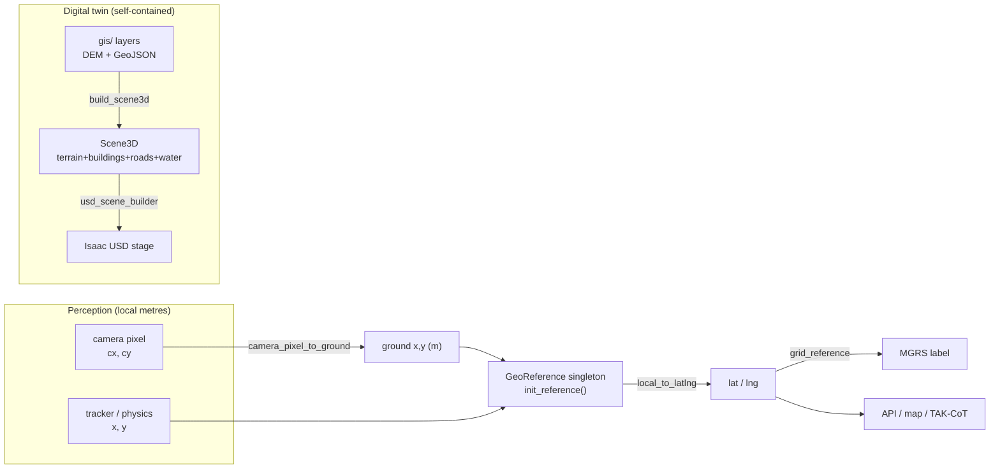

# tritium_lib.geo — the coordinate substrate

**Where you are:** `tritium-lib/src/tritium_lib/geo/`

**Parent:** [tritium_lib package map](../README.md) | [tritium-lib CLAUDE.md](../../../CLAUDE.md)

## What this is for

Every position in Tritium — a tracked car, a robot, a BLE ping, a camera
detection, a geofence corner — lives in **two frames at once**: fast **local
metres** (physics, tracking, and the sim run here) and real-world **WGS84
lat/lng** (every API response, the map, TAK/CoT). This package is the bridge
between them, plus the geodesy the tactical map needs (distance, bearing,
UTM/MGRS, ECEF) and the digital-twin geometry the Isaac lane renders.

Convention (single source of truth, `__init__.py:11`):

> Local origin `(0, 0, 0)` = the geo-reference point. `+X = East`,
> `+Y = North`, `+Z = Up`. 1 local unit = 1 metre. Heading 0 = North,
> clockwise degrees.

It is **shared** between tritium-sc (the tactical engine) and tritium-edge
(the fleet server): both agree on the same origin so a sighting from an ESP32
and a track in the simulator land on the same square metre of the map.

## The reference singleton — how the world gets anchored

`geo/__init__.py` holds a **module-level `GeoReference` singleton** (`_ref`,
guarded by a `threading.Lock`). Set it once at startup and every conversion in
the process is grounded to that real-world point:

```python
from tritium_lib import geo

geo.init_reference(30.2672, -97.7431)     # Austin — call once at boot
geo.latlng_to_local(30.2680, -97.7420)    # -> (x_east_m, y_north_m, z)
geo.local_to_latlng(120.0, 85.0)          # -> {"lat":…, "lng":…, "alt":…}
```

Before `init_reference` is called `is_initialized()` is `False` and the
local↔latlng transforms degrade gracefully to `(0, 0)` / origin rather than
throwing — the sim can run un-georeferenced. `reset()` clears it (tests only).
This singleton is the **spherical, fast** path (`METERS_PER_DEG_LAT =
111_320.0`, a constant); it re-homes whenever a new demo picks a new map
centre.

For work that must **not** depend on process-global state, use
`ProjectedCoordinate` (below) — it carries its own origin — or the precise
WGS84-ellipsoid functions, which are stateless.

## Objects & typed actions (Palantir lens)

| Object | What it is |
|--------|-----------|
| `GeoReference` | The AO anchor — `lat/lng/alt` + `initialized`. One lives in the module singleton; grounds every local↔latlng transform. |
| `ProjectedCoordinate` | A position in local ENU metres that **carries its own origin** (`from_latlng(...)` / `to_latlng()` / `distance_to` / `bearing_to`). WGS84-ellipsoid accurate; no singleton dependency. |
| `CameraCalibration` | A camera's ground-projection model — position, heading, FOV, mount height, max range. Feeds `camera_pixel_to_ground`. |
| `Scene3D` / `Mesh3D` (`scene3d.py`) | The neutral digital-twin geometry of an AO — terrain heightfield + extruded buildings + road/water ribbons, in AO-local metres. |

| Typed action | Signature (file:line) | Turns … into … |
|--------------|----------------------|----------------|
| Anchor the world | `init_reference(lat, lng, alt=0)` — `__init__.py:116` | a real point → the local origin |
| Frame transform | `latlng_to_local` / `local_to_latlng` / `local_to_latlng_2d` — `__init__.py:149,163,177` | metres ↔ degrees |
| Perception → world | `camera_pixel_to_ground(cx, cy, calib)` — `__init__.py:187` | image pixel → ground `(x, y)` metres |
| World → grid label | `grid_reference(lat, lng, precision=5)` — `__init__.py:1089` | lat/lng → MGRS string (e.g. `14RPU…`) |
| GIS → 3D twin | `build_scene3d(ao, bbox, …)` — `scene3d.py:649` | DEM + GeoJSON layers → `Scene3D` |

## Key files

| File | Lines | Contains |
|------|-------|----------|
| `__init__.py` | 1233 | All transforms + geodesy + the reference singleton. Pure stdlib `math` (only `reverse_geocode` touches the network). |
| `scene3d.py` | 697 | AO map data → a framework-neutral `Scene3D` (digital twin) for NVIDIA Isaac Sim. Pure geometry — no USD/isaacsim deps; imports clean on Jetson. |
| `gis/` | — | Real public-government GIS fetchers (USGS DEM, TIGER roads, FEMA flood, NOAA alerts, NHD water, OSM buildings) → normalized layers. See [`gis/README.md`](gis/README.md). |

## The API, grouped (`__init__.py`)

All names below are in `__all__` and verified against source. Everything is
pure `math` except `reverse_geocode`.

**Reference singleton** — `init_reference` · `get_reference` · `is_initialized`
· `reset`

**Local ↔ lat/lng** (spherical, uses the singleton) — `local_to_latlng` ·
`latlng_to_local` · `local_to_latlng_2d`

**Camera projection** — `camera_pixel_to_ground` (+ `CameraCalibration`).
Simple flat-ground model: ±5 m for objects 10–30 m out; returns `None` above
the horizon.

**Distance & bearing** — `haversine_distance` (great-circle) ·
`approx_distance_m` (fast equirectangular, ~0.5 % under 100 km) ·
`distance_vincenty` (WGS84 ellipsoid, sub-mm, haversine fallback near
antipodal) · `initial_bearing` · `midpoint` · `destination_point` ·
`bounding_box`

**WGS84 / ECEF** (precise, ellipsoid, stateless) — `meters_per_degree_lat` ·
`meters_per_degree_lng` · `latlng_to_ecef` · `ecef_to_latlng` (Bowring
iterative). Constants: `WGS84_A/B/F/E2`, `METERS_PER_DEG_LAT`.

**UTM / MGRS** — `utm_zone_from_latlng` (handles Norway/Svalbard special
zones) · `latlng_to_utm` / `utm_to_latlng` (Karney-accurate transverse
Mercator) · `grid_reference` (MGRS, 1 m…10 km precision).

**Polygon & area** — `point_in_polygon` / `point_in_polygon_latlng`
(ray-casting; the latlng variant also accepts `{"lat","lon"}` dicts) ·
`compute_area` (shoelace, local metres) · `compute_area_latlng` (tangent-plane
projected) · `polygon_area_geodetic` (authalic-sphere, <0.01 % to continental
scale).

**Geocoding** — `reverse_geocode(lat, lng, radius_m=50)` — the **only**
network call; queries OSM Overpass for the nearest named feature, returns an
empty result on any failure. For bulk lookups use
`tritium_lib.intelligence.geospatial.osm_enrichment.OSMEnrichment` instead.

## scene3d — the digital twin (feeds the Isaac lane)

`scene3d.py` is the reusable pipeline that turns shared GIS layers into a
**framework-neutral** 3D scene, serializable to JSON. It is deliberately
**pure geometry** (math + stdlib, optional numpy) — no USD, no isaacsim — so
it imports clean on aarch64/Jetson. A downstream writer
(`examples/isaac-scene/usd_scene_builder.py`) turns the JSON into a USD stage
that NVIDIA Isaac Sim renders as a faithful twin of the real map area — the
ground truth the Isaac camera and robot dogs then operate in.

Its own coordinate note: X=east, Y=north, **Z=up** (matches Isaac Z-up and the
tracker, so no axis flips downstream). A `Scene3D` is **self-contained** — it
carries its own AO-centre `(origin_lat, origin_lng)` and is independent of the
runtime geo singleton (which re-homes with the demo).

Builders (all in `scene3d.py`): `build_scene3d` (the top assembler) ·
`extrude_footprint` · `terrain_heightfield_mesh` · `make_elevation_sampler` ·
`buildings_from_geojson` · `roads_from_geojson` · `water_from_geojson`.
`Mesh3D.kind ∈ {building, terrain, road, water}`. Roads + water landed
recently, so a twin now shows the road network and water bodies, not just
buildings and terrain.

## How it's consumed (grep 2026-07-11)

`geo` is one of the most-depended-on packages in the tree.

| Consumer | `from tritium_lib.geo …` hits |
|----------|------------------------------|
| tritium-sc (`src/` + `plugins/`) | 85 |
| tritium-lib internal | 52 |
| tritium-lib tests | 63 |
| tritium-addons | 4 |

Most-imported symbols in SC: `latlng_to_local` ×18, `init_reference` ×10,
`get_reference` ×9, `is_initialized` ×5, `local_to_latlng` ×4,
`haversine_distance` ×4, `point_in_polygon` ×3. Live callers include the
tactical WebSocket (`app/routers/ws.py`), TAK/CoT bridges
(`engine/comms/cot.py`, `tak_bridge.py`), the synthetic/demo generators, the
camera→target linker, and the GIS-costmap adapter.

`scene3d` (Isaac digital twin) is consumed by
`src/frontend/js/command/isaac-export.js`, the `layers.js` map panel, and the
`gis_layers` plugin route.



## Related

- [`gis/`](gis/README.md) — the real government GIS fetchers that supply
  `scene3d` and the planning costmap.
- [`../planning/`](../planning/README.md) — the A* costmap planner; shares the
  exact same local-metre frame (`+X = East, +Y = North`).
- [`../tracking/`](../tracking/) — trilateration and multi-node position
  estimation, expressed in this frame.
- [`../models/gis.py`](../models/) — map-tile / offline-region models
  (`TileCoord`, `MapLayer`, `MapRegion`, `OfflineRegion`).
