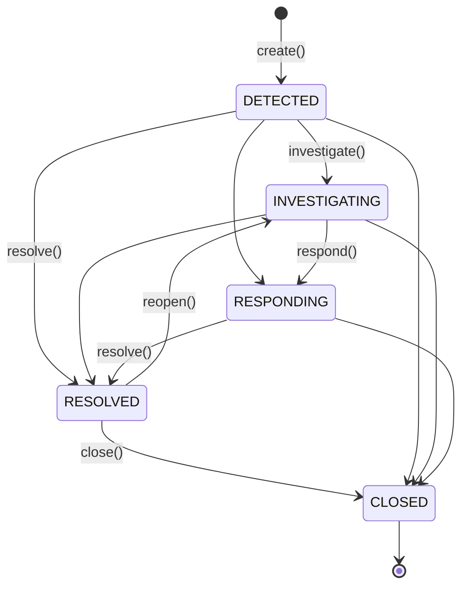

# tritium_lib.incident

**The lifecycle of an incident, from detection to resolution.** Create an
incident, walk it through a state machine (detected -> investigating ->
responding -> resolved -> closed), record every event on a timeline, assign
and release resources, escalate severity, and capture how it was resolved
(with lessons learned). Alert escalations can auto-open incidents.

**Where you are:** `tritium-lib/src/tritium_lib/incident/`
**Parent:** [`../`](../) — the tritium-lib package map

## What it's for

A tracker sees *targets*; an operator manages *incidents*. When an alert fires
("Hostile in Zone Alpha"), someone has to own the response: dispatch a drone,
log what happened when, escalate if a second hostile appears, and close it out
with a summary the next shift can read. This package is that operator-facing
casebook — pure data model + logic (stdlib only), thread-safe, EventBus-aware.

## How it works

The `Incident` state machine (`_VALID_TRANSITIONS`, `__init__.py:112`), enforced
by `IncidentManager.transition()`:

`resolve()` also attaches a `Resolution` and auto-releases every active
resource; `escalate()` only ever moves severity *upward*; `merge()` folds a
secondary incident's targets/alerts/tags into a primary and resolves the
secondary as "merged".

## Files

Single-module package (`__init__.py`, ~1340 lines):

| Object | Where | What it does |
|--------|-------|--------------|
| `IncidentState` / `IncidentSeverity` | `:94` / `:103` | The lifecycle enum (5 states) and severity enum (LOW/MEDIUM/HIGH/CRITICAL). |
| `TimelineEntry` | `:125` | One timestamped event: `description`, `author`, `entry_type` (note/state_change/escalation/assignment/alert/action/resolution), `metadata`. |
| `Timeline` | `:178` | Chronological entry collection: `add`, `get_entries` (filter by type/since/limit), `latest`, `to_list`/`from_list`. |
| `AssignedResource` | `:262` | A person/drone/unit on the incident: `role`, `assigned_at`/`released_at`, `is_active`, `release()`. |
| `Resolution` | `:325` | The outcome: `summary`, `resolution_type`, `lessons_learned`, `follow_up_actions`. |
| `Incident` | `:378` | The full record — owns a `Timeline`, a list of `AssignedResource`, an optional `Resolution`; `is_open`, `active_resources`, `duration_seconds`, `can_transition_to`, `to_dict`/`from_dict`. |
| `IncidentManager` | `:516` | The engine. `create` (`:568`), `transition`/`investigate`/`respond` (`:655`), `escalate` (`:718`), `resolve` (`:783`), `close`/`reopen`, `assign_resource`/`release_resource` (`:908`/`:966`), `add_timeline_entry`, the query API (`get_all` `:1128` with 8 filters, `get_open`, `get_by_target`), `merge` (`:1219`), `get_stats`, LRU `_evict_if_needed`. |

**Alert integration:** `connect_alert_engine()` (`:1027`) registers a handler on
an `AlertEngine` so `DispatchAction.ESCALATE` alerts auto-create incidents;
`create_from_alert()` (`:1078`) does it manually from an `AlertRecord`. Both map
alert severity -> `IncidentSeverity` and copy the alert's target/zone/record ids.

## Core objects & typed actions (Palantir lens)

- **Objects:** `Incident` (the case), `TimelineEntry` (an event), `AssignedResource`
  (a committed asset), `Resolution` (the closeout).
- **Links:** an incident links to `target_ids` (the tracked entities involved),
  a `zone_id`, `alert_ids` (the alerts that spawned/fed it), and — via `merge` —
  to a parent incident.
- **Typed actions:** `create` · `investigate`/`respond` · `escalate` · `resolve` ·
  `close`/`reopen` · `assign_resource`/`release_resource` · `merge`. Every one
  appends a typed `TimelineEntry` and publishes an `incident.*` EventBus event —
  the casebook is itself an audit log.

## How it's consumed (verified 2026-07-11)

**Transitively live via the SitAware capstone** — the same shape as
`alerting` / `mission` / `monitoring` (Operations family, iter-14). No sc, edge,
or addon code imports `tritium_lib.incident` directly. It reaches the running
server through one seam:

- `sitaware/engine.py:31` imports `IncidentManager` and **constructs one at
  `:344`** (`self._incidents`, exposed via the `incidents` property `:411`); the
  SitAware snapshot carries `incident_count` (`engine.py:187-220`).
- SC mounts the `SitAwareEngine` at boot (`app/main.py:159` router,
  `:1302` `_sitaware()`, on `app.state.sitaware_engine`), so incidents surface
  **read-only** through `/api/sitaware/*`.
- **No incident CRUD operator surface yet** — nothing in SC lets an operator
  create/escalate/assign/resolve an incident from the browser, and no alert
  engine is actually `connect_alert_engine`'d at runtime (grep: callers are
  tests + the demo). Capable-but-underexposed, exactly like `mission`.
- `sitaware/demos/sitaware_demo.py:40` uses `IncidentSeverity`.
- **64 tests** in `tests/test_incident.py` (green).

## Related

- [../alerting/](../alerting/) — `AlertEngine`/`AlertRecord`/`DispatchAction`; the escalation source
- [../sitaware/](../sitaware/) — the capstone that owns the live `IncidentManager`
- [../mission/](../mission/) — the sibling lifecycle engine (missions, not incidents); same "live via SitAware, no operator UI" status
- [../events/](../events/) — the `EventBus` incidents publish `incident.*` events to
