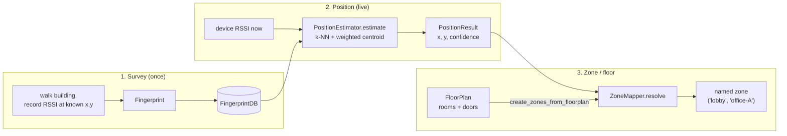

# tritium_lib.indoor — WiFi/BLE fingerprint positioning

**Where you are:** `tritium-lib/src/tritium_lib/indoor/`

**Parent:** [tritium_lib package map](../README.md) | [tritium-lib CLAUDE.md](../../../CLAUDE.md)

## What this is for

Track a target **inside a building, where GPS is dead**, using the RSSI it
already leaks to WiFi access points and BLE beacons. You survey a space once
(record RSSI at known spots), then any live device's RSSI readings resolve to
an `(x, y)` position and a human-readable zone ("lobby", "server-room"). This
is the indoor half of the operational mission — one target ID, every sensor,
inside and out.

Pure Python (`stdlib math`, no numpy). RSSI-distance conventions match
[`../signals/`](../signals/README.md) so indoor and outdoor RF reasoning agree.

## The workflow (`__init__.py:4`) — three phases

1. **Survey** — record the RSSI a spot sees from each visible AP/beacon into a
   `Fingerprint`; collect them in a `FingerprintDB`.
2. **Position** — a live device reports current RSSI; `PositionEstimator` finds
   the *k* nearest reference fingerprints (k-NN in RSSI space) and returns a
   confidence-weighted centroid.
3. **Zone / floor** — `ZoneMapper` resolves that `(x, y)` to a named zone;
   `PositionEstimator.estimate_floor` picks the floor; `FloorPlan` supplies the
   room/door geometry zones can be derived from.

## Objects & typed actions (Palantir lens)

| Object | What it is |
|--------|-----------|
| `Fingerprint` | an RSSI snapshot `{ap_id: dBm}` at a known `(x, y, floor)` (`to_dict`/`from_dict`) |
| `FingerprintDB` | the survey map — a queryable bag of fingerprints |
| `PositionResult` | an estimated `(x, y)` + `confidence` (`to_dict`) |
| `FloorPlan` / `Room` / `Door` / `RoomType` | building geometry for path-based reasoning and containment |
| `ZoneMapper` / `Zone` | named regions and the resolver that maps a position to one |

| Typed action | Where (file:line) | Turns … into … |
|--------------|-------------------|----------------|
| `FingerprintDB.find_nearest` | `fingerprint.py:232` | live RSSI → the *k* closest survey fingerprints |
| `Fingerprint.rssi_distance` | `fingerprint.py:71` | two RSSI vectors → Euclidean distance in dBm space |
| `PositionEstimator.estimate` | `estimator.py:124` | live RSSI → `PositionResult(x, y, confidence)` |
| `PositionEstimator.estimate_floor` | `estimator.py:178` | live RSSI → best-guess floor |
| `ZoneMapper.resolve` / `resolve_name` | `zone_mapper.py:140,190` | `(x, y)` → `Zone` / zone name |
| `ZoneMapper.create_zones_from_floorplan` | `zone_mapper.py:214` | a `FloorPlan`'s rooms → zones |
| `FloorPlan.find_room_at` | `floorplan.py:263` | `(x, y)` → the containing `Room` |

## Key files

| File | Contains |
|------|----------|
| `fingerprint.py` | `Fingerprint` (RSSI-space distance metrics) + `FingerprintDB` (survey store + k-NN `find_nearest`) |
| `estimator.py` | `PositionEstimator` (k-NN weighted centroid) + `PositionResult` |
| `floorplan.py` | `FloorPlan`, `Room`, `Door`, `RoomType` — lightweight building geometry |
| `zone_mapper.py` | `ZoneMapper`, `Zone` — cluster positions / rooms into named regions |

## How it's consumed (grep 2026-07-11)

| Consumer | hits |
|----------|------|
| tritium-sc | 3 (`plugins/indoor_positioning/fusion.py`) |
| tritium-lib tests | 2 |

The consumer is the **`indoor_positioning` SC plugin** (WiFi+BLE fusion). Its
`fusion.py` (Gap-fix B-8) deliberately **prefers these lib primitives over its
own hand-rolled k-NN**: `_build_fingerprint_db` wraps floorplan-store
fingerprint dicts in a `FingerprintDB`, then delegates nearest-neighbour search
to it and position estimation to `PositionEstimator`. (The plugin stores survey
points as lat/lon and converts to lib's local `x/y` at the boundary.) This is
the standing lib-extraction pattern: the app owns storage + I/O; the reusable
algorithm lives here.

## Related

- [`../signals/`](../signals/README.md) — RSSI smoothing, path-loss distance,
  and fingerprinting for the *outdoor* / device-re-id side; shared RSSI
  conventions.
- [`../geo/`](../geo/README.md) — the local-metre ↔ lat/lng frame the plugin
  converts survey points through.
- [`../tracking/`](../tracking/) — where an indoor fix becomes a correlated
  target ID on the unified map.
