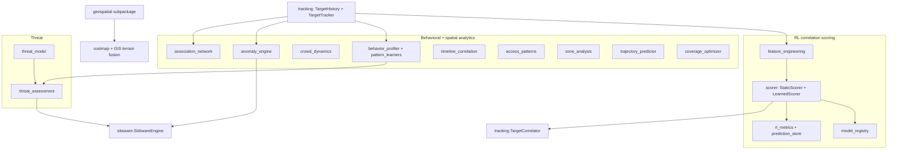

# tritium_lib.intelligence

**Where you are:** `tritium-lib/src/tritium_lib/intelligence/`
**Parent:** [../README.md](../README.md)

The analytics brain that sits *above* raw tracking. Where
[`tracking`](../tracking/README.md) answers "what is where,"
`intelligence` answers the harder questions: *is this correlation real, is
this behavior normal, is this target a threat, where is it going, who does
it associate with.* It is 26 modules plus an 18-file `geospatial/`
subpackage — the largest package in the library by source volume — grouped
into four concerns: the **RL correlation scorer** (the learning core),
**behavioral & spatial analytics**, **threat assessment**, and
**imagery-to-terrain geospatial segmentation**.

Nothing here is required to run: every learned model degrades to a
hand-tuned baseline, and every engine is optional enrichment over the
tracker. `LearnedScorer` falls back to `StaticScorer`; `AutoencoderDetector`
falls back to `SimpleThresholdDetector`.

## How it fits together



## The Palantir-ontology lens

- **Objects** (the dataclasses this package emits): `ScorerResult`,
  `Anomaly` / `AnomalyAlert`, `ThreatAssessment` / `ThreatMatrix` /
  `ThreatIndicator`, `BehavioralProfile` / `LongTermBehaviorProfile`,
  `Association` / `TargetGroup` / `KeyPlayer`, `CrowdCluster` /
  `CrowdState`, `TimelineEvent` / `CausalChain`, `AccessEvent` /
  `TailgateAlert`, `Hotspot` / `ZoneReport`, `Prediction` /
  `DestinationPrediction`, `CoverageMap` / `CoverageGap`.
- **Links** (what they consume): almost everything reads
  `tracking.TargetHistory` position trails and `tracking.TargetTracker`
  target state; the scorer's output flows *back* into
  `tracking.TargetCorrelator`; the engines' output flows *up* into
  `sitaware.SitAwareEngine`.
- **Typed actions** (the verbs): `train()` / `predict()` (learners &
  scorers), `detect()` / `analyze()` (anomaly, crowd),
  `build_from_tracking()` (association network), `optimize_placement()`
  (coverage), `frequency_analysis()` (access patterns).

## Modules by concern

### RL correlation scoring — the learning core

Answers "are these two detections the same physical entity?" with a
probability, not a hand-wave. This is the model the maintenance baseline
tracks (the 16-feature `LearnedScorer`; canonical feature set in
`FEATURE_NAMES`).

| File | Purpose |
|------|---------|
| `scorer.py` | `CorrelationScorer` ABC + `StaticScorer` (hand-tuned weights, always available) and `LearnedScorer` (trained logistic regression). `FEATURE_NAMES`, `DEFAULT_WEIGHTS`, `ScorerResult`. |
| `feature_engineering.py` | Feature extraction — `build_extended_features`, `co_movement_score`, `time_similarity`, `source_diversity`, `wifi_probe_temporal_correlation`. |
| `base_learner.py` | `BaseLearner` ABC — the `train / predict / save / load / get_stats` contract every learner honors. |
| `model_registry.py` | `ModelRegistry` — SQLite-backed versioned model persistence. |
| `rl_metrics.py` | `RLMetrics` — model-health tracking: accuracy, feature importance, `FeatureAblation`, `TrainingSnapshot`, prediction distribution. |
| `prediction_store.py` | `PredictionStore` — durable SQLite history of `PredictionRecord`s (gap-fix B-6: RLMetrics used to lose predictions on restart). |
| `fusion_metrics.py` | `FusionMetrics` — correlation-pipeline health (confirm/reject rate, per-strategy accuracy). |
| `mot_eval.py` | Thin wrapper over py-motmetrics (MIT) → CLEAR-MOT / IDF1 scorecards for tracker evaluation. |
| `pattern_learning.py` | `PatternLearner` — learns which behavior sequences *predict threats* (pattern → outcome). |

### Behavioral & spatial analytics

| File | Purpose |
|------|---------|
| `anomaly.py` | `AnomalyDetector` ABC + `SimpleThresholdDetector` (no deps) and `AutoencoderDetector` (numpy). |
| `anomaly_engine.py` | `AnomalyEngine` — real-time per-zone / per-time-of-day behavioral baselines; flags speed/dwell/route/count deviations. Emits `AnomalyAlert`. |
| `behavior_profiler.py` | `BehaviorProfiler` — long-term multi-dimensional profiles (temporal, spatial, social, device); `TargetRole`, `BehaviorChange`, `TransitCorridor`. |
| `behavioral_pattern_learner.py` | `BehavioralPatternLearner` — learns an individual target's routines (routes, schedules, zones) and alerts on deviation. |
| `crowd_dynamics.py` | `CrowdDynamicsAnalyzer` — crowd formation / growth / dispersal, density estimation, flow analysis. Feeds the riot/crowd stack. |
| `association_network.py` | `AssociationNetwork` — weighted relationship graph from four evidence kinds; `KeyPlayer`, `TargetGroup`, `WeakLink`, `build_from_tracking`. |
| `timeline_correlation.py` | `TimelineCorrelator` — temporal links across target timelines: escort, meetup, surveillance, `CausalChain`. |
| `access_patterns.py` | Zone-access analysis — `detect_tailgating`, `detect_piggybacking`, `frequency_analysis`. |
| `zone_analysis.py` | `ZoneAnalyzer` — per-zone activity patterns, hotspots, peak hours, activity prediction. |
| `trajectory_predictor.py` | `TrajectoryPredictor` — where a target is heading; blends Kalman, road constraints (`RoadConstrained`), learned routine (`RoutineAware`), group motion (`FlockAware`). |
| `coverage_optimizer.py` | Sensor placement optimization — `optimize_placement`, `coverage_gaps`, `redundancy_analysis`, `SENSOR_RANGE_PROFILES`. |
| `position_estimator.py` | Anchor-weighted position estimate for non-GPS devices from detection edges + RSSI. |

### Threat assessment

| File | Purpose |
|------|---------|
| `threat_model.py` | `ThreatModel` — composite per-target score from weighted `ThreatSignal`s; `ThreatLevel`, `score_to_threat_level`, `THREAT_THRESHOLDS`. |
| `threat_assessment.py` | `ThreatAssessmentEngine` — advanced multi-source fusion (signal, movement, temporal, association, history) into `ThreatMatrix` / `AreaAssessment` / `ThreatPrediction`. |

### Acoustic classification

| File | Purpose |
|------|---------|
| `acoustic_classifier.py` | Audio-event classifier (gunshot / voice / vehicle / animal / glass-break) — three tiers (rule → MFCC+KNN → learned). |
| `acoustic_classifier_train.py` | Training harness for the acoustic classifier (ESC-50-class datasets). |

### `geospatial/` subpackage (18 files)

Imagery → classified terrain polygons. Distinct enough to own its own
namespace (`tritium_lib.intelligence.geospatial`): segment → classify →
cache → query, producing buildings/roads/water/vegetation/sidewalk layers
consumed by pathfinding, NPC AI, and GIS/costmap fusion. Key modules:
`segmentation.py`, `terrain_classifier.py`, `terrain_layer.py`,
`sidewalk_graph.py`, `osm_enrichment.py`, `dual_resolution.py`,
`tile_downloader.py`, `mission_generator.py`, plus a `cli.py`.

## Consumed by (dated 2026-07-11, grep `from tritium_lib.intelligence`)

- **tritium-sc (the app): 28 import sites** — the SC intelligence plugin and
  tactical engine wrap these (`tritium-sc/src/engine/intelligence/`).
- **lib-internal: 9 sites** — mostly `fusion` (scorer, feature_engineering,
  fusion_metrics) and `sitaware` (anomaly_engine).
- **tests: 189 sites** — by far the most-tested lib package; the RL scorer,
  threat, anomaly, crowd, and association engines each carry dedicated suites.

## Usage

```python
from tritium_lib.intelligence import StaticScorer, build_extended_features

feats = build_extended_features(distance=12.0, co_movement=0.8, rssi_delta=3.0)
scorer = StaticScorer()                       # always-available baseline
result = scorer.predict(feats)                # ScorerResult(probability, confidence, method)
```

## Related

- [../tracking/README.md](../tracking/README.md) — the target state this package reasons over
- [../fusion/README.md](../fusion/README.md) — uses the scorer + fusion_metrics
- [../sitaware/README.md](../sitaware/README.md) — consumes anomaly + threat output
- [../classifier/README.md](../classifier/README.md) — device-type classification (a different axis)
