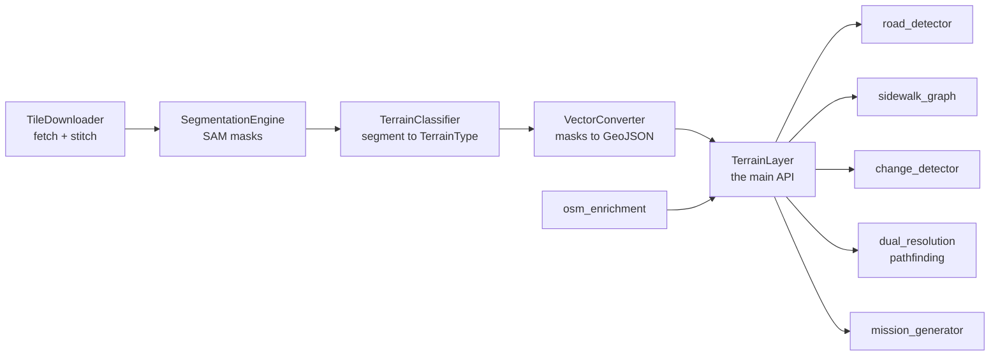

# tritium_lib.intelligence.geospatial

Turns satellite / aerial imagery into classified terrain polygons the rest of
the system can reason over -- buildings, roads, water, vegetation, sidewalks,
parking. "Process once, use everywhere": download tiles, segment, classify,
cache, then query cheap forever.

**Where you are:** `tritium-lib/src/tritium_lib/intelligence/geospatial/`

The output feeds pathfinding (movement-cost tables per unit class), NPC/AI
movement, commander intelligence (mission generation), and GIS fusion. Heavy
deps (torch, SAM, rasterio, shapely, cv2) are all **optional** and guarded --
the Pydantic models import on a bare Jetson; the ML pipeline only pulls its
weight when the deps are present.

## The pipeline



## Files

| File | What it does |
|------|--------------|
| `models.py` | Pydantic contracts: `AreaOfOperations`, `SegmentationConfig`, `SegmentedRegion`, `TerrainLayerMetadata`, `MovementCostTable`, and the per-class cost tables (`PEDESTRIAN_COSTS`, `LIGHT_VEHICLE_COSTS`, `HEAVY_VEHICLE_COSTS`, `DRONE_COSTS`, `ROVER_COSTS`). Always importable. |
| `_deps.py` | Optional-dependency guards: `HAS_NUMPY`, `HAS_PILLOW`, `HAS_RASTERIO`, `HAS_SHAPELY`, `HAS_TORCH`, `HAS_SAM`, `HAS_CV2`. Every heavy module checks these and degrades gracefully. |
| `terrain_layer.py` | `TerrainLayer` -- the main entry point. Orchestrates the pipeline and exposes the queryable classified layer. |
| `tile_downloader.py` | TMS tile downloader -- fetch, cache, and stitch satellite imagery for an area of operations. |
| `providers.py` | Satellite imagery provider registry (which tile source to pull from). |
| `segmentation.py` | SAM-based image segmentation engine (Segment Anything). Raw imagery to unlabeled masks. |
| `terrain_classifier.py` | Maps image segments to a `TerrainType` (building / road / water / vegetation / ...). |
| `vector_converter.py` | Converts raster masks to GeoJSON polygons for map layers and geometry queries. |
| `road_detector.py` | Specialized pre-pass for road identification (roads are hard for generic segmentation). |
| `sidewalk_graph.py` | Builds a `SidewalkGraph` -- a pedestrian navigation network derived from terrain. |
| `osm_enrichment.py` | Fuses OpenStreetMap semantics onto the segmentation (named streets, building tags). |
| `change_detector.py` | Temporal change detection between two captures of the same layer. |
| `dual_resolution.py` | Dual-resolution terrain-aware pathfinding (coarse global + fine local). |
| `mission_generator.py` | Generates tactical missions from detected terrain features. |
| `llm_client.py` | LLM client (llama-server) for geospatial intelligence -- narrative + reasoning over the layer. |
| `cli.py` | Command-line entry point for running geospatial operations. |

## How it fits

`intelligence/` reasons over target state and the operating picture; this
subpackage is its **spatial substrate**. A `TerrainLayer` gives movement-cost
fields to the sim-engine planner and the `dual_resolution` pathfinder, feeds
GIS map layers (via GeoJSON), and gives `mission_generator` + the LLM client
real terrain to plan against.

## Usage

```python
from tritium_lib.intelligence.geospatial import AreaOfOperations, SegmentationConfig
from tritium_lib.intelligence.geospatial.terrain_layer import TerrainLayer

# Models import with no heavy deps; the pipeline needs the optional extras.
layer = TerrainLayer(AreaOfOperations(...), SegmentationConfig(...))
layer.build()          # download -> segment -> classify -> vectorize -> cache
cost = layer.movement_cost(lat, lon, unit="rover")
```

Import pipeline stages directly (they are not re-exported from `__init__` to
keep the light import path clean):

```python
from tritium_lib.intelligence.geospatial.tile_downloader import TileDownloader
from tritium_lib.intelligence.geospatial.segmentation import SegmentationEngine
from tritium_lib.intelligence.geospatial.terrain_classifier import TerrainClassifier
from tritium_lib.intelligence.geospatial.vector_converter import VectorConverter
```

## Dependencies

Models + cost tables: pure Pydantic (always available). Pipeline: numpy,
Pillow, rasterio, shapely, cv2, torch + Segment Anything -- all optional and
guarded by `_deps.py`. Absent deps disable the relevant stage rather than
crashing the import.

**Parent:** [../README.md](../README.md)
