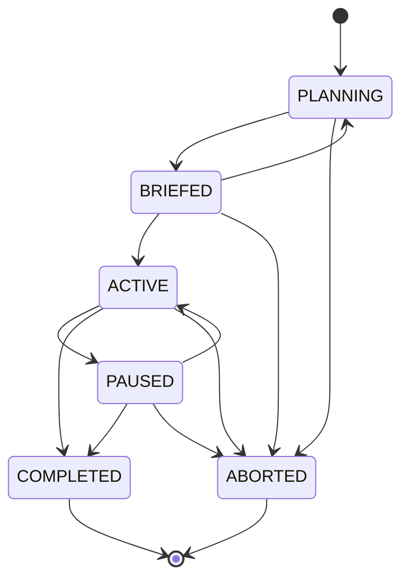

# tritium_lib.mission

Plan and coordinate surveillance/security operations end to end: define a
mission with objectives, resources, schedule and constraints; brief it;
activate it; and track it through to completion or abort — with a strict
state machine and EventBus lifecycle events throughout.

**Where you are:** `tritium-lib/src/tritium_lib/mission/`

## What it's for

Above the level of individual targets and rules sits the *operation*: "run
a 4-hour perimeter watch on the north fence with these two cameras and one
drone." `MissionPlanner` is the registry and lifecycle manager for those
operations. It holds the objectives (what to achieve), the resource
allocations (which sensors/devices are committed), the schedule (when), and
generates a human-readable `MissionBrief`. It integrates with the
`AlertEngine` for mission-scoped alerts and the `geo` module for
areas-of-interest.

## Mission lifecycle (the real state machine)

Transitions are enforced by `_VALID_TRANSITIONS`
(`mission/__init__.py:~148`) and `Mission.can_transition_to()`; illegal
jumps are rejected. `COMPLETED` and `ABORTED` are terminal.

## Files

| File | What's in it |
|------|--------------|
| `__init__.py` | The bulk (~57 KB). `MissionPlanner` plus the object model: `Mission`, `MissionObjective` + `ObjectiveStatus`, `ResourceAllocation`, `MissionSchedule`, `MissionConstraint`, `MissionBrief`, `MissionStatus`, and the `MissionType`/`MissionState`/`MissionPriority` enums. Everything is `to_dict`/`from_dict` serializable. |
| `defense.py` | Pure tactical helper — `rank_hold_points()` and `assign_defenders_to_chokepoints()`. Given GIS chokepoint objects (`hold_value`/`key_terrain` from `geo.gis.chokepoints`) and defender units, decides which crossings to garrison, nearest unit first. Deterministic, no planner state. |

## Core objects & typed actions (Palantir lens)

- **Objects:** `Mission` (the operation), `MissionObjective` (what to
  achieve), `ResourceAllocation` (an asset committed to an objective),
  `MissionBrief`/`MissionStatus` (read models).
- **Links:** mission→objectives (`add_objective`), objective→resources
  (`allocate_resource` / `release_resource`), mission→constraints
  (`add_constraint`), mission→area-of-interest (via `geo`).
- **Typed actions (all publish EventBus lifecycle events):** `create_mission`,
  `activate`, `pause`, `complete`, `abort`, `replan`, `generate_brief`,
  `update_objective_status`. `MissionType`: `SURVEILLANCE` · `TRACKING` ·
  `PERIMETER` · `INVESTIGATION` · `PATROL`. `MissionPriority`:
  `LOW`/`MEDIUM`/`HIGH`/`CRITICAL`.
- **Decisions as data:** `get_status()` (live `MissionStatus`),
  `get_stats()` (fleet-wide counts) — the readouts a mission board renders.

## How it's consumed (verified 2026-07-11)

**Reaches production transitively via the SitAware capstone; no direct SC
consumer and no dedicated mission UI yet.**

- `tritium_lib/sitaware/engine.py:32,347` — `SitAwareEngine` imports and
  instantiates `MissionPlanner(event_bus=...)`. That engine is wired into
  SC at `app/main.py:2402`, so a `MissionPlanner` is live inside the
  capstone — but nothing in SC currently drives mission planning through an
  operator surface. This is capable-but-underexposed: the planner exists
  and runs; the UX Loop to create/brief missions from the browser is the
  missing half.
- `tritium_lib/sitaware/demos/sitaware_demo.py:41` exercises it in a demo.
- Do not confuse with `tritium_lib.models.mission` (imported at
  `models/__init__.py:368`) — those are the mission *data models*; this
  package is the *planner/engine* over them.

6 test files cover this package.

## Related

- [../sitaware/](../sitaware/) — the capstone that instantiates the planner
- [../alerting/](../alerting/) — mission-scoped alerts
- [../geo/](../geo/) — areas-of-interest and `gis.chokepoints` (used by `defense.py`)
- [../models/](../models/) — `models.mission` data models
