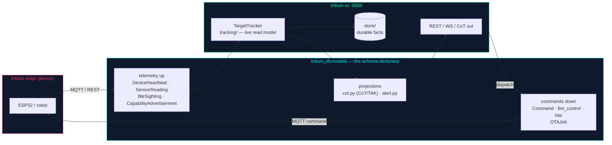

# tritium_lib.models — the wire contracts

**Where you are:** `tritium-lib/src/tritium_lib/models/` — the typed
vocabulary every Tritium component serializes to and from. If two processes
exchange a fact (over MQTT, REST, WebSocket, or CoT), the shape of that fact
is defined here.

**Parent:** [`../README.md`](../README.md) (whole-library map) ·
[`../../../CLAUDE.md`](../../../CLAUDE.md) (tritium-lib)

## What this package is

106 modules, **577 names exported** from `__init__.py` (538 `class`
definitions — Pydantic v2 models, plus their `Enum`s and a few dataclasses),
measured 2026-07-11. It is the largest package in the library and the most
imported: **59 call sites in tritium-sc, 19 in tritium-edge, 54 lib-internal,
1 in tritium-addons** (DATED grep of `from tritium_lib.models`, 2026-07-11).
Nothing else in the CORE family comes close — this is the backbone the whole
system leans on.

The package docstring states the doctrine plainly (`__init__.py:4-19`):

> This package **IS** Tritium's semantic layer — the single typed vocabulary
> of objects and properties. The `tritium_lib.ontology` package and the SC
> `/api/v1/ontology` router schema are **VIEWS** of this layer; where they
> drift, **these models win**, and the views must be derived or retired. New
> entity concepts land HERE first.

So this is the source of truth for *what things are*, deliberately above any
one storage or transport choice.

## The boundary you must not blur

`models/` holds **contracts** — inert, serializable Pydantic types. It does
**not** hold live state:

- The live tactical entity is `TrackedTarget`, defined in
  [`../tracking/`](../tracking/) at `tracking/target_tracker.py:183`, held
  in memory by `TargetTracker` (the read model). It is *not* a
  `models/` class.
- Durable facts live in [`../store/`](../store/), which serializes these
  models into SQLite.

Rule of thumb: if it moves on a wire or sits in a database column, its
*schema* is here; the *object that lives and changes* is in `tracking/` or
`store/`.

## Ontology lens

In Palantir-Ontology terms this package defines the **object types and their
properties** for the entire system. `command.py` (`Command`, `CommandType`,
`CommandStatus`) is the typed-action vocabulary; `capability.py`
(`CapabilityAdvertisement`) is how an object announces which actions it
supports; `cot.py` projects objects into the CoT/TAK interchange format.
Links and live instances are assembled a layer up (`tracking/`, `fusion/`,
`store/`) — this layer is the dictionary, not the running graph.

## How the contracts flow

Every device that speaks the Tritium protocol imports the *same* Pydantic
types, so a `DeviceHeartbeat` built on an ESP32-facing test and one parsed by
the command center are byte-compatible by construction.

## The families (don't read all 106 — read the map)

The whole-library map in [`../README.md`](../README.md) one-lines every
module with a grounded file cite. The rough shape:

| Domain | Representative modules |
|--------|------------------------|
| Devices & fleet | `device.py`, `capability.py`, `fleet.py`, `firmware.py`, `command.py` |
| Sensors & signals | `sensor.py`, `ble.py`, `acoustic_*.py`, `ais.py`, `cot.py` |
| Intelligence | `dossier.py`, `behavior.py`, `correlation*.py`, `confidence.py`, `clustering.py` |
| Tactical / sim | `scenario.py`, `city.py`, `convoy*.py`, `autonomous.py` |
| Ops | `alert*.py`, `analytics*.py`, `diagnostics.py`, `deployment.py` |
| Config | `config.py` (the `SystemConfigModel` round-trip helpers — note: **not** the [`../config/`](../config/) settings package) |

### Recently landed — the robot wire contracts (sim-to-real on-ramp)

Three modules added for the P6 robotics push (2026-07) are the direct wire
language a simulated *or* real robot dog speaks. They are the clearest
example of a contract that is both fun (drives Nerf-class battles in the sim)
and production (the actuator/health path for real hardware):

- **`fire_control.py`** — turret actuation contract (`turret_aim` / `fire`
  commands + `WeaponStatus` telemetry). Docstring: *"the wire contract for
  turret actuation."*
- **`hits.py`** — hit-feedback contract: `RegisterHitCommand`, `HitReport`,
  `HealthStatus`, `HealthTracker` (taking damage and owning health), carried
  on the existing command topic.
- **`quadruped.py`** — robot-dog *profile* models, the *"shared gait
  vocabulary."*

These ride the same command/telemetry topics the rest of the fleet already
uses — which is exactly why a simulated dog and a real one are
interchangeable to the operator.

## Conventions

- Pydantic v2 (`model_config`, not `class Config`).
- Every public model is listed in `__init__.py`'s `__all__` (577 names).
- Changing a model here is a cross-repo event — verify consumers in
  tritium-sc and tritium-edge before landing (see the consumer counts above).

## Tests

`tests/test_models.py` plus per-domain suites at the top level
(`test_cot_models.py`, `test_behavior_models.py`, `test_sdr_models.py`, …)
and in `tests/models/` (the robot contracts: `test_fire_control.py`,
`test_hits.py`, `test_quadruped.py`). Model round-trip and validation
coverage is part of the lib baseline.

## Related

- Live state that consumes these contracts: [`../tracking/`](../tracking/)
- Durable serialization: [`../store/`](../store/)
- Views derived from this layer: [`../ontology/`](../ontology/)
- Whole-library one-liner map: [`../README.md`](../README.md)
