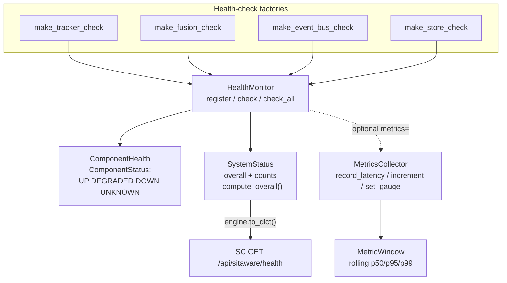

# tritium_lib.monitoring

Dependency-free health and metrics for the tracking pipeline. No
Prometheus, no Grafana, no external agent — just an in-process
`HealthMonitor` that runs component health checks and a `MetricsCollector`
that keeps rolling latency/counter/gauge windows. Built to answer "is the
capstone actually up?" from inside the same process.

**Where you are:** `tritium-lib/src/tritium_lib/monitoring/`

## What it's for

The system fuses sensors, fires alerts, and serves a UI — and you need to
know when a piece of that is degraded or dead without standing up an
observability stack. `HealthMonitor` holds a set of named health-check
callables (tracker, fusion, event bus, store), runs them on demand, and
aggregates a single `SystemStatus` (`up`/`degraded`/`down`).
`MetricsCollector` gives you p50/p95/p99 latency windows, monotonic
counters, and point-in-time gauges — all bounded, all in memory.

## How it works

## Files

| File | What's in it |
|------|--------------|
| `health.py` | `HealthMonitor`, `ComponentHealth`, `SystemStatus`, the `ComponentStatus` enum (`UP`/`DEGRADED`/`DOWN`/`UNKNOWN`), the `HealthCheck` type alias, `_compute_overall()`, and ready-made check factories: `make_tracker_check`, `make_fusion_check`, `make_event_bus_check`, `make_store_check`. |
| `metrics.py` | `MetricsCollector`, `MetricWindow` (time-bounded ring with percentile stats), `MetricSample`. Latency histograms, counters, and gauges with `export()`. |

## Core objects & typed actions (Palantir lens)

- **Objects:** `ComponentHealth` (one subsystem's status + detail),
  `SystemStatus` (the aggregate), `MetricWindow` (a rolling series).
- **Links:** monitor→checks (`register(name, check)`), status→components
  (aggregated in `check_all()`).
- **Typed actions:** `register`/`unregister` a check, `check(name)` /
  `check_all()`, `record_latency` / `increment` / `set_gauge`. Readouts:
  `get_last_status()`, `MetricsCollector.export()`.
- **Decision rule:** `_compute_overall()` folds component statuses into one
  system verdict (any `DOWN` → down, any `DEGRADED` → degraded, else up).

## How it's consumed (verified 2026-07-11)

Split status — **HealthMonitor is production-wired via the capstone;
MetricsCollector is ready-but-unwired.**

- `HealthMonitor`: `tritium_lib/sitaware/engine.py:33,343` imports and
  instantiates `self._health = HealthMonitor()`. The capstone is mounted
  in SC (`app/main.py:2402`) and exposed at `GET /api/sitaware/health`
  (`tritium-sc/src/app/routers/sitaware.py:138`), which
  `system-health-panel.js` renders as structured components. So health
  data reaches the operator.
- `MetricsCollector`: no runtime instantiation outside docstring examples
  and tests (grep 2026-07-11). `HealthMonitor` accepts an optional
  `metrics=` collector, but the SitAware default constructs `HealthMonitor()`
  without one. Clean, tested, and waiting to be wired — a good pickup for a
  future latency-dashboard loop.
- `scheduler/builtin.py` references `HealthMonitor` inside its demo/wiring
  block for a periodic `check_sensor_health` task.

2 test files cover this package.

## Related

- [../sitaware/](../sitaware/) — instantiates `HealthMonitor` and exposes it
- [../../../../tritium-sc/src/app/routers/sitaware.py](../../../../tritium-sc/src/app/routers/sitaware.py) — `/api/sitaware/health`
- [../fleet/](../fleet/) — `HeartbeatMonitor` there is device-liveness; this is subsystem health
- [../scheduler/](../scheduler/) — periodic health-check task
