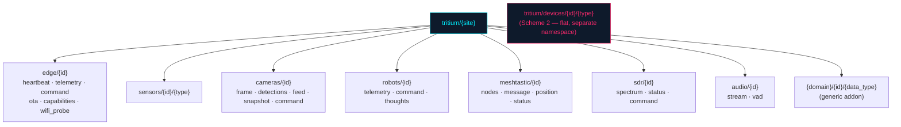

# tritium_lib.mqtt — the topic grammar (a spec, read honestly)

**Where you are:** `tritium-lib/src/tritium_lib/mqtt/` — the canonical
definition of how a Tritium MQTT topic is spelled, plus builders and parsers
for it.

**Parent:** [`../README.md`](../README.md) ·
[`../../../CLAUDE.md`](../../../CLAUDE.md)

## What this package is

One file — `topics.py` — that defines **two** topic conventions and the
functions to build and parse each. Everything is re-exported from
`__init__.py`.

### Scheme 1 — site-scoped (the `TritiumTopics` builder)

```
tritium/{site}/{domain}/{device_id}/{data_type}
```

`TritiumTopics(site_id="home")` builds every domain topic by method:
`edge_heartbeat` / `edge_telemetry` / `edge_command` / `edge_ota_status` /
`edge_capabilities`, `sensor`, `camera_frame` / `camera_detections` /
`camera_feed`, `robot_telemetry` / `robot_command` / `robot_thoughts`,
`meshtastic_*`, `sdr_*`, `audio_*`, plus the generic
`addon_device(domain, id, data_type)` for any addon domain
(`topics.py:134-309`). Subscription wildcards come as `all_edge()`,
`all_sensors()`, `all_cameras()`, `all_meshtastic()`, `all_sdr()`,
`all_addon_domain(domain)`. `parse_site_topic()` is the inverse.

### Scheme 2 — device-centric flat (module functions)

```
tritium/devices/{device_id}/{message_type}
```

Free functions `device_heartbeat` / `device_sensors` / `device_commands` /
`device_ota_status` + the `TOPIC_*` constants, with `parse_topic()` as the
inverse (`topics.py:16-101`). A flatter namespace with no site or domain
segment.

`ParsedTopic` is the shared dataclass both parsers return.

## Read this before you trust the docstring

`topics.py:4-6` calls itself *"single source of truth … Both tritium-sc and
tritium-edge import these."* **As of 2026-07-11 that is aspirational, not
true.** No `.py` file in tritium-sc or tritium-edge imports
`tritium_lib.mqtt` (DATED grep for `TritiumTopics` / `tritium_lib.mqtt` /
`parse_topic` across `tritium-sc/src`, `tritium-sc/plugins`,
`tritium-edge` — zero code hits). What actually builds topics today:

- **tritium-sc** hand-writes the strings inline in the *site-scoped grammar*
  — e.g. `engine/comms/mqtt_bridge.py` builds
  `tritium/{site}/cameras/{cam_id}/detections`,
  `tritium/{site}/robots/{robot_id}/command` directly. It matches Scheme 1's
  shape but does **not** call the builder.
- **tritium-edge** is C++ firmware; it *cannot* import a Python module. It
  hardcodes its own strings — `snprintf(..., "tritium/%s/heartbeat", ...)`
  (`lib/hal_mqtt/mqtt_sc_bridge.cpp:553`), a flatter form matching neither
  scheme exactly.
- The only live importer is this package's own demo,
  `mqtt/demos/mqtt_demo.py:40`.

So `topics.py` is best understood as **the written spec of the grammar and a
tested codec** — genuinely useful as the reference and reusable by any pure
Python consumer — but it is not currently a shared dependency wiring sc and
edge together. Treat "single source of truth" as the goal, not the state.

> **Routed out of this lane (doc bugs, not code):** `topics.py:5`'s "both
> import these" claim, and `tritium-edge/docs/INTEGRATION.md:195`'s
> `from tritium_lib.mqtt import TopicBuilder` — there is **no** `TopicBuilder`
> symbol (the class is `TritiumTopics`). Both belong to a follow-up doc fix.

## The site-scoped tree



## Ontology lens

A topic is the *address* of a typed channel: `{domain}` names the object kind
(camera, robot, sensor, sdr), `{device_id}` the instance, `{data_type}` the
property or action. `parse_topic` / `parse_site_topic` turn an address back
into those typed fields — the same object/property decomposition the
[`../models/`](../models/) layer defines, expressed as a routing key.

## Tests

`tests/test_mqtt.py`, `tests/test_mqtt_topics.py`,
`tests/test_mqtt_topics_extended.py`, `tests/test_mqtt_addon_topics.py`, and
`tests/mqtt/` cover both schemes, all builders, and round-trip parse.

## Related

- In-process bus (not the broker): [`../events/`](../events/)
- What travels on these topics: [`../models/`](../models/)
- SC broker bridge (hand-builds topics): `tritium-sc/src/engine/comms/mqtt_bridge.py`
- Edge MQTT HAL (C++, own strings): `tritium-edge/lib/hal_mqtt/`
