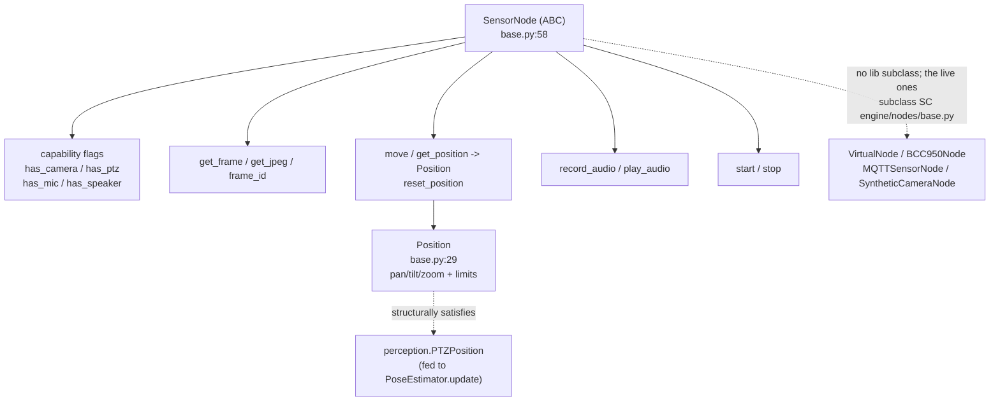

# tritium_lib.nodes

**The abstract interface for a sensor endpoint** — a physical or virtual thing
you can see through (camera), aim (PTZ), hear through (mic), and speak through
(speaker). `SensorNode` is the base class every concrete node would implement;
`Position` is its PTZ pose with limit-awareness.

**Where you are:** `tritium-lib/src/tritium_lib/nodes/`
**Parent:** [`../`](../) — the tritium-lib package map

> **Status: interface-only, never subclassed in-tree.** This is the extracted,
> generalized copy of a hardware interface. The **live** `SensorNode`/`Position`
> hierarchy is SC's own near-identical `engine/nodes/base.py` — this lib copy
> has **no concrete subclass anywhere** (dated grep 2026-07-11). Kept honest
> below; consolidation is a code decision (routed), not a docs one.

## What it's for

A camera node, a PTZ turret, an MQTT robot, a synthetic demo feed — from the
perspective of the perception + cognition stack these are the same shape: *can
I get a frame? can I move? can I record audio? can I play audio?* `SensorNode`
captures that shape as capability-flag properties (`has_camera`, `has_ptz`,
`has_mic`, `has_speaker`) plus graceful default methods that return `None`/no-op
until a subclass overrides them. numpy is optional here — frame/audio methods
degrade to `None` if it is absent, so importing the interface never drags in a
heavy dependency.

`Position` is the PTZ state: `pan`/`tilt`/`zoom` plus optional discovered
limits, with `can_pan_left`/`can_pan_right`/`can_tilt_up`/`can_tilt_down`
convenience properties.

## How it works

## API

Single-module package (`base.py`, 128 lines; re-exported by `__init__.py`):

| Object | Where | What it does |
|--------|-------|--------------|
| `Position` | `base.py:29` | PTZ pose dataclass: `pan`/`tilt`/`zoom` + optional `pan_min`/`pan_max`/`tilt_min`/`tilt_max`; `can_pan_left`/`can_pan_right`/`can_tilt_up`/`can_tilt_down` limit checks. |
| `SensorNode` | `base.py:58` | Abstract endpoint. Capability flags (`has_camera`/`has_ptz`/`has_mic`/`has_speaker`, all `False` by default). Camera: `get_frame`/`get_jpeg`/`frame_id`. PTZ: `move`/`get_position`/`reset_position`. Audio: `record_audio`/`play_audio`. Lifecycle: `start`/`stop`. Every method has a safe default so a partial node only overrides what it supports. |

## Core objects & typed actions (Palantir lens)

- **Objects:** `SensorNode` (an addressable endpoint, keyed by `node_id`),
  `Position` (its aim state).
- **Links:** a node's `Position` links its aim to discovered mechanical limits;
  a node's `frame_id` is the dedup key linking successive frames.
- **Typed actions:** `get_frame`/`get_jpeg` (see) · `move`/`reset_position`
  (aim) · `record_audio`/`play_audio` (hear/speak) · `start`/`stop` (lifecycle).

## How it's consumed (verified 2026-07-11)

**Shelfware in the library; the live twin is SC-local.** Dated grep finds
**no importer of `tritium_lib.nodes` in sc, edge, or addons**, and **no
subclass of the lib `SensorNode` anywhere** (only `tests/test_nodes_base.py` +
`tests/nodes/test_base.py` exercise it — **32 tests** total).

The functioning `SensorNode` hierarchy is SC's own
`tritium-sc/src/engine/nodes/base.py` — a **near-identical parallel copy**
(both define `Position` and `SensorNode(ABC)` with the same capability-flag
shape; the diffs are cosmetic: the SC docstrings name Amy, and SC imports
`numpy` unconditionally where this copy made it optional and added a `frame_id`
property). The live camera/robot nodes subclass **that** one:
`VirtualNode` (`engine/nodes/virtual.py:14`), `BCC950Node` (`bcc950.py:88`),
`MQTTSensorNode` (`mqtt_robot.py:34`), `SyntheticCameraNode`
(`synthetic_camera.py:35`); Amy's motor programs type against it
(`amy/actions/motor.py:18`).

**One real link to the rest of lib:** `Position` structurally satisfies the
[`perception.PTZPosition`](../perception/) protocol — `tests/perception/test_perception.py:13`
feeds a `nodes.Position` straight into `PoseEstimator.update()`. That is the
interoperability this interface was designed for; adopting the lib `SensorNode`
in SC (or deleting it as a duplicate) is the open decision, routed below.

## Related

- [../perception/](../perception/) — `PoseEstimator`/`PTZPosition`; `Position` satisfies its protocol
- `tritium-sc/src/engine/nodes/base.py` — the live parallel `SensorNode`/`Position` (the one that is actually subclassed)
