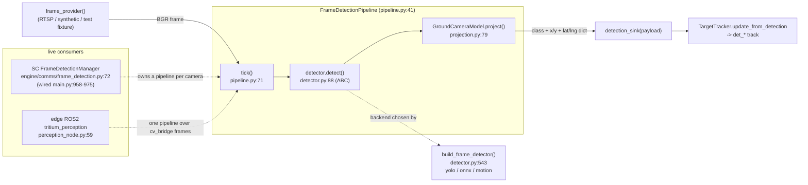

# tritium_lib.perception

**Turn a camera frame into a map track.** The reusable perception primitives
that sit between a raw BGR frame and the multi-sensor `TargetTracker`: cheap
OpenCV frame analysis (L0-L2), object detection with three interchangeable
backends, pixel->world projection, and a provider-driven loop that ties them
together. Plus the framework-free LLM chat client and regex fact-extraction
that Amy's cognition uses.

**Where you are:** `tritium-lib/src/tritium_lib/perception/`
**Parent:** [`../`](../) — the tritium-lib package map

This is the **most live-wired** package in the operational-glue group. The
same code runs on a synthetic demo feed (a person walks through a simulated
camera and lights up the tactical map — the fun half) and on real RTSP frames
from a security camera (the production half). Swapping a real camera in
changes the frame *source*, not this code.

## What it's for

A detection is a box in image pixels; the tactical map needs a world-positioned
`det_*` track that fuses with BLE/mesh/sim into one unique target id. This
package is that bridge, split into small, individually-testable rungs:

- **Analyse** a frame cheaply first (sharp? bright? moving?) before spending ML.
- **Detect** objects — real YOLO when a GPU/model is present, a classical MOG2
  motion detector otherwise (the honest always-available path, no torch).
- **Project** each detection's foot point to a bearing + range + lat/lng.
- **Emit** the projected detection to a sink — exactly the dict shape
  `TargetTracker.update_from_detection()` expects.

Everything is provider-driven: the frame source, camera pose, and detection
sink are injected callables, so the loop owns no framework objects.

## How it works

## Files

| File | What's in it |
|------|--------------|
| `perception.py` | Cheap L0-L2 frame analysis (no ML). `FrameAnalyzer` (`:127`) — one `analyze()` (`:140`) returns `FrameMetrics` (`:115`: sharpness/brightness/complexity/motion). `PoseEstimator` (`:58`) normalizes a raw PTZ position to a `CameraPose` (`:43`); it accepts anything satisfying the `PTZPosition` structural protocol (`:28`) so it never hard-imports a node type. |
| `detector.py` | `FrameObjectDetector` ABC (`:88`) — pixels in, `CameraDetection` boxes out — with three backends: `BackgroundMotionDetector` (`:111`, MOG2+contours, always available), `YoloObjectDetector` (`:223`, graceful ultralytics), `OnnxYoloDetector` (`:431`, CPU onnxruntime). `build_frame_detector()` (`:543`) picks the best available; `available_backends()` (`:538`) reports which. The pure ONNX math — `letterbox_frame` (`:291`), `decode_yolo_predictions` (`:325`, v5/v8 layouts + NMS) — is module-level and unit-testable without a model. `RELEVANT_CLASSES`/`COCO80_NAMES` are the shared vocabulary. |
| `projection.py` | `GroundCameraModel` (`:35`) — a documented pin-hole ground-plane model. `bearing_range()` (`:60`) maps a detection's foot point to (bearing, range); `project()` (`:79`) returns local metres + lat/lng (via `geo`, graceful without a reference). Bearing 0deg=N, 90deg=E — matches the embodiment SDK. |
| `pipeline.py` | `FrameDetectionPipeline` (`:41`) — the provider-driven loop. `tick()` (`:71`) grabs a frame, detects, projects, and emits; `start()`/`stop()` run it in a daemon thread. `_build_payload` (`:102`) shapes the tracker dict (falls back to normalized image coords when no pose is available). Every provider call is wrapped so a bad frame never kills the loop. |
| `extraction.py` | Pure-regex fact extraction from conversation: `extract_person_name` (`:27`, "I'm X" / "call me X") and `extract_facts` (`:54`, schedules / preferences / possessions / identity). No LLM calls. |
| `vision.py` | `ollama_chat` (`:69`) — framework-free LLM chat client, auto-detects llama-server (`/v1/chat/completions`, `cache_prompt`) vs ollama by port; `set_ollama_host` (`:57`) injects the host at app init; `check_radio_detection` (`:24`) is a simple BLE/WiFi proximity helper. |
| `__init__.py` | Flat re-export surface for all of the above. |

## Core objects & typed actions (Palantir lens)

- **Objects:** `FrameMetrics` (a frame's quality/motion), `CameraDetection`
  (a box + class + confidence, defined in `models.camera`), `GroundCameraModel`
  (a posed camera), `CameraPose` (a normalized PTZ pose), `FrameDetectionPipeline`
  (a running per-camera loop).
- **Links:** a detection is linked to its `source_id` (camera); a projected
  detection carries `lat`/`lng`/`bearing_deg`/`distance_m`; the sink links a
  detection to a `det_*` target id in the tracker.
- **Typed actions:** `analyze()` (grade a frame) · `detect()` (find boxes) ·
  `project()` (place in the world) · `tick()` (do all three + emit) ·
  `build_frame_detector()` (choose a backend) · `extract_facts()` (mine a
  transcript).

## How it's consumed (verified 2026-07-11)

**LIVE — this is the camera->detection->map production path**, wired in three
independent places:

- **SC (the operator server).** `engine/comms/frame_detection.py`
  (`FrameDetectionManager`, `:72`) is the SC consumer: `_default_detector_factory`
  (`:56`) calls `build_frame_detector(prefer="auto")`; `attach()` (`:146`) spins
  up one `FrameDetectionPipeline` per camera source; `_sink()` (`:101`) calls
  `tracker.update_from_detection(payload)` -> `det_*` tracks. It is wired at boot
  in `app/main.py:958-975` (when the `tritium.camera-feeds` plugin is present)
  and stored at `app.state.frame_detection`. This is the UX-Loop-8 production
  half — the same path a real RTSP camera takes.
- **Amy (cognition).** `set_ollama_host` (`app/main.py:243`, `amy/__init__.py:97`);
  `ollama_chat` (`amy/brain/agent.py:17`, `brain/thinking.py:19`,
  `commander.py:1527/1599/1856`, plus `engine/inference/robot_thinker.py:20`,
  `engine/simulation/npc_intelligence/think_scheduler.py:19`,
  `engine/perception/vision_prompts.py:31`); `FrameAnalyzer`/`FrameMetrics`/
  `PoseEstimator` and `extract_facts`/`extract_person_name` (`amy/commander.py:31,35`).
- **Edge (on-robot ROS2).** `tritium_perception/nodes/perception_node.py:59`
  imports the pipeline and runs it over `cv_bridge` frames, publishing
  `TrackedTarget`-shaped messages — the same detector, not a fork
  (`test/test_pipeline_integration.py` proves it, skipping honestly when
  numpy/opencv are absent).
- **Addon.** `tritium-addons/isaac_sim/examples/smoke_detect.py:93` runs the
  primitives on Isaac frames.
- **Extraction already done, not pending.** SC's `engine/perception/` is now a
  thin **re-export shim** — its `__init__.py` and `README.md` defer to this
  package; only `vision_prompts.py` (prompt templates) is SC-local. (The sc
  CLAUDE.md file table still lists the old `perception.py`/`vision.py`/
  `extraction.py` bodies — stale, routed below.)
- Lib-internal: `tracking/target_tracker.py:559` documents the sink contract.
- **73 tests** in `tests/perception/` (`test_perception` 20 / `test_extraction`
  17 / `test_onnx_detector` 21 / `test_frame_detection` 15).

## Related

- [../nodes/](../nodes/) — the `SensorNode`/`Position` hardware interface;
  `Position` structurally satisfies this package's `PTZPosition` protocol
- [../models/](../models/) — `models.camera.CameraDetection`/`BoundingBox`, the box contract
- [../geo/](../geo/) — `latlng_to_local`/`local_to_latlng_2d`, the projection's geo helpers
- [../tracking/](../tracking/) — `TargetTracker.update_from_detection`, the sink
- `tritium-sc/src/engine/comms/frame_detection.py` — the SC per-camera manager
- `tritium-edge/ros2/tritium_perception/` — the on-robot ROS2 node
