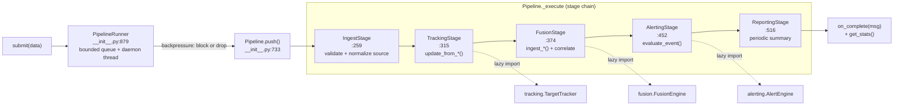

# tritium_lib.pipeline

**A configurable ingest -> track -> fuse -> alert -> report chain** with
per-stage stats, error policies, and a backpressure-managed threaded runner.
One managed flow that wires the operational spine together from a dict/YAML
config instead of hand-assembling it in application code.

**Where you are:** `tritium-lib/src/tritium_lib/pipeline/`
**Parent:** [`../`](../) — the tritium-lib package map

> **Status: built + tested, not wired.** This is a complete, 64-test
> orchestrator with **zero consumers** — no sc, edge, addon, or other lib
> package imports it (dated grep 2026-07-11; only `tests/test_pipeline.py`).
> It is the config-driven expression of the composition SC currently
> hand-assembles at startup (a `TargetTracker`, a `FusionEngine`, and an
> `AlertEngine` mounted individually on `app.state`). Documented honestly so a
> future loop can either adopt it as the one composition root or retire it —
> not a docs decision (routed below).

## What it's for

Sensor data arrives from many sources (BLE, WiFi, camera, acoustic, mesh,
ADS-B, RF-motion) and needs the same downstream treatment: normalize ->
update the tracker -> run fusion -> evaluate alerts -> summarize. A `Pipeline`
expresses that as an ordered list of `PipelineStage`s, each of which can
transform, filter (drop), enrich, or fan-out a `PipelineMessage`. The five
built-in stages lazily import the real engines, so a pipeline *is* a would-be
composition root for the whole operational stack.

## How it works

## Files

Single-module package (`__init__.py`, ~1140 lines):

| Object | Where | What it does |
|--------|-------|--------------|
| `PipelineMessage` | `:67` | The envelope: `data` dict + `source` + `stage_trace` + `errors` + `dropped`. `clone()`/`to_dict()`. |
| `PipelineState` | `:108` | `CREATED`/`RUNNING`/`PAUSED`/`STOPPED`/`ERROR`. |
| `PipelineStage` (ABC) | `:121` | Base stage: implement `process()` (`:166`); `_run()` wraps it with timing + error capture; per-stage `stats`. |
| `PipelineConfig` | `:209` | Topology config (`from_dict`/`to_dict`); `max_queue_size`, `error_policy` = `propagate`/`drop`/`halt`. |
| `IngestStage` | `:259` | Validates `source` against `VALID_SOURCES` (`:256`), infers it from data keys, normalizes timestamp. Drops unknown sources. |
| `TrackingStage` | `:315` | Dispatches to `TargetTracker.update_from_*()` by source (`setup()` lazily builds one at `:333`). |
| `FusionStage` | `:374` | Dispatches to `FusionEngine.ingest_*()` by source; optional `auto_correlate`. |
| `AlertingStage` | `:452` | Maps source -> `sensor.<source>` topic, runs `AlertEngine.evaluate_event()`, attaches fired alerts. |
| `ReportingStage` | `:516` | Buffers messages, emits a periodic summary dict (`force_report()` on demand). |
| `Pipeline` | `:630` | The chain executor: `start`/`stop`/`pause`/`resume`, `push`/`push_batch`, `get_stats` (per-stage + completion rate). |
| `PipelineRunner` | `:879` | Threaded runner with a bounded `queue.Queue`; `submit()` blocks or drops on full; poison-pill drain on `stop()`. |
| registry + `default_pipeline()` | `:1043`, `:1097` | `register_stage`/`build_pipeline_from_config` (config-driven construction); `default_pipeline()` returns the 5-stage chain. |

## Core objects & typed actions (Palantir lens)

- **Objects:** `Pipeline` (a configured chain), `PipelineStage` (one processing
  step), `PipelineMessage` (a unit of work, carrying its own trace), `PipelineRunner`
  (an async feeder with a queue).
- **Links:** a message's `stage_trace` links it to every stage it passed
  through; a `PipelineConfig` links a topology name to an ordered stage list;
  the registry links a stage `type` string to a class.
- **Typed actions:** `push()` (run one message) · `submit()` (enqueue with
  backpressure) · `pause()`/`resume()` · `force_report()` · `build_pipeline_from_config()`.

## How it's consumed (verified 2026-07-11)

**Shelfware.** Dated grep of `tritium_lib.pipeline` across `tritium-sc/src`,
`tritium-edge`, `tritium-addons`, and the rest of `tritium_lib` finds **no
importers** — the only reference is `tests/test_pipeline.py` (**64 tests**,
green). SC builds the same components independently at boot: `TargetTracker`,
`FusionEngine` (`app/main.py:2115`), and `AlertEngine` (via the SitAware
capstone) are mounted individually on `app.state`, and sensor plugins push to
the tracker directly rather than through a staged pipeline. This package is
the unused, config-first alternative to that hand-wiring.

## Related

- [../tracking/](../tracking/) — `TargetTracker`, what `TrackingStage` feeds
- [../fusion/](../fusion/) — `FusionEngine`, what `FusionStage` feeds
- [../alerting/](../alerting/) — `AlertEngine`, what `AlertingStage` evaluates
- [../reporting/](../reporting/) — the richer report engine (`ReportingStage` emits a lightweight count dict, not a `SitRep`)
- [../sitaware/](../sitaware/) — the capstone that *does* compose fusion + alerting + incident today (the live alternative to this pipeline)
