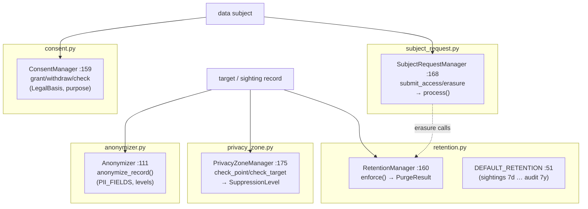

# tritium_lib.privacy

**The privacy-law conscience of a tracking system.** Five cooperating
subsystems for operating a surveillance stack responsibly: retention purging,
PII anonymization, consent tracking, GDPR subject-request handling, and
geographic no-track zones.

**Where you are:** `tritium-lib/src/tritium_lib/privacy/`
**Parent:** [`../`](../) — the tritium-lib package map

> **Status: shelfware / reference (verified 2026-07-11).** Fully built and
> tested, but no runtime consumer wires it in yet — see "How it's consumed."
> It is the ready-made compliance layer for when Tritium runs against real
> people, not just sim entities.

## What it's for

A system that assigns a unique ID to every phone, car, and person accumulates
exactly the data privacy law regulates. This package is the toolkit to keep
that lawful: automatically forget data past its retention window, strip or
pseudonymize identifiers, record the legal basis for processing each subject,
answer right-of-access / right-to-erasure requests, and suppress tracking
entirely inside sensitive geofences (schools, hospitals, homes).

Everything is pure logic with handlers/data fed in by the caller — no store,
no I/O of its own — so it composes over whatever persistence the deployment
uses.

## How it works

The five are independent but designed to interlock: a subject-erasure request
drives a retention purge; a privacy-zone hit selects an anonymization level; a
withdrawn consent narrows what may be retained.

## Files

| Module | Key objects | What it does |
|--------|-------------|--------------|
| `retention.py` | `RetentionManager` (`:160`), `RetentionPolicy` (`:69`), `DataCategory` (`:32`), `DEFAULT_RETENTION` (`:51`), `PurgeResult` (`:124`) | Per-category age limits (9 categories: realtime 7d, target_history 30d, dossiers 90d, incidents 1y, audit 7y, camera_frames 3d, …). `register_handler` + `enforce()` run the caller's purge callbacks and record results. |
| `anonymizer.py` | `Anonymizer` (`:111`), `AnonymizationLevel` (`:44`), `PII_FIELDS` (`:57`), `AnonymizationResult` (`:87`) | Strip/pseudonymize/redact PII fields; HMAC pseudonyms keyed by a deployment secret so the same identity maps consistently without being reversible. |
| `consent.py` | `ConsentManager` (`:159`), `ConsentRecord` (`:71`), `ProcessingPurpose` (`:34`), `LegalBasis` (`:48`), `ConsentStatus` (`:58`) | Track per-subject processing consent with legal basis + evidence; `grant`/`withdraw`/`check`. |
| `subject_request.py` | `SubjectRequestManager` (`:168`), `DataSubjectRequest` (`:56`), `RequestType` (`:33`), `RequestStatus` (`:42`) | GDPR request lifecycle: submit access/erasure/rectification/portability → `process()` through a state machine. |
| `privacy_zone.py` | `PrivacyZoneManager` (`:175`), `PrivacyZone` (`:44`), `SuppressionLevel` (`:31`), `ZoneCheckResult` (`:335`) | Polygon no-track zones with time windows; `check_point`/`check_target` return the applicable `SuppressionLevel` (NONE/ANONYMIZE/SUPPRESS_PII/FULL). |

## Core objects & typed actions (Palantir lens)

- **Objects:** `PrivacyZone` (a governed area), `ConsentRecord` (a per-subject
  permission), `DataSubjectRequest` (a legal ask), `RetentionPolicy` (a
  data-lifetime contract).
- **Typed actions:** `enforce` (purge) · `anonymize_record` · `grant`/`withdraw`
  consent · `submit_access`/`submit_erasure` → `process` · `check_point`/
  `check_target` (zone suppression).

## How it's consumed (verified 2026-07-11)

**No consumer anywhere.** Dated grep for `from tritium_lib.privacy` across
sc/edge/addons: **0 hits.** Tests only (4 lib test files). The privacy-zone
concept exists elsewhere in the product (geofences in `tracking/`, the SC
tactical map), but nothing yet routes tracked data through this package's
purge/anonymize/consent gates.

Fun + production: a "privacy mode" toggle in the sim that visibly greys out and
anonymizes targets inside a drawn zone (fun) is the exact same code that keeps
a real deployment lawful (production) — a high-value, self-contained wire-up
for a future loop.

## Related

- [../tracking/](../tracking/) — geofences here overlap the no-track zones; `TrackedTarget` is what gets anonymized/purged
- [../audit/](../audit/) — retention sets the `audit_trail` 7-year default; erasure requests should be audited
- [../store/](../store/) — a real deployment registers store-backed purge handlers with `RetentionManager`
