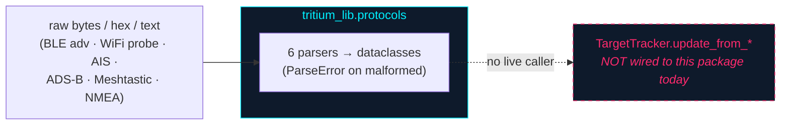

# tritium_lib.protocols — pure-Python radio decoders

**Where you are:** `tritium-lib/src/tritium_lib/protocols/` — parsers that
turn raw radio bytes/hex/text into structured dataclasses, with no C
extensions and no hardware dependency.

**Parent:** [`../README.md`](../README.md) ·
[`../../../CLAUDE.md`](../../../CLAUDE.md)

## What this package is

Six parsers plus a shared error type, each accepting raw bytes, a hex string,
or text and returning dataclasses — handling malformed input by raising
`ParseError(protocol, reason, raw_data)` rather than crashing
(`errors.py:6-23`).

| Module | Parser | Decodes into |
|--------|--------|--------------|
| `ble_advert.py` | `BLEAdvertParser` | `BLEAdvertisement` (flags, service UUIDs, `ManufacturerData`, `ServiceData`) |
| `wifi_probe.py` | `WiFiProbeParser` | `WiFiProbeRequest` (SSID, rates, `WiFiHTCapabilities`) |
| `ais.py` | `AISParser` | `AISPositionReport`, `AISStaticData` (vessel tracking) |
| `adsb.py` | `ADSBParser` | `ADSBMessage` subtypes — identification, airborne/surface position |
| `meshtastic.py` | `MeshtasticParser` | `MeshtasticPosition` / `NodeInfo` / `Telemetry` / `Routing` |
| `nmea.py` | `NMEAParser` | `NMEAPosition` / `Time` / `Date` / `Satellite` (GPS sentences) |

These are substantial implementations (adsb ~24 KB, meshtastic ~25 KB, nmea
and ais ~15 KB each), and every parser is `__all__`-exported from
`__init__.py`.

## The shape — and the honest gap

**As of 2026-07-11 these parsers have no external consumers.** A DATED grep
for `BLEAdvertParser` / `AISParser` / `ADSBParser` / `MeshtasticParser` /
`NMEAParser` / `WiFiProbeParser` (and `from tritium_lib.protocols import`)
across `tritium-sc`, `tritium-edge`, `tritium-addons`, and the rest of
`tritium-lib/src` returns **only the self-imports inside this package's own
`__init__.py`**. The live decode paths parse independently:

- tritium-sc decodes in-plugin: `plugins/sdr_monitor/adsb.py`,
  `plugins/sdr_monitor/ism_decoder.py`, etc.
- the hackrf addon has its own `hackrf_addon/decoders/adsb.py`
  (`adsb.py:830` pushes straight to `target_tracker.update_from_adsb`).
- the meshtastic addon uses the upstream `meshtastic` Python library, not
  `MeshtasticParser`.

> **Don't mistake `tritium_lib.protocols` (this wire-decoder package) for
> `tritium_lib.sdk.protocols`** — the latter is the SDK's structural-typing
> `Protocol`s (`ITargetTracker`, `IEventBus`, …), a completely different
> thing. Greps for "protocols" hit both; only this one decodes radio bytes.

So this is a **tested, dependency-free decoder set waiting for a consumer** —
the clearest consolidation opportunity in the CORE family: the sc/addon
decoders duplicate what lives here, and folding them onto one tested
implementation would harden every real-sensor path (the production half)
while giving the simulator a single decode vocabulary (the fun half). Until
that happens, document it as ready-not-wired, not as "the decoders the system
uses."

## Ontology lens

Each parser is a typed *projection* from an untyped byte stream to a
[`../models/`](../models/)-adjacent object: an ADS-B frame becomes an
aircraft position, an AIS sentence a vessel report, a BLE advert a device
fingerprint. It is the boundary where raw RF becomes a typed observation the
rest of the ontology can reason about — the seam that is currently open.

## Tests

`tests/test_protocols.py` (covers `ADSBParser` / `BLEAdvertParser`),
`tests/test_protocols_errors.py`, `tests/test_protocols_nmea.py`,
`tests/test_protocols_wifi_probe.py`, `tests/test_ais.py`,
`tests/test_meshtastic.py` — malformed-input handling and per-field decode
correctness.

## Related

- The typed objects these would feed: [`../models/`](../models/)
- Structural-typing `Protocol`s (different package): [`../sdk/`](../sdk/) `protocols.py`
- Live decoders that duplicate these: `tritium-sc/plugins/sdr_monitor/`,
  `tritium-addons/hackrf/`
