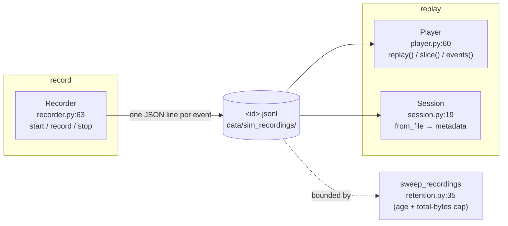

# tritium_lib.recording

**Record and replay sensor event streams** to a JSON-lines file. Capture
everything the pipeline sees — BLE sightings, WiFi probes, camera
detections, acoustic events, fusion results, alerts, zone crossings — then
play it back at original or modified speed. This is the flight-recorder for
the "game IS the test harness" mantra: every battle becomes a re-runnable
fixture on disk.

**Where you are:** `tritium-lib/src/tritium_lib/recording/`
**Parent:** [`../`](../) — the tritium-lib package map

## What it's for

An in-memory replay ring buffer forgets a battle the moment the server
restarts. `recording` persists each session as one append-only `.jsonl`
file (one event per line: `{ts, sensor_type, source, data}`), so:

- an After-Action Review can offer "Replay this battle" hours later,
- a captured real-sensor stream can drive regression tests offline,
- a bug seen once can be replayed deterministically.

Pure standard library — no external deps. The write path is crash-safe by
construction (each `record()` flushes a line), and a context-manager form
guarantees `stop()` runs.

## How it works

## Files

| File | What's in it |
|------|--------------|
| `recorder.py` | `Recorder` (`:63`) — the writer. `start()` (`:121`) opens the file + assigns a `session_id`; `record(sensor_type, *, source, data)` (`:158`) appends one line; `stop()` (`:203`) closes and returns the session summary dict. Context-manager (`__enter__`/`__exit__`) + `__del__` safety net; `event_count`, `is_recording` properties. |
| `player.py` | `Player` (`:60`) — the reader. `load()` (`:120`), `events()` (`:147`) and `replay()` (`:159`, sleeps to honor `speed`), `slice(start, end)` (`:186`), and the `sensor_types`/`sources` set accessors. `ReplayEvent` (`:31`, `from_line`/`to_dict`) is the per-line record. |
| `session.py` | `Session` (`:19`) — metadata over a file *without* loading every event: `from_file` (`:58`) scans for `duration`, `event_count`, `sensor_types`, `sources`; `to_dict`/`from_dict`, `summary` (`:188`). |
| `retention.py` | `sweep_recordings(...)` (`:35`) — bound the on-disk store by age and total bytes; returns a dict of what it deleted. |

## Core objects & typed actions (Palantir lens)

- **Objects:** `Recorder` (open session, being written), `Player` (a file
  opened for playback), `Session` (immutable metadata view), `ReplayEvent`
  (one recorded event).
- **Links:** every object is keyed by the on-disk `.jsonl` path; a
  `session_id` ties a Recorder's output to its file.
- **Typed actions:** `record()` (append) · `stop()` (seal) ·
  `replay()`/`slice()` (read back) · `sweep_recordings()` (retire).

## How it's consumed (verified 2026-07-11)

**Wired to the operator via the AAR + SIM Lab.** This is one of the more
deeply-wired SIM-Lab packages — it has a live *write* path, not just a read
API.

- **Write:** `tritium-sc/src/engine/simulation/aar.py:51` imports
  `Recorder` + `sweep_recordings`; the AAR builder creates a `Recorder` per
  battle and writes `data/sim_recordings/<scenario_id>.jsonl`
  (Gap-fix G G-2).
- **Read:** `tritium-sc/src/app/routers/sim_recordings.py` mounts
  **`/api/sim/recordings/*` (2 routes: `/sessions`, `/{scenario_id}`)** at
  `main.py:2830`, importing `Session` + `sweep_recordings`. It wraps the lib
  sweep with SC defaults (`SIM_RECORDINGS_RETENTION_DAYS=7`,
  `SIM_RECORDINGS_MAX_BYTES=50 GB`, both env-tunable).
- **Retention:** `main.py:2364` runs an **hourly** `sweep_recordings` loop
  in a background thread (`sim_recordings retention sweep started (hourly)`)
  — without it the `.jsonl` store has historically filled the root
  filesystem.
- Frontend: `panels/sim-lab.js` lists sessions via `/sessions`.
- **No other `tritium_lib` package imports `recording`** (dated grep: the
  only in-package hit is the docstring example). 3 test files.

## Related

- [../scenarios/](../scenarios/) — generate the scenario a recording captures
- [../store/](../store/) — the SQLite persistence layer (recording is flat-file, not a store)
- `tritium-sc/src/engine/simulation/aar.py` — the per-battle write path
- `tritium-sc/src/app/routers/sim_recordings.py` — the SIM Lab read + retention wiring
