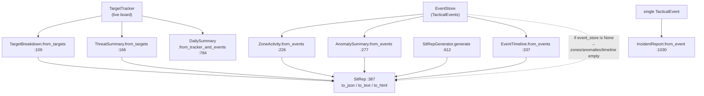

# tritium_lib.reporting

**Situation-report generation from live tracking data.** Turn the current
`TargetTracker` state plus the event history into a structured, human-
readable report — a SitRep, a daily summary, or an incident report —
rendered as JSON, plain text, or HTML. This is the "give me the board's
state as a briefing" layer.

**Where you are:** `tritium-lib/src/tritium_lib/reporting/`
**Parent:** [`../`](../) — the tritium-lib package map

## What it's for

An operator (or a scheduled job) needs to snapshot "what is happening right
now" into something a human reads or an archive keeps. `reporting` composes
that from two live sources:

- the **tracker** — `TargetBreakdown` (counts by source/class/alliance) and
  `ThreatSummary` (hostiles, threat levels), built via
  `from_targets(...)`;
- the **event store** — `ZoneActivity`, `AnomalySummary`, and an
  `EventTimeline`, built via `from_events(...)`.

Every report renders three ways (`to_json` / `to_text` / `to_html`), so the
same object feeds an API, a terminal, and a browser. Unlike most SIM-Lab
packages, `reporting` is **not standalone** — it imports
`tracking.target_tracker` (`TargetTracker`/`TrackedTarget`) and
`store.event_store` (`EventStore`/`TacticalEvent`/`SEVERITY_LEVELS`) at
`__init__.py:47-48`.

## How it works

## Files

| File | What's in it |
|------|--------------|
| `__init__.py` | The whole package. Section builders (`TargetBreakdown` `:90`, `ThreatSummary` `:143`, `ZoneActivity` `:207`, `AnomalySummary` `:262`, `EventTimeline` `:320`); the three report types (`SitRep` `:387`, `DailySummary` `:662`, `IncidentReport` `:876`), each with `to_dict`/`to_json`/`to_text`/`to_html`; and `SitRepGenerator` (`:593`), the tracker+store → `SitRep` composer. |

## Core objects & typed actions (Palantir lens)

- **Objects:** `SitRep` (`:387`) — the point-in-time board briefing;
  `DailySummary` (`:662`) — a 24-hour rollup; `IncidentReport` (`:876`) — a
  single-event write-up. Each composes the shared section objects
  (`TargetBreakdown`, `ThreatSummary`, `ZoneActivity`, `AnomalySummary`,
  `EventTimeline`).
- **Links:** section objects are *derived* from `TrackedTarget`s
  (`from_targets`) and `TacticalEvent`s (`from_events`) — the report links
  back to the live objects by id.
- **Typed actions:** `SitRepGenerator.generate(event_time_range, notes)`
  (`:612`) · `DailySummary.from_tracker_and_events(...)` (`:784`) ·
  `IncidentReport.from_event(...)` (`:1030`) · the three renderers on each.

## How it's consumed (verified 2026-07-11)

**Wired to the operator via SIM Lab — but only the SitRep, and only its
tracker-fed half.**

- `tritium-sc/src/app/routers/sim_reporting.py` mounts
  **`/api/sim/reporting/*` (3 routes: `/sitrep`, `/sitrep.text`,
  `/sitrep.html`)** at `main.py:2836`, importing `SitRepGenerator`. It pulls
  the live tracker off `app.state` (`_get_tracker` — Amy's tracker first,
  else the standalone).
- **Honest gap:** the router builds
  `SitRepGenerator(tracker=tracker, event_store=None, ...)`
  (`sim_reporting.py:_build_sitrep`). With `event_store=None`,
  `generate()` (`:634`) skips the event query, so **`zones`, `anomalies`,
  and `timeline` render empty** in the SIM Lab surface — only
  `TargetBreakdown` + `ThreatSummary` (from the live tracker) populate. The
  package fully supports the event sections; the SC wiring just doesn't pass
  a store yet.
- **`DailySummary` and `IncidentReport` have no route** — they are
  lib-and-test-only today (no operator surface).
- Frontend: `panels/sim-lab.js` renders the SitRep (json/text/html).
- Cross-package: `reporting` *depends on* `tracking` + `store.event_store`
  (not the reverse). No other `tritium_lib` package imports `reporting`
  (the scheduler's daily-report builtin is a separate inline implementation
  — see `../scheduler/`). 3 test files.

## Related

- [../tracking/](../tracking/) — `TargetTracker`/`TrackedTarget`, the tracker source
- [../store/](../store/) — `EventStore`/`TacticalEvent`, the event source
- [../scheduler/](../scheduler/) — its `generate_daily_report` builtin is a *separate*, duck-typed report (not this package)
- [../sitaware/](../sitaware/) — the capstone that also composes tracker + events
- `tritium-sc/src/app/routers/sim_reporting.py` — the SIM Lab wiring
