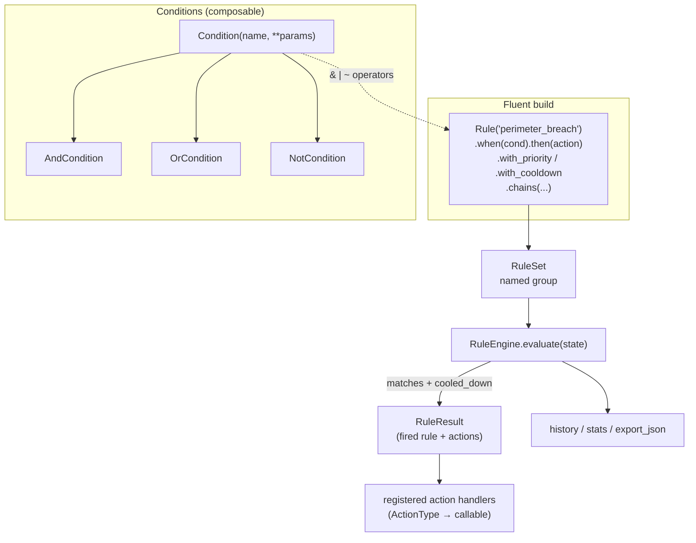

# tritium_lib.rules

A general-purpose IF-THEN automation engine over tracking state. Operators
compose boolean conditions (with `AND`/`OR`/`NOT` via Python operators),
attach actions, and the engine fires them when the world matches. Rules are
JSON round-trippable, priority-ordered, cooldown-aware, and groupable into
named `RuleSet`s.

**Where you are:** `tritium-lib/src/tritium_lib/rules/`

## What it's for

"When a hostile enters perimeter_alpha, start recording on cam_north and
send an alert." That sentence should be data an operator can build in a UI,
persist, and replay — not code. This package is that: a fluent rule DSL
plus an evaluator that takes a state dict (targets, zones, threat levels)
and returns which rules fired and what actions to run.

It is deliberately **separate from `tritium_lib.alerting`**: alerting turns
events into notifications; this engine executes arbitrary actions —
dispatch a unit, lock a zone, set a threat level, generate a report.

## How it works

## Files

| File | What's in it |
|------|--------------|
| `__init__.py` | Everything. `Rule` (fluent builder), `RuleSet`, `RuleEngine`; the `ConditionBase` tree (`Condition`, `AndCondition`, `OrCondition`, `NotCondition`) with `__and__`/`__or__`/`__invert__` operator overloads; `Action` + the `ActionType` enum; `RuleResult`; the built-in condition evaluators (`_eval_*`) and the `register_condition()` extension hook. |

## Core objects & typed actions (Palantir lens)

- **Objects:** `Rule` (condition→actions with metadata), `RuleSet` (named
  bag of rules), `Condition` (a named predicate over state).
- **Links:** rule→conditions (`when`), rule→actions (`then`, repeatable),
  rule→rule (`chains(*rule_ids)` for cascades), rule→ruleset membership.
- **Typed actions (`ActionType`, `rules/__init__.py:75`):** `SEND_ALERT` ·
  `DISPATCH_UNIT` · `START_RECORDING` · `STOP_RECORDING` ·
  `GENERATE_REPORT` · `PUBLISH_EVENT` · `LOG` · `ESCALATE` ·
  `SET_THREAT_LEVEL` · `LOCK_ZONE` · `UNLOCK_ZONE` · `CUSTOM`. Bind a
  Python callable per type with `register_action_handler`.
- **Built-in conditions:** `target_enters_zone`, `threat_level_above`,
  `target_count_in_zone_exceeds`, `target_dwell_exceeds`, `sensor_offline`,
  `target_alliance_is`, `field_compare` (the `_eval_*` functions);
  `register_condition(name, fn)` adds more.
- **Decisions as data:** the whole engine serializes — `to_dict`/`from_dict`
  on every part, `export_json`/`import_json` on the engine — so rulesets
  are stored and shipped, not hardcoded.

## How it's consumed (verified 2026-07-11)

- `tritium-sc/src/app/routers/sim_rules.py:49` imports `Rule`,
  `RuleEngine`, `RuleSet`, `Condition`+combinators, `Action`, `ActionType`
  and holds a module-level `_engine = RuleEngine()` (`sim_rules.py:246`).
  This is the SIM Lab rules surface — the live production consumer.
- **Not** the automation plugin: `plugins/automation/plugin.py` imports
  `RuleEngine` from its **own** `plugins/automation/rules.py`
  (`class RuleEngine` at line 179), a separate implementation. Don't
  conflate the two — this package feeds SIM Lab, not the automation panel.

6 test files cover this package.

## Related

- [../../../../tritium-sc/src/app/routers/sim_rules.py](../../../../tritium-sc/src/app/routers/sim_rules.py) — the SIM Lab consumer
- [../alerting/](../alerting/) — the sibling engine for notifications (not arbitrary actions)
- [../scheduler/](../scheduler/) — time-driven counterpart (rules are state-driven)
- [../../../../tritium-sc/plugins/automation/](../../../../tritium-sc/plugins/automation/) — a *separate* rules engine, not this one
