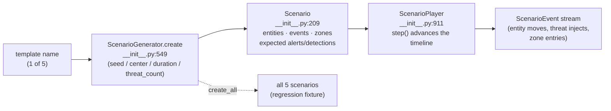

# tritium_lib.scenarios

The **procedural scenario engine** — turn a one-word template name into a
fully populated surveillance/security scenario (a geographic area, normal-
activity entities with waypoints and sensor signatures, threat actors
injected at timeline offsets, and the alerts/detections you *expect* to
fire). This is the "video-game level generator" behind the SIM Lab mission
picker: deterministic, seedable, hardware-free.

**Where you are:** `tritium-lib/src/tritium_lib/scenarios/`
**Parent:** [`../`](../) — the tritium-lib package map

## What it's for

A running system needs realistic worlds to exercise the perception →
fusion → alerting pipeline without real cameras or radios. `scenarios`
builds those worlds from five hand-tuned templates:

| Template | Setting |
|----------|---------|
| `airport_surveillance` | terminal, parking, runways |
| `border_crossing` | checkpoint, approach roads, staging areas |
| `urban_patrol` | city blocks, intersections, parks |
| `maritime_port` | docks, approaches, anchorages |
| `campus_security` | buildings, pathways, parking lots |

(`TEMPLATE_NAMES`, sorted from `_SCENARIO_TEMPLATES.keys()`,
`__init__.py:528`.)

Everything is seeded (`ScenarioGenerator(seed=42)` default,
`__init__.py:541`), so the same template + seed + center always yields the
same scenario — a scenario is a *reproducible test fixture* as much as a
game level. The package is pure geometry + `random`; the only external
dependency is `tritium_lib.geo` for great-circle distance
(`approx_distance_m`, imported at `__init__.py:40`).

This is the pre-built alternative to the LLM-driven `/api/game/generate`
path — a fixed catalog an operator can pick from without a model call.

## How it works

## Files

| File | What's in it |
|------|--------------|
| `__init__.py` | The entire package (single 1,100-line module). Data model (`Scenario`, `ScenarioEntity`, `ScenarioEvent`, `GeoZone`, `ExpectedAlert`, `ExpectedDetection`), the enums, the `_SCENARIO_TEMPLATES` template table + `TEMPLATE_NAMES`, `ScenarioGenerator`, and `ScenarioPlayer`. |

## Core objects & typed actions (Palantir lens)

- **Objects:**
  - `Scenario` (`:209`) — the root: `entities`, `events`, `zones`,
    `expected_alerts`, `expected_detections`, plus `computed_duration`
    (`:236`) and query helpers (`entity_by_id`, `zone_by_id`,
    `events_for_entity`, `friendly_entities`/`hostile_entities`/
    `neutral_entities`).
  - `ScenarioEntity` (`:142`) — a tracked thing with an alliance, type, and
    waypoints/sensor signature.
  - `GeoZone` (`:122`) — a named region with a `contains(lat, lng)` test
    (`:136`).
  - `ScenarioEvent` (`:171`), `ExpectedAlert` (`:184`),
    `ExpectedDetection` (`:196`) — the timeline and the ground-truth the
    pipeline is *supposed* to produce.
- **Enums:** `EntityAlliance` (`:58`), `EntityType` (`:66`),
  `ZoneType` (`:78`), `EventKind` (`:97`), `AlertLevel` (`:112`).
- **Typed actions:**
  - `ScenarioGenerator.create(template_name, *, seed, center, duration_s,
    threat_count)` (`:549`) → one `Scenario`.
  - `ScenarioGenerator.create_all(*, seed)` (`:804`) → all five (the
    regression sweep).
  - `ScenarioPlayer.step()` (`:955`, generator) / `step_once()` (`:973`) /
    `reset()` (`:993`) — advance the scenario clock and emit the events due
    this tick; `is_complete` (`:951`) when the timeline is exhausted.

## How it's consumed (verified 2026-07-11)

**Wired to the operator via SIM Lab.** The lib package is stateless
generation; all run orchestration lives SC-side.

- `tritium-sc/src/app/routers/sim_scenarios.py` — mounts
  **`/api/sim/scenarios/*` (24 routes)** at `main.py:2829`
  (`app.include_router`). It holds a module-level
  `_generator = ScenarioGenerator(seed=42)` (`sim_scenarios.py:51`) and
  imports `TEMPLATE_NAMES` + the private `_SCENARIO_TEMPLATES` for metadata.
  The **launch/replay/leaderboard/challenge/run-history** surface
  (`_active_runs` thread registry, `POST /launch`, `/replay/{id}`,
  `GET /leaderboard`, `/challenge`) is an SC-side playback layer *on top of*
  the lib generator — the library itself has no notion of a "run."
- Frontend consumers (all hitting `/api/sim/scenarios/*`):
  `panels/sim-lab.js` (the `;`-key SIM Lab — the main surface),
  `command/mission-modal.js` (level picker), `panels/mission-select.js`,
  `panels/run-history-viewer.js`.
- **No other `tritium_lib` package imports `scenarios`** (dated grep: the
  only in-package `tritium_lib.scenarios` hit is the docstring usage
  example). It is a leaf consumed only by the SC router. 1 dedicated test
  file (`tests/test_scenarios.py`).

> Not to be confused with `tritium_lib.synthetic` (ad-hoc synthetic
> *records* — sightings/APs/patrols) — `scenarios` builds a whole
> topology with a timeline; `synthetic` seeds data shapes.

## Related

- [../synthetic/](../synthetic/) — the sibling ad-hoc data-shape generator
- [../geo/](../geo/) — `approx_distance_m`, the one dependency
- [../recording/](../recording/) — record a scenario run for later replay
- `tritium-sc/src/app/routers/sim_scenarios.py` — the SIM Lab wiring + run layer
