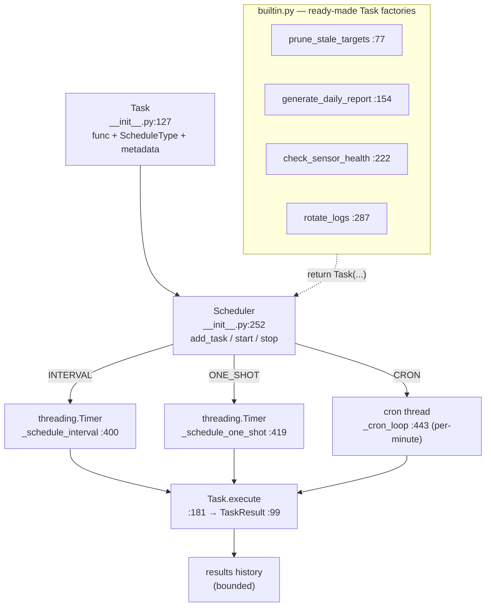

# tritium_lib.scheduler

A **pure-Python, thread-safe task scheduler** for recurring operations —
interval, cron, and one-shot — with no external dependency (no APScheduler;
built on `threading.Timer` and stdlib primitives). Plus a `TaskQueue` for
fire-and-forget one-time jobs and four ready-made operator tasks.

**Where you are:** `tritium-lib/src/tritium_lib/scheduler/`
**Parent:** [`../`](../) — the tritium-lib package map

## What it's for

The system has housekeeping that should happen on a clock: prune stale
targets, roll up a daily report, check sensor heartbeats, rotate logs. This
package is that clock — a small, dependency-free scheduler an operator (or
the app) can register tasks on, enable/disable individually, and start/stop
as a whole. Two execution models:

- **`Scheduler`** — recurring tasks. Each `Task` carries its own schedule
  (`interval` / `cron` hour+minute / `one_shot` delay). One cron thread wakes
  each minute; interval/one-shot tasks arm `threading.Timer`s.
- **`TaskQueue`** — a FIFO of one-time `Task`s drained by N worker threads
  (`submit`/`submit_func`/`drain`).

Every run yields a `TaskResult` (status, duration, return value or error),
kept in a bounded history.

## How it works

## Files

| File | What's in it |
|------|--------------|
| `__init__.py` | The engine. `ScheduleType` (`:82`, `INTERVAL`/`CRON`/`ONE_SHOT`) + `TaskStatus` (`:89`) enums; `TaskResult` (`:99`, with `duration`/`to_dict`); `Task` (`:127`, the work unit — `execute()` at `:181`); `Scheduler` (`:252`, the recurring engine — `add_task`/`enable_task`/`disable_task`/`run_now`/`start`/`stop`); `TaskQueue` (`:502`, worker-pool FIFO — `submit`/`submit_func`/`drain`). |
| `builtin.py` | Four `Task` factories for common operator chores: `prune_stale_targets` (`:77`), `generate_daily_report` (`:154`), `check_sensor_health` (`:222`), `rotate_logs` (`:287`). Each pairs a `_do_*` work function with a factory that wraps it in a scheduled `Task`. **Self-contained + duck-typed:** the only `tritium_lib` import is `Task`/`ScheduleType` (`builtin.py:40`) — e.g. `_do_generate_daily_report` (`:108`) builds its report dict inline from a duck-typed `tracker`/`event_store` (`Any`); it does **not** import `tritium_lib.reporting`. |

## Core objects & typed actions (Palantir lens)

- **Objects:** `Task` (schedulable unit of work), `TaskResult` (immutable
  execution record), `Scheduler` (the recurring engine), `TaskQueue` (the
  one-shot worker pool).
- **Links:** `Scheduler.tasks` (name → `Task`), `Scheduler.results` /
  `TaskQueue.results` (history rings). Cross-package: the builtins *accept*
  a `TargetTracker` / `EventStore` / `HealthMonitor` as parameters
  (type-hinted in the `TYPE_CHECKING` block, `builtin.py:18-20`) but never
  import them — pure duck typing.
- **Typed actions:** `add_task` · `enable_task`/`disable_task` ·
  `run_now(name)` (immediate one-shot) · `start`/`stop`; queue side:
  `submit`/`submit_func`/`drain`.

## How it's consumed (verified 2026-07-11)

**Wired to the operator via SIM Lab, deliberately manual.**

- `tritium-sc/src/app/routers/sim_scheduler.py` mounts
  **`/api/sim/scheduler/*` (7 routes: `/status`, `/tasks`,
  `/tasks/{name}/run|enable|disable`, `/start`, `/stop`)** at
  `main.py:2835`. It keeps a **module-level singleton `Scheduler`** built by
  `_build_default_scheduler()`, which registers the four builtins **disabled
  and not auto-started** — the router's own comment: *"we don't fire
  builtins automatically because they touch real state (target store, log
  files, dossier db)."* The operator explicitly enables + starts them.
- Frontend: `panels/sim-lab.js` shows scheduler status and offers
  `run`/`start` buttons (e.g. `prune_stale_targets`, `check_sensor_health`).
- **No other `tritium_lib` package imports `scheduler`** (the lib-internal
  grep hits are `builtin.py` importing its own package's `Task`, plus
  docstring examples). 1 test file.

## Related

- [../reporting/](../reporting/) — the *real* report generator (the builtin
  daily-report task is a separate, inline duck-typed version, not this)
- [../monitoring/](../monitoring/) — `HealthMonitor`, the type the sensor-health builtin expects
- [../tracking/](../tracking/) — `TargetTracker`, the type the prune builtin expects
- `tritium-sc/src/app/routers/sim_scheduler.py` — the SIM Lab wiring
