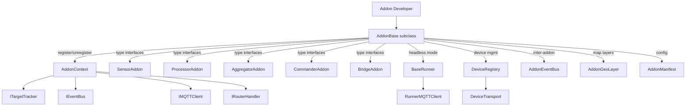

# tritium_lib.sdk

Addon development SDK -- the interfaces and base classes every Tritium addon uses.

**Where you are:** `tritium-lib/src/tritium_lib/sdk/`

**License:** Apache-2.0 (not AGPL). Private/proprietary addons can import freely.

## How It Works



## Files

| File | Description |
|------|-------------|
| `__init__.py` | Package exports, `SDK_VERSION = "1.0.0"` |
| `addon_base.py` | `AddonBase` -- base class with register/unregister lifecycle, panels, layers, health checks |
| `context.py` | `AddonContext` -- dependency injection container passed during registration |
| `protocols.py` | `ITargetTracker`, `IEventBus`, `IMQTTClient`, `IRouterHandler`, `ICommander` -- structural typing |
| `interfaces.py` | Type-specific subclasses: `SensorAddon`, `ProcessorAddon`, `AggregatorAddon`, `CommanderAddon`, `BridgeAddon`, `DataSourceAddon`, `PanelAddon`, `ToolAddon` |
| `manifest.py` | `AddonManifest` -- reads and validates `tritium_addon.toml` files |
| `config_loader.py` | `AddonConfig` -- runtime config from manifest `[config]` section |
| `device_registry.py` | `DeviceRegistry` -- tracks N devices per addon with state and transport |
| `device_transport.py` | `DeviceTransport`, `LocalTransport`, `MQTTTransport` -- uniform device communication |
| `runner_base.py` | `BaseRunner` -- ABC for headless device runners with MQTT wiring and run-loop |
| `runner_mqtt.py` | `RunnerMQTTClient` -- lightweight paho-mqtt wrapper for runners |
| `addon_events.py` | `AddonEventBus` -- inter-addon pub/sub with wildcard patterns |
| `async_store.py` | `AsyncBaseStore` -- WAL-mode SQLite base class for addon persistence |
| `geo_layer.py` | `AddonGeoLayer` -- GeoJSON layer definition for tactical map integration |
| `subprocess_manager.py` | `SubprocessManager` -- tracks child processes per addon, prevents orphans |

## Adoption (DATED 2026-07-11)

Unlike the rest of the CORE family, this SDK is **live and widely
consumed**: a DATED grep of `from tritium_lib.sdk` finds **17 call sites in
tritium-addons** (the real audience), **3 in tritium-sc** (the loader/host
side), 0 in tritium-edge, 0 lib-internal. The functional addons —
`hackrf`, `meshtastic` — are built on it.

## Emitting targets — read this (corrected 2026-07-11)

The **runtime never polls `SensorAddon.gather()`.** A DATED grep for
`.gather()` finds callers only in this package's own `weather_station`
example (`sdk/examples/weather_station/__init__.py`) and a meshtastic addon
test — no loader in tritium-sc drives it. Functional addons emit targets by
**pushing directly to the tracker** through the injected `AddonContext`:

```python
from tritium_lib.sdk import AddonBase, AddonInfo, SensorAddon

class MyScanner(SensorAddon):
    info = AddonInfo(id="my-scanner", name="My Scanner", version="1.0.0")

    async def register(self, app=None, *, context=None):
        await super().register(app, context=context)
        self.tracker = context.target_tracker      # ITargetTracker
        # start hardware; on each observation, push:
        self.tracker.update_target("ble_aabb", {"source": "ble", "rssi": -60})
```

`ITargetTracker` (the structural `Protocol` in `protocols.py:16-22`)
guarantees exactly `update_target` / `get_target` / `get_all_targets` /
`remove_target`. The richer `update_from_adsb` / `update_from_mesh` methods
are **optional extensions** the concrete `TargetTracker` provides; addons
feature-detect them — `hackrf` does
`getattr(self.target_tracker, 'update_from_adsb', None)` with a fallback
(`decoders/adsb.py:830-833`), and `meshtastic` calls `update_from_mesh`
(`node_manager.py:83`). `gather()` remains a convenient shape for a
self-driven poll loop you own, but nothing calls it for you.

## Canonical guide

The full manifest → `AddonBase` → loader lifecycle → `AddonContext` DI →
target-emission → panels/layers → headless `BaseRunner` walkthrough (every
claim file:line-cited) is **[`tritium-addons/DEVELOPER-GUIDE.md`]** — that is
the canonical addon-authoring document; this README is the package reference.

**Parent:** [../README.md](../README.md)
