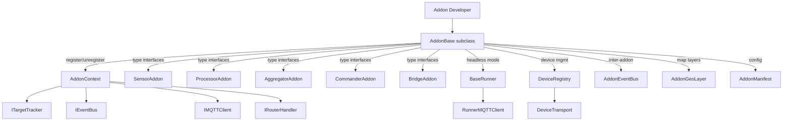

# tritium_lib.sdk

Addon development SDK -- the interfaces and base classes every Tritium addon uses.

**Where you are:** `tritium-lib/src/tritium_lib/sdk/`

**License:** Apache-2.0 (not AGPL). Private/proprietary addons can import freely.

## How It Works



## Files

| File | Description |
|------|-------------|
| `__init__.py` | Package exports, `SDK_VERSION = "1.0.0"` |
| `addon_base.py` | `AddonBase` -- base class with register/unregister lifecycle, panels, layers, health checks |
| `context.py` | `AddonContext` -- dependency injection container passed during registration |
| `protocols.py` | `ITargetTracker`, `IEventBus`, `IMQTTClient`, `IRouterHandler`, `ICommander` -- structural typing |
| `interfaces.py` | Type-specific subclasses: `SensorAddon`, `ProcessorAddon`, `AggregatorAddon`, `CommanderAddon`, `BridgeAddon`, `DataSourceAddon`, `PanelAddon`, `ToolAddon` |
| `manifest.py` | `AddonManifest` -- reads and validates `tritium_addon.toml` files |
| `config_loader.py` | `AddonConfig` -- runtime config from manifest `[config]` section |
| `device_registry.py` | `DeviceRegistry` -- tracks N devices per addon with state and transport |
| `device_transport.py` | `DeviceTransport`, `LocalTransport`, `MQTTTransport` -- uniform device communication |
| `runner_base.py` | `BaseRunner` -- ABC for headless device runners with MQTT wiring and run-loop |
| `runner_mqtt.py` | `RunnerMQTTClient` -- lightweight paho-mqtt wrapper for runners |
| `addon_events.py` | `AddonEventBus` -- inter-addon pub/sub with wildcard patterns |
| `async_store.py` | `AsyncBaseStore` -- WAL-mode SQLite base class for addon persistence |
| `geo_layer.py` | `AddonGeoLayer` -- GeoJSON layer definition for tactical map integration |
| `subprocess_manager.py` | `SubprocessManager` -- tracks child processes per addon, prevents orphans |

## Usage

```python
from tritium_lib.sdk import AddonBase, AddonInfo, SensorAddon

class MyScanner(SensorAddon):
    info = AddonInfo(id="my-scanner", name="My Scanner", version="1.0.0")

    async def register(self, app=None, *, context=None):
        await super().register(app, context=context)
        # subscribe to events, start hardware

    async def gather(self) -> list[dict]:
        return [{"target_id": "ble_aabb", "source": "ble", "rssi": -60}]
```

**Parent:** [../README.md](../README.md)
