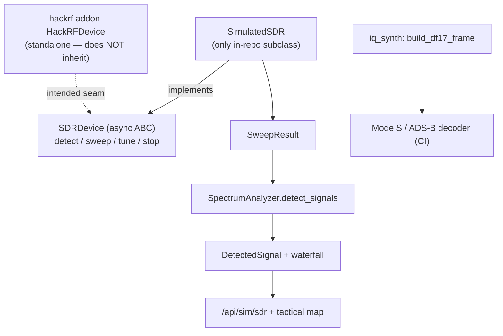

# tritium_lib.sdr — SDR device abstraction + simulated radio

**Where you are:** `tritium-lib/src/tritium_lib/sdr/`

**Parent:** [tritium_lib package map](../README.md) | [tritium-lib CLAUDE.md](../../../CLAUDE.md)

## What this is for

The generic **radio contract** the rest of Tritium plans against, plus a fully
software radio so the whole SDR stack (sweep → detect → waterfall → decode)
runs with **zero hardware** — the North-Star "works in demo mode" rule applied
to RF. `SDRDevice` is the async ABC every real backend (HackRF, RTL-SDR, …)
is meant to satisfy; `SimulatedSDR` is the built-in stand-in that generates a
believable spectrum for the simulator and CI.

Pure stdlib. Everything here runs on the fleet server and in tests with no
radio attached.

## Four things it ships (`__init__.py`)

| Piece | File | Role |
|-------|------|------|
| `SDRDevice` (ABC) + `SDRInfo` / `SweepResult` / `SweepPoint` | `base.py` | the async hardware contract + its data shapes |
| `SimulatedSDR` + `SimulatedSignal` + `default_signal_environment` | `simulator.py` | a software radio and its configurable RF emitters |
| `SpectrumAnalyzer` + `DetectedSignal` / `FrequencyBand` / `ScanPreset` / `WaterfallRow` / `KNOWN_BANDS` / `SCAN_PRESETS` | `analyzer.py` | turn sweeps into labelled detections + a waterfall |
| `crc24` / `build_df17_frame` / `synth_modes_iq` (+ `CRC24_GENERATOR`, `PREAMBLE_PULSE_POSITIONS`, `SAMPLES_PER_US`) | `iq_synth.py` | synthesize Mode S / ADS-B baseband IQ |

## The device contract — and what actually implements it

`SDRDevice` (`base.py:79`) is an **async ABC**. Its abstract surface is small
and hardware-shaped:

| Abstract method | Purpose |
|-----------------|---------|
| `async detect() -> SDRInfo` | enumerate + identify the radio |
| `async sweep(...) -> SweepResult` | broadband power sweep |
| `async tune(freq_hz, sample_rate=2_000_000, bandwidth=0)` | park on a frequency |
| `async stop()` | halt streaming |

plus non-abstract helpers `read_iq(n_samples)`, the `info` property,
`is_available`, and the `find_devices()` static hook.

> **Honest wiring note (routed to code-truth, not fixed here).** The
> `__init__.py` docstring sketches a class tree `SDRDevice ├── HackRFDevice
> ├── RTLSDRDevice ├── LimeSDRDevice └── SimulatedSDR`. In this repo the
> **only concrete `SDRDevice` subclass is `SimulatedSDR`** (`simulator.py:353`).
> The real HackRF backend lives in the separate `tritium-addons/hackrf` addon
> and its `HackRFDevice` (`hackrf_addon/device.py:92`) is a **standalone
> class — it does not inherit this ABC.** So today the ABC is the *intended*
> seam, honoured only by the simulator; RTL/Lime are aspirational. Treat the
> hierarchy in the docstring as a design target, not shipped reality.

## Objects & typed actions (Palantir lens)

| Object | What it is |
|--------|-----------|
| `SDRInfo` | a radio's identity + capabilities (`to_dict()`) |
| `SweepResult` / `SweepPoint` | a broadband sweep and one power bin; `SweepResult.get_peaks(threshold_dbm)` |
| `SimulatedSignal` | a configurable synthetic emitter (power/frequency over time) |
| `DetectedSignal` | a classified detection over a sweep (`to_dict()`) |
| `FrequencyBand` / `ScanPreset` | a named band and a canned scan config (`KNOWN_BANDS`, `SCAN_PRESETS`) |
| `WaterfallRow` | one time-slice of the spectrogram |

| Typed action | Where (file:line) | Turns … into … |
|--------------|-------------------|----------------|
| `SimulatedSDR.sweep` | `simulator.py:353` (impl of ABC) | a scan range → a synthetic `SweepResult` |
| `SpectrumAnalyzer.detect_signals` | `analyzer.py:235` | a sweep → `DetectedSignal`s (band-matched) |
| `SpectrumAnalyzer.get_waterfall` | `analyzer.py:329` | accumulated sweeps → waterfall rows |
| `build_df17_frame` / `synth_modes_iq` | `iq_synth.py:81,171` | aircraft fields → correct ADS-B baseband IQ |

## `iq_synth` — ADS-B without an antenna

`iq_synth.py` synthesizes **Mode S / ADS-B baseband IQ at 1090 MHz**. It builds
a *correct* DF17 extended-squitter frame — 112 bits / 224 data samples, with a
valid CRC-24 (generator `0xFFF409`) — and emits it as PPM baseband so the Mode
S decoder can run **end-to-end in CI without a radio**. This is the RF twin of
`SimulatedSDR`: a test/demo signal source for the decode path, not a
production transmitter.

> **`SpectrumAnalyzer` name collision.** This package's `SpectrumAnalyzer`
> (`analyzer.py`) **detects and classifies** signals over SDR sweeps
> (waterfall, `KNOWN_BANDS` matching, `DetectedSignal`s). The identically
> named `tritium_lib.signals.SpectrumAnalyzer` does **pure-math** peak/entropy
> analysis on a spectrum array you already have. Different jobs — import the
> one you mean. See [`../signals/`](../signals/README.md).

## How it's consumed (grep 2026-07-11)

| Consumer | hits |
|----------|------|
| tritium-sc | 3 (`app/routers/sim_sdr.py`) |
| tritium-lib internal | 1 |
| tritium-lib tests | 12 |

The operator surface is the **SIM Lab SDR router**, `/api/sim/sdr`
(`tritium-sc/src/app/routers/sim_sdr.py`), wiring `SimulatedSDR`,
`SimulatedSignal`, `SpectrumAnalyzer`, `default_signal_environment`, and
`SCAN_PRESETS` behind:

| Route | Backed by |
|-------|-----------|
| `GET /presets` | `SCAN_PRESETS` |
| `GET /environment` | `default_signal_environment()` |
| `POST /sweep` | `SimulatedSDR.sweep` |
| `POST /scan` | `SimulatedSDR.sweep` → `SpectrumAnalyzer.detect_signals` |

## Related

- [`../signals/`](../signals/README.md) — pure-math spectrum analysis + the
  other `SpectrumAnalyzer` (note the collision above).
- `tritium-addons/hackrf` — the real HackRF backend + rtl_433 ISM decoding
  (functional addon; does not currently inherit `SDRDevice`).
- `sdr/demos/sdr_demo.py` — a runnable end-to-end demo of the simulated stack.
