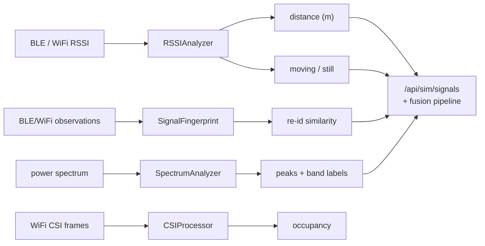

# tritium_lib.signals — RF signal analysis toolkit

**Where you are:** `tritium-lib/src/tritium_lib/signals/`

**Parent:** [tritium_lib package map](../README.md) | [tritium-lib CLAUDE.md](../../../CLAUDE.md)

## What this is for

Turn raw radio observations into **decisions** for the fusion pipeline. A BLE
beacon's RSSI stream becomes a distance and a moving/still verdict; a device's
scatter of RSSI/channel/UUID observations becomes a fingerprint you can
re-identify later; an SDR power spectrum becomes labelled peaks; a WiFi CSI
stream becomes an occupancy count. These feed the sensor-priority ladder
(`BLE → WiFi → … → Acoustic → RF`) that assigns and correlates target IDs.

Everything here is **pure Python** (`stdlib math` only, no numpy) so it runs on
the fleet server, in tests, and on constrained hosts — with one optional
exception (`gcc_phat`, below). Each analyser is a small stateful object you
feed samples into and query.

## The four analysers (`__init__.py:4`)

| Analyser | File | Ingests | Produces |
|----------|------|---------|----------|
| `RSSIAnalyzer` | `rssi_analyzer.py` | per-device RSSI samples | Kalman-smoothed RSSI, log-distance range, variance-based motion |
| `SignalFingerprint` | `fingerprint.py` | BLE/WiFi observations | an RF signature for device re-identification |
| `SpectrumAnalyzer` | `spectrum.py` | a power spectrum array | detected peaks, band labels, spectral entropy, periodogram |
| `CSIProcessor` | `csi_processor.py` | WiFi CSI subcarrier frames | occupancy verdict via subcarrier-variance + Hampel filter |

> **Name collision, on purpose two different classes.**
> `tritium_lib.signals.SpectrumAnalyzer` does **pure-math frequency-domain
> analysis** of a spectrum you already have (peaks / entropy / periodogram).
> `tritium_lib.sdr.SpectrumAnalyzer` (see [`../sdr/`](../sdr/README.md)) is a
> higher-level **signal detector** over SDR sweep results (waterfall, band
> matching, `DetectedSignal`s). Import the one you mean; they are not
> interchangeable.

## Objects & typed actions (Palantir lens)

| Object | What it is |
|--------|-----------|
| `RSSIReading` | one timestamped dBm sample for a device |
| `RSSIStats` / `MotionResult` | rolled-up stats and a moving/still verdict (`to_dict()` for telemetry) |
| `SignalFingerprint` | a device's accumulated RF signature (RSSI histogram, beacon interval, channel usage, service UUIDs) |
| `SpectralPeak` / `SpectralSummary` / `BandClassification` | a peak, a spectrum summary, and a `(band, service)` label |
| `OccupancyResult` / `CSIStats` / `SubcarrierBand` | CSI occupancy verdict + per-band activity |

| Typed action | Where (file:line) | Turns … into … |
|--------------|-------------------|----------------|
| `RSSIAnalyzer.add_reading` | `rssi_analyzer.py:198` | a dBm sample → updated per-device Kalman state |
| `RSSIAnalyzer.estimate_distance` | `rssi_analyzer.py:242` | RSSI + tx-power + path-loss exponent → metres |
| `RSSIAnalyzer.detect_motion` | `rssi_analyzer.py:267` | RSSI variance → moving / still |
| `SignalFingerprint.compare` | `fingerprint.py:219` | fingerprint ↔ fingerprint → similarity score |
| `SpectrumAnalyzer.find_peaks` | `spectrum.py:184` | spectrum array → `SpectralPeak`s |
| `SpectrumAnalyzer.classify_frequency` | `spectrum.py:261` | Hz → `(band, service)` label |
| `CSIProcessor.detect_occupancy` | `csi_processor.py:258` | CSI window → `OccupancyResult` |

Band reference data lives alongside the analyser: `BandDef`, `BAND_TABLE`,
`WIFI_24_CHANNELS`, `WIFI_5_CHANNELS` (all exported).

## `gcc_phat` — the one optional piece

`gcc_phat.py` is Generalized Cross-Correlation with Phase Transform — the
time-difference-of-arrival estimator used for acoustic/RF source localisation.
It needs **numpy** (FFT), so `__init__.py` imports it in a `try/except` and
only adds it to `__all__` when numpy is present (`__init__.py:61`). A core,
no-numpy install still imports the four pure-Python analysers above; code that
needs TDoA should check for the symbol or import `signals.gcc_phat` directly.

## How it's consumed (grep 2026-07-11)

| Consumer | hits |
|----------|------|
| tritium-sc | 2 (`app/routers/sim_signals.py`) |
| tritium-lib internal | 1 |
| tritium-lib tests | 4 |

The live operator surface is the **SIM Lab signals router**,
`/api/sim/signals` (`tritium-sc/src/app/routers/sim_signals.py`), which wires
`RSSIAnalyzer`, `SignalFingerprint`, and `SpectrumAnalyzer` behind:

| Route | Analyser action |
|-------|-----------------|
| `POST /rssi/distance` | `estimate_distance` |
| `POST /rssi/motion` | `detect_motion` |
| `POST /spectrum/peaks` | `find_peaks` |
| `POST /spectrum/classify` | `classify_frequency` |
| `POST /fingerprint/compare` | `SignalFingerprint.compare` |

## Related

- [`../sdr/`](../sdr/README.md) — SDR device abstraction + its own
  `SpectrumAnalyzer` (signal **detection** over sweeps; note the collision
  above).
- [`../indoor/`](../indoor/README.md) — indoor positioning; reuses RSSI
  distance conventions from this package.
- [`../tracking/`](../tracking/) — where fingerprints and distances become
  correlated target IDs.
