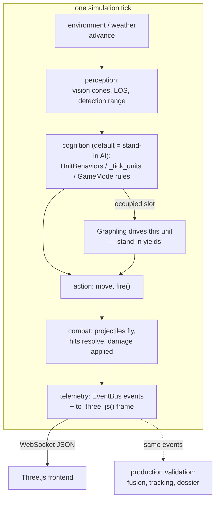

# Tritium Simulation Engine (`sim_engine/`)

**Parent:** [`../README.md`](../README.md) · **Family:** Simulation (the largest live-gameplay surface)

A pure-Python tactical simulation engine that computes the entire
battlespace — units, weapons, terrain, weather, crowds, logistics, medical,
intel, economy — and streams JSON frames to a Three.js frontend. No rendering
or game-engine dependency on the backend: the server produces state, the
browser draws it.

**This engine *is* the test harness.** Per the North Star, the game validates
the production stack because they run the same pipeline: perception →
cognition → action → telemetry. Every unit is driven by default by a
**stand-in AI** (FSMs, behavior trees, per-type combat) so the simulator and
the real system both run fully with zero Graphlings on the field. A rare unit
occupied by a Graphling has its stand-in suppressed — Tritium asks, it never
puppets (`behavior/behaviors.py:440`).

## Two tick surfaces

The one fact that makes the rest of the package legible: there are **two**
places a simulation is stepped, and they use different combat/AI wiring.

| | Standalone `World` | SC BattleEngine composition |
|---|---|---|
| Entry | `world/_world.py:404` `World.tick(dt)` | `tritium-sc/src/engine/simulation/engine.py` |
| Ballistics | `ProjectileSimulator` (`arsenal.py:202`) | `combat.CombatSystem` (`combat/combat.py:268`) |
| Per-unit AI | inline `_tick_units` 6-priority ladder (`world/_world.py:561`) | `behavior.UnitBehaviors` (`behavior/behaviors.py:171`) |
| Rules/mode | (none — free sim) | `game.GameMode` FSM (`game/game_mode.py:167`) |
| Used by | `demos/game_server.py`, demo scripts | the live battle / riot / civil-unrest game |

`World` is a self-contained sandbox that returns a rendered frame from a
13-step tick. The **SC BattleEngine** composes the reusable `combat/` +
`behavior/` + `game/` packages (plus `world/` cover, vision, sensors) into the
operator-facing game; `GameMode` is duck-typed against the engine so the rules
travel to any host.



## Subpackages

| Package | Files* | Key objects | Purpose |
|---------|------:|-------------|---------|
| [`core/`](core/README.md) | 7 | `SimulationTarget`, `StateMachine`, `SpatialGrid`, `MovementController`, `NPCThinker`, `UnitInventory` | Entity dataclass, FSM engine, spatial queries, movement, inventory |
| [`ai/`](ai/README.md) | 15 | `SteeringSystem`, behavior-tree `Node` + `make_patrol_tree`, `RoadNetwork`, `StrategicAI` | Steering, pathfinding, behavior trees, squad tactics, formations |
| `unit_types/` | 18 | `UnitType`, `CombatStats`, `MovementCategory` + robot/person/sensor archetypes | Type registry — archetype stats, perception cones |
| [`behavior/`](behavior/README.md) | 6 | `UnitBehaviors`, `create_fsm_for_type`, `UnitMissionSystem`, `NPCManager` | **Stand-in drivers** — per-type combat AI, missions, civilians |
| [`game/`](game/README.md) | 8 | `GameMode`, `StatsTracker`, `DifficultyScaler`, `PoliceTacticsController` | **Rules layer** — waves, victory/defeat, scoring, riot doctrine |
| [`combat/`](combat/README.md) | 4 | `CombatSystem`, `MatchReferee`, `WeaponSystem`, `SquadManager` | **Hit resolution** — projectiles + transport-agnostic nerf-match scoring |
| [`world/`](world/README.md) | 13 | `World`, `WorldBuilder`, `WorldConfig`, `CoverSystem`, `VisionSystem` | Standalone tick loop, world presets, cover/vision, grid pathfinding |
| [`effects/`](effects/README.md) | 2 | `EffectsManager`, `ParticleEmitter` | Explosions, muzzle flash, tracers, smoke, fire, debris |
| [`physics/`](physics/README.md) | 2 | `PhysicsWorld`, `VehiclePhysics` | 2D collision detection, rigid-body vehicle physics |
| [`audio/`](audio/README.md) | 1 | `SoundEvent`, `distance_attenuation`, `stereo_pan` | Spatial audio math for Web Audio |
| [`debug/`](debug/README.md) | 1 | `DebugOverlay` | Frame inspection data streams |
| [`demos/`](demos/README.md) | 44 | `game_server`, `CitySim`, demo scripts + HTML | Runnable demos and performance tests |

\* non-`__init__` Python modules per package.

There are also **50 top-level modules** (one file each) covering domain
subsystems — `air_combat`, `arsenal`, `artillery`, `campaign`, `civilian`,
`commander`, `crowd`, `cyber`, `destruction`, `detection`, `economy`,
`electronic_warfare`, `environment`, `event_bus`, `factions`, `hud`, `intel`,
`logistics`, `mapgen`, `medical`, `morale`, `multiplayer`, `naval`,
`objectives`, `spawner`, `telemetry`, `terrain`, `territory`, `traffic`,
`vehicles`, `weather_fx`, and more. **Total: 171 Python modules** (excluding
`__init__.py`).

## Running the demo

The primary demo is `demos/game_server.py` — a FastAPI app that streams
frames to a Three.js frontend.

```bash
cd tritium-lib
PYTHONPATH=src python3 -m tritium_lib.sim_engine.demos.game_server
```

Open `http://localhost:8090`. Other demos: `demo_city` (NPC routines),
`demo_full` (GTA-style city), `demo_steering`, `demo_rf`, `demo_perf`,
`serve_city3d`. All require `PYTHONPATH=src`; the server demos need `fastapi`
+ `uvicorn`.

## Frame data format

Each tick, `World.tick()` returns a JSON dict the frontend renders — core keys
`tick`, `time`, `units`, `projectiles`, `effects`, `weather`, `time_of_day`,
`crowd`, `events`. The `game_server.py` layer adds one key per subsystem
engine, each via a `to_three_js()` method: `destruction`, `detection`,
`comms`, `medical`, `logistics`, `naval`, `air_combat`, `intel`, `morale`,
`electronic_warfare`, `artillery`, `abilities`, `status_effects`,
`objectives`, `economy`, `cyber`, `hud`, `buildings`, `campaign`,
`fortifications`, `civilians`, and the `narration` from Amy's `BattleNarrator`.

## Extending

**Add a unit type:** subclass `UnitType` (`unit_types/base.py:38`) in
`robots/`, `people/`, or `sensors/`, set its `ClassVar` fields
(`type_id`, `category`, `speed`, `combat=CombatStats(...)`), and import it in
`unit_types/__init__.py` so the registry discovers it. The flat
`SimulationTarget` carries runtime state; the `UnitType` defines the archetype.

**Add a behavior:** add a `_tick_*` handler to `UnitBehaviors`
(`behavior/behaviors.py`) and dispatch to it by `asset_type` in `tick()`. For
richer AI, compose behavior-tree nodes via `ai/behavior_tree.py`
(`make_patrol_tree()` and friends return a tree whose `tick(context)` yields a
`Status`).

## Dependencies

- **Required:** none (pure Python, stdlib only)
- **Optional:** `numpy` for vectorized steering (`SteeringSystem`,
  `AmbientSimulatorNP`); `fastapi` + `uvicorn` for the demo servers.
