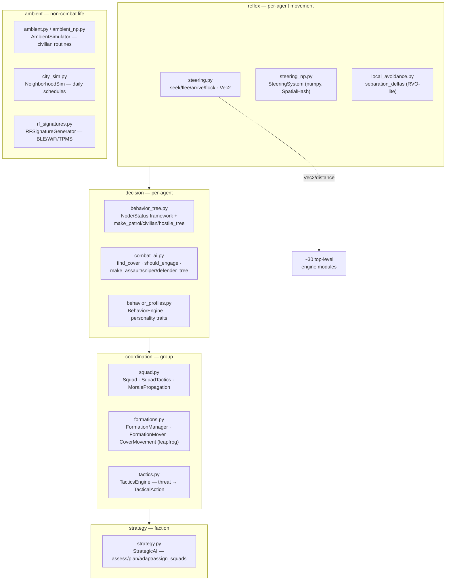

# sim_engine/ai/ — the stand-in driver toolkit

**Parent:** [`../README.md`](../README.md) · **Family:** Simulation

The library of **stand-in AI** that Tritium ships to drive units by default —
steering kinematics, behavior trees, tactical math, squad/formation
coordination, strategic planning, and ambient civilian life. Per the
Tritium-vs-Graphling boundary, this is deliberately *basic video-game AI*:
finite-state reflexes, behavior trees, and steering. It is **not** autonomous
cognition. A Graphling — the rare, exceptional thinking machine — suppresses
these drivers when it occupies a unit; nothing here reasons about the world as
an individual.

Nothing in this package owns a tick loop. It is a **toolkit** of pure
functions and composable objects that the two tick surfaces call into:
`world/_world.py` (the standalone `World`) and `demos/game_server.py` compose
these pieces. The SC `behavior/` drivers do their own thing and do *not* import
`ai/`.

## The one load-bearing module: `steering.py`

`ai/steering.py` is not only "AI" — it defines `Vec2` (a bare
`tuple[float, float]`) and the vector helpers `distance`, `magnitude`,
`normalize` (`steering.py:21`, `:28`, `:33`) that **~30 top-level engine
modules import** (`vehicles.py`, `artillery.py`, `naval.py`, `intel.py`,
`objectives.py`, …). It is the math floor of the whole engine. On top of that
floor sit the classic Reynolds steering behaviors — `seek`, `flee`, `arrive`,
`pursue`, `evade`, `wander`, `follow_path`, `avoid_obstacles`, plus the boids
trio `separate`/`align`/`cohere` and `flock` (`steering.py:71`–`:411`) and
`pn_steer` proportional navigation (`steering.py:166`).

## The AI stack (reflex → strategy)

The package layers cleanly from twitch-reflex movement up to faction-level
planning. Each layer is a separate concern a tick can pull in independently.

## Files

| File | Key objects | What it does |
|------|-------------|--------------|
| `steering.py` | `Vec2`, `distance`/`normalize`, `seek`…`flock`, `pn_steer` | Vector math floor + Reynolds steering behaviors |
| `steering_np.py` | `SteeringSystem`, `SpatialHash` (`:116`, `:28`) | Vectorized steering for large crowds (needs `numpy`) |
| `local_avoidance.py` | `separation_deltas` (`:29`) | Lightweight reciprocal collision-avoidance nudges |
| `behavior_tree.py` | `Node`/`Status`, `Sequence`/`Selector`/`Parallel`, `make_patrol_tree` (`:395`) | BT framework + civilian/patrol/vehicle/friendly/hostile trees |
| `combat_ai.py` | `find_cover`, `should_engage`, `suppression_cone`, `make_assault_tree` (`:608`) | Pure tactical geometry + combat BT builders |
| `behavior_profiles.py` | `BehaviorProfile`, `BehaviorEngine` (`:107`) | Personality traits (aggression, caution…) → decision modifiers |
| `squad.py` | `Squad`, `SquadTactics`, `MoralePropagation` (`:72`, `:228`, `:471`) | Membership, orders, fire sectors, bounding overwatch, morale |
| `formations.py` | `FormationManager`, `FormationMover`, `CoverMovement`, `PathPlanner` | Formation geometry, covered advance, leapfrog (`:699`) |
| `tactics.py` | `TacticsEngine`, `AIPersonality`, `TacticalAction` (`:165`) | Threat assessment → single/squad tactical action choice |
| `strategy.py` | `StrategicAI`, `StrategicGoal`, `StrategicPlan` (`:257`) | Faction-level assess → plan → adapt → assign squads |
| `pathfinding.py` | `RoadNetwork`, `WalkableArea` (`:56`, `:271`) | Road-graph A* + polygon-obstacle A* + patrol routes |
| `ambient.py` | `AmbientSimulator`, `AmbientEntity`, `ActivityProfile` (`:317`) | Civilian ambient life (pure Python) |
| `ambient_np.py` | `AmbientSimulatorNP` (`:89`) | Vectorized ambient sim (needs `numpy`) |
| `city_sim.py` | `NeighborhoodSim`, `Resident`, `DailySchedule`, `SimVehicle` (`:1486`) | Full city-life sim — residents run daily routines, drive, park |
| `rf_signatures.py` | `RFSignatureGenerator`, `Person/Vehicle/BuildingRFProfile` (`:577`) | Emits BLE/WiFi/TPMS signatures (MAC rotation, persistent TPMS) |

## How a tick invokes it (Palantir lens)

- **Objects:** `Squad`, `FormationManager`, `TacticsEngine`, `StrategicAI`,
  `NeighborhoodSim` — long-lived state holders. `Vec2`/`Node`/`TacticalAction`
  — value objects passed between them.
- **Typed actions:** `TacticsEngine.decide_action(situation) -> TacticalAction`
  (`tactics.py:298`), `StrategicAI.plan(faction, assessment) -> StrategicPlan`
  (`strategy.py:370`), behavior-tree `Node.tick(context) -> Status`
  (`behavior_tree.py:47`). Each is a pure decision: state in, decision out.
- **Links:** a `Squad` links member unit-ids; a `StrategicPlan` links a goal to
  the squads assigned to it (`StrategicAI.assign_squads`, `strategy.py:681`).

**Standalone `World`** pulls in `steering`, `squad` (`Squad`/`SquadTactics`),
`tactics` (`TacticsEngine`), and `formations` (`_world.py:29`, `:91`–`:93`);
its `_tick_squads` runs squad cohesion/orders and its `_tick_units` steers
units toward tactical targets. **`game_server.py`** composes nearly the whole
package — `tactics`, `squad`, `behavior_tree`, `steering`, `formations`,
`combat_ai`, `pathfinding`, `strategy`, `behavior_profiles`
(`game_server.py:171`–`:222`) — the fullest demonstration of the stack.

## Dependencies

- **Required:** none for `steering`, `behavior_tree`, `combat_ai`, `squad`,
  `tactics`, `strategy`, `formations`, `pathfinding`, `ambient`, `city_sim`,
  `rf_signatures`, `behavior_profiles` (pure Python, stdlib only).
- **Optional:** `numpy` — required only by `steering_np.SteeringSystem` and
  `ambient_np.AmbientSimulatorNP` for vectorized large-crowd math.
