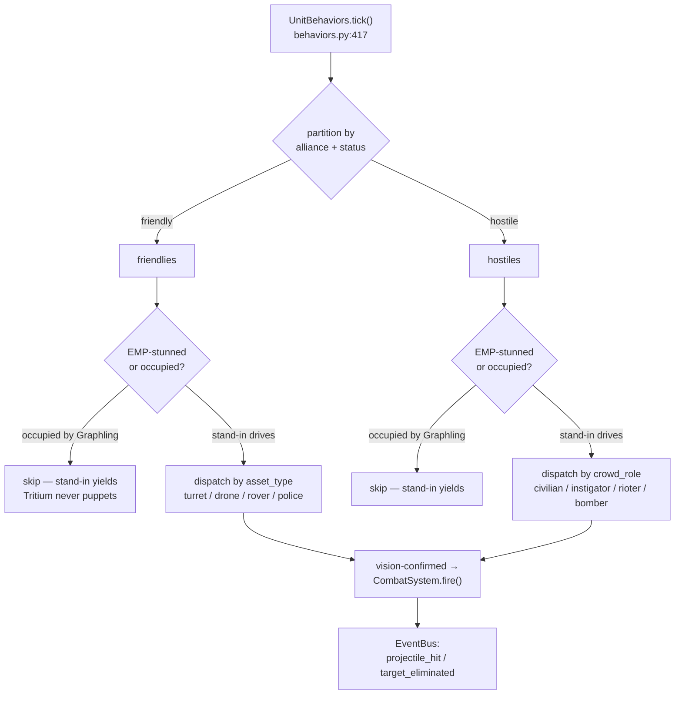

# sim_engine/behavior/

**Parent:** [`../README.md`](../README.md) · **Family:** Simulation

The **stand-in drivers**. This package is the "basic video-game-style AI"
the North Star calls for: FSMs and per-type combat logic that drive *every*
unit by default so the simulator and the production stack both run fully with
zero Graphlings on the field. When a rare, exceptional unit *is* occupied by a
Graphling, the stand-in here steps aside — it never puppets an occupied
embodiment.

## Files

| File | Key objects | Purpose |
|------|-------------|---------|
| `behaviors.py` | `UnitBehaviors` (@171), `_WEAPON_TYPES` (@118) | Per-type combat AI — the main per-tick dispatch for turrets, drones, rovers, police, and hostile crowd roles |
| `unit_states.py` | `create_turret_fsm` (@45), `create_rover_fsm` (@161), `create_drone_fsm` (@267), `create_hostile_fsm` (@363), `create_fsm_for_type` (@590) | FSM **factories** — build a per-unit-type `StateMachine`; plus three.js serializers for the state overlay |
| `unit_missions.py` | `UnitMissionSystem` (@171) | Assigns and advances patrol / grid-sweep / sector-scout waypoint missions |
| `npc.py` | `NPCManager` (@176), `NPCMission` (@55), `traffic_density` (@150) | Civilian population — vehicles, pedestrians, road following, daily schedules |
| `doctrine.py` | `find_peek_position` | LOS-recovery: side-step a masked shooter to a peek/flank point that restores line of sight |
| `_degradation_compat.py` | `can_fire_degraded` (@21) | Degradation gate — a too-damaged unit cannot fire (back-compat helper) |

> Note on `unit_states.py`: it holds FSM *factories*, not a state dataclass.
> The mutable runtime state (health, ammo, morale, suppression, kills) lives on
> the `SimulationTarget` entity (`core/entity.py`); the FSM tracks the discrete
> combat *phase* (idle / scanning / tracking / engaging / cooldown) that the
> stand-in AI reads each tick.

## Palantir lens

- **Objects:** `UnitBehaviors` (the per-tick driver), a per-unit `StateMachine`
  (its combat phase), an `NPCMission` (a civilian's route + schedule).
- **Links:** each tick partitions the target set into friend/foe links —
  friendlies engage hostiles, crowd roles engage the police line.
- **Typed actions:** `tick(dt, targets, vision_state)`, and the per-type
  handlers it dispatches to (`_turret_behavior`, `_drone_behavior`,
  `_rover_behavior`, `_police_behavior`, `_instigator_behavior`,
  `_rioter_behavior`, `_rover_de_escalation`).
- **Decisions as data:** a decision to shoot is expressed as a
  `CombatSystem.fire(...)` call (`behaviors.py:550`), which the combat system
  turns into a published `projectile_hit` / `target_eliminated` event — the
  behavior layer never mutates health directly.

## The per-tick dispatch

`UnitBehaviors.tick(dt, targets, vision_state)` (`behaviors.py:417`) is the
heart of the stand-in AI for the SC BattleEngine:

1. **Partition by alliance + role.** Friendlies are `alliance == "friendly"`,
   combatant, in an alive status; hostiles are `alliance == "hostile"`,
   combatant, `active` (`behaviors.py:423-432`). Behaviors *read* alliance to
   pick friend from foe — they never reclassify it. (Deliberate alliance
   changes, e.g. de-escalating an instigator to `neutral`, are the mode
   layer's job.)
2. **Two guards skip a unit before any AI runs** (`behaviors.py:436-441`,
   `483-488`):
   - **EMP-stunned** units cannot act.
   - **Occupied embodiment** — `_is_occupied(tid)` is true when an external
     agent (a Graphling) drives this unit; the stand-in AI is suppressed so
     *Tritium never puppets it.* This is the IP boundary in one `if` statement.
3. **Dispatch friendlies by `asset_type`** (`behaviors.py:447-464`): turret,
   heavy/missile turret, drone, scout_drone, rover, tank/apc, police, graphling.
4. **Dispatch hostiles by crowd role / drone variant** (`behaviors.py:491-511`):
   `civilian`, `instigator`, `rioter`, `bomber_swarm`, `scout_swarm`, else the
   default hostile combatant. Combat choices (engage, suppress, flee, seek
   cover, de-escalate) are weighted by health, morale, and range.

A turret's decision to fire is confirmed by the vision system before the
trigger pulls (`behaviors.py:544-551`) — heading rotates toward the nearest
threat, but only a vision-confirmed target draws a `fire()`.

## Two stand-in AI implementations

There are two per-unit AI drivers in the family, one per tick surface:

- **`UnitBehaviors`** (this package) is the AI the **tritium-sc BattleEngine**
  wires (`engine.py:355` `UnitBehaviors(self.combat)`) — the richest one,
  covering combat, crowd control, riots, and de-escalation.
- The standalone **`World`** carries its own inline `_tick_units`
  (`world/_world.py:561`), a 6-priority behaviour ladder (retreat → seek cover →
  suppress-without-LOS → flank → engage → follow squad order) for the
  self-contained demo world.

Both are stand-ins in the North-Star sense; a Graphling replaces neither by
force — it simply occupies a slot and the stand-in yields.

## Dependencies

Pure stdlib + intra-package (`combat.CombatSystem`, `core.StateMachine`,
`core.SimulationTarget`). No framework deps — this is reusable library code.
