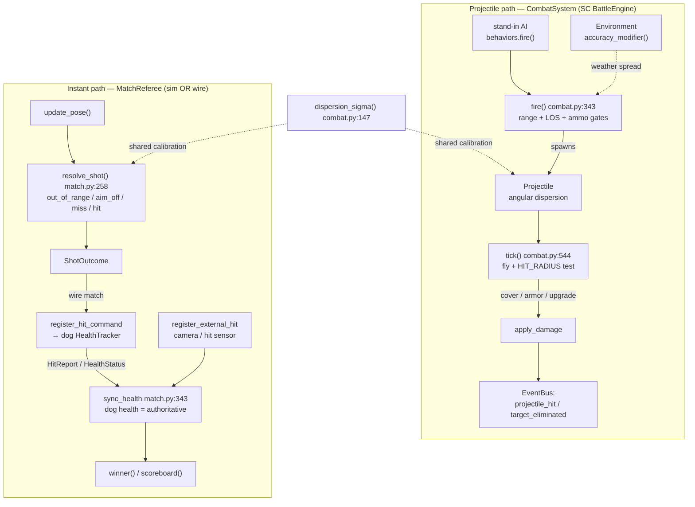

# sim_engine/combat/

**Parent:** [`../README.md`](../README.md) · **Family:** Simulation

Hit resolution for the simulator — and the *same* scoring brain that
arbitrates real hardware. Combat here is deliberately transport-agnostic:
a shot is a shot whether it comes from a stand-in AI in the sim tick, a
robot dog pulling a nerf trigger on the field, or a camera-scored impact.
That dual use is the North Star in one package — the game validates the
production scoring path because they are literally the same code.

## Files

| File | Key objects | Purpose |
|------|-------------|---------|
| `combat.py` | `CombatSystem` (@268), `Projectile` (@197), `dispersion_sigma` (@147), `weather_spread_factor` (@125) | Projectile lifecycle: spawn with angular dispersion, fly ballistically, resolve hits, apply damage, publish events |
| `match.py` | `MatchReferee` (@183), `MatchCombatant` (@137), `ShotOutcome` (@168), `register_hit_command` (@449) | Instant-resolve duel/match scoring — one trigger pull → one adjudicated verdict, sim units *and* wire robots |
| `weapons.py` | `Weapon` (@27), `WeaponSystem` (@122), `WEAPON_CATALOG` (@101) | Per-unit weapon stats: ammo, reload, accuracy, damage, weapon class (missile = guided) |
| `squads.py` | `Squad` (@89), `SquadManager` (@175) | Auto-clusters units into squads with a leader, shared targeting, focus-fire |

## Palantir lens

- **Objects:** `Projectile` (an in-flight round), `Weapon` (a firing
  profile), `MatchCombatant` (an entrant's pose + hitpoints), `ShotOutcome`
  (a verdict).
- **Links:** every projectile links a `source_id` → `target_id`; a squad
  links a leader → members.
- **Typed actions:** `CombatSystem.fire(source, target)`,
  `CombatSystem.tick(dt, targets)`, `MatchReferee.resolve_shot(shooter, target)`,
  `MatchReferee.register_external_hit(...)`, `MatchReferee.sync_health(...)`.
- **Decisions as data:** hits are not applied silently — they are published
  as `projectile_hit` / `target_eliminated` events on the `EventBus`
  (`combat.py:674`, `combat.py:701`) and returned as immutable `ShotOutcome`
  records. The frontend, announcer, and stats tracker all read the same
  decision stream.

## Two resolution paths

### Projectile path — `CombatSystem`

Physically-modelled ballistics for the live battle sim. Every qualifying
shot spawns a *real* projectile; there is no accuracy pre-roll — accuracy is
realised as angular dispersion at flight time.

1. **`fire(source, target)`** (`combat.py:343`) gates the shot: `can_fire()`,
   non-empty magazine, in `weapon_range`, and (for ground direct fire) a
   terrain line-of-sight check. Mortar-capable units lob indirect over
   obstacles; aerial shots skip LOS. A *refused* fire solution never burns a
   round. Damage/accuracy come from `WeaponSystem` when wired, else the
   unit's flat combat profile.
2. **`tick(dt, targets, cover_system)`** (`combat.py:544`) advances each
   projectile. Unguided rounds commit to their dispersed aim point and fly
   straight; guided (missile-class) rounds home on the target's live
   position. In-flight building occlusion detonates a flat shot at the wall.
   A hit within `HIT_RADIUS` applies damage after cover, inventory armor, and
   upgrade reductions (capped at 80% total reduction), then publishes
   `projectile_hit` and — on a kill — `target_eliminated`.
3. **Weather perception** (`combat.py:313` `set_weather_environment`) attaches
   a duck-typed `Environment`; worse weather lowers its `accuracy_modifier()`,
   which `weather_spread_factor` (`combat.py:125`) maps to a wider dispersion
   sigma at fire time (`combat.py:489`). **Weather-off is byte-identical to
   the pre-weather path** — the canonical projectile-flight goldens run
   weather-off, so this layer adds fidelity without disturbing determinism.

### Instant-resolve path — `MatchReferee`

The nerf-match adjudicator (`match.py`). Two or more combatants register a
pose + weapon; each trigger pull is resolved immediately against the *same*
`dispersion_sigma` calibration the projectile sim uses (`match.py:36`), so a
match self-calibrates to the identical ballistics the goldens prove.

- **`resolve_shot(shooter, target, spread_factor)`** (`match.py:258`) returns
  a `ShotOutcome` with an ordered miss-gate reason: `out_of_range`, `aim_off`
  (world aim `heading + turret_pan` ≥ 90° off true bearing), `dispersion_miss`,
  or `hit`. Range/aim gates consume no RNG draw, so replaying a match with
  different arena geometry keeps deterministic per-shot draws.
- **Wire-match hit feedback:** in a hardware match the referee only
  *adjudicates* — the dog owns its health. A verdict becomes a
  `register_hit` command (`register_hit_command`, `match.py:449`) on the
  target's command topic; the dog applies damage with its own
  `HealthTracker`, publishes a `HitReport`, and embeds `HealthStatus` in
  telemetry. That reported health is **authoritative**: `sync_health`
  (`match.py:343`) pins the referee's book to it, and KO resolves on the
  dog-reported health. Hits the referee never saw (physical hit sensor,
  camera impact) enter via `register_external_hit` (`match.py:375`).
- This is stand-in scoring *support*, never cognition — the referee decides
  the outcome of a shot, it never decides *for* a machine.

## Integration

`combat/` is the reusable combat brain consumed by the **tritium-sc
BattleEngine**, not by the standalone `World`:

- `tritium-sc/src/engine/simulation/engine.py:351` constructs `CombatSystem`
  and wires it to `UnitBehaviors` (`:355`) and `GameMode` (`:354`). Units call
  `fire()` from their behavior step (`behavior/behaviors.py:550`); the engine
  calls `combat.tick()` each frame.
- The standalone `World` (`world/_world.py`) uses its **own**
  `ProjectileSimulator` from `arsenal.py`, not `CombatSystem` — a parallel
  ballistics path for the self-contained demo world.
- `MatchReferee` is transport-agnostic: whatever delivers poses and trigger
  pulls (sim tick, MQTT bridge, REST, camera scorer) simply calls
  `update_pose()` and `resolve_shot()`.

## Dependencies

Pure stdlib + intra-package imports. `match.py` also imports
`tritium_lib.models.fire_control` (`FireSolution`, pan/tilt clamps) and
`tritium_lib.models.hits` (`RegisterHitCommand`) so its verdicts speak the
same contract a real robot's `WeaponStatus` telemetry uses.
