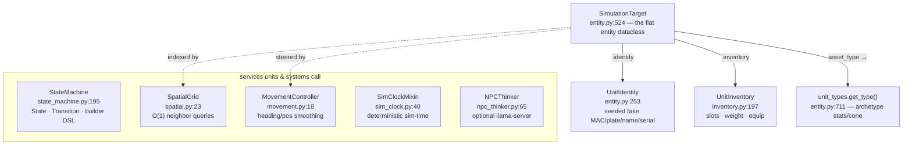

# sim_engine/core/ — the shared primitives

**Parent:** [`../README.md`](../README.md) · **Family:** Simulation

The seven foundational modules every other subpackage builds on: the entity
dataclass, its identity and inventory, the FSM engine, the spatial grid,
movement smoothing, the deterministic sim clock, and the optional LLM thinker.
Small, dependency-free, and reused everywhere.

## What composes into a unit

## Files

| File | Key objects | What it does |
|------|-------------|--------------|
| `entity.py` | `SimulationTarget` (`:524`), `UnitIdentity` (`:253`), `build_identity` (`:334`), `generate_*` (`:141`+) | The flat runtime entity + deterministic, seed-stable fake identity (MAC, license plate, cell id, address, serial, firmware, name, employer, vehicle info) |
| `inventory.py` | `UnitInventory` (`:197`), `InventoryItem` (`:52`), `build_loadout` (`:513`), `select_best_weapon` (`:702`) | Item slots, weight, equip/drop; loadout builder from a catalog; best-weapon selection |
| `state_machine.py` | `StateMachine` (`:195`), `State` (`:43`), `Transition` (`:160`) | Generic FSM with on-enter/on-tick/on-exit callbacks and a fluent transition builder |
| `spatial.py` | `SpatialGrid` (`:23`) | 2-D cell grid; O(1) neighbor lookups replace O(n) scans |
| `movement.py` | `MovementController` (`:18`), `smooth_path` (`:148`) | Smooth position interpolation + heading updates; waypoint smoothing |
| `sim_clock.py` | `SimClockMixin` (`:40`) | `_now()` reads an attached engine's `_sim_clock` (deterministic sim-time), falls back to wall-clock only when standalone |
| `npc_thinker.py` | `NPCThinker` (`:65`), `NPCThought` (`:54`) | Async LLM-backed NPC reasoning via llama-server — enhances, never required |

## Two primitives worth understanding

**`UnitIdentity` (entity.py:253)** — every entity gets a *deterministic* fake
identity seeded from its `target_id` (`_seed_rng`, `entity.py:125`). Re-running
the same sim produces the same MACs, plates, and names, so RF/vision fusion
tests are reproducible. `SimulationTarget` looks up its archetype at
`entity.py:711` via `unit_types.get_type(self.asset_type)` — see
[`../unit_types/README.md`](../unit_types/README.md).

**`SimClockMixin` (sim_clock.py:40)** — the determinism fix for golden replays.
A headless replay runs ~500× real-time, so a *wall-clock* "3 seconds since last
hit" window never elapses between ticks — until CPU load deschedules the
process and it crosses on some ticks but not others, drifting the same seed
run-to-run. Routing time-gated windows (morale recovery, assist windows,
cooldowns) through `_now()` makes them mean *simulated* seconds. Mixed into
`game/morale.py` and `game/stats.py` via `attach_clock(engine)`.

## Palantir lens

- **Objects:** `SimulationTarget` (the entity), `UnitIdentity` / `UnitInventory`
  (its components), `State` (a node), `InventoryItem` (a carried thing).
- **Typed actions:** `StateMachine.transition_to(state)` and `.update(ctx, dt)`;
  `UnitInventory.equip/drop`; `SpatialGrid.query_radius(pos, r)`;
  `MovementController` step; `NPCThinker.think(...) -> NPCThought`.
- **Links:** `SimulationTarget` → `UnitIdentity` (has-a), → `UnitInventory`
  (has-a), → `unit_types.UnitType` (is-a-kind-of, by `asset_type`).

## Dependencies

- **Required:** none — pure Python / stdlib.
- **Optional:** an LLM endpoint (llama-server) for `NPCThinker`; absent, it
  degrades gracefully and units fall back to stand-in FSM/BT drivers.
