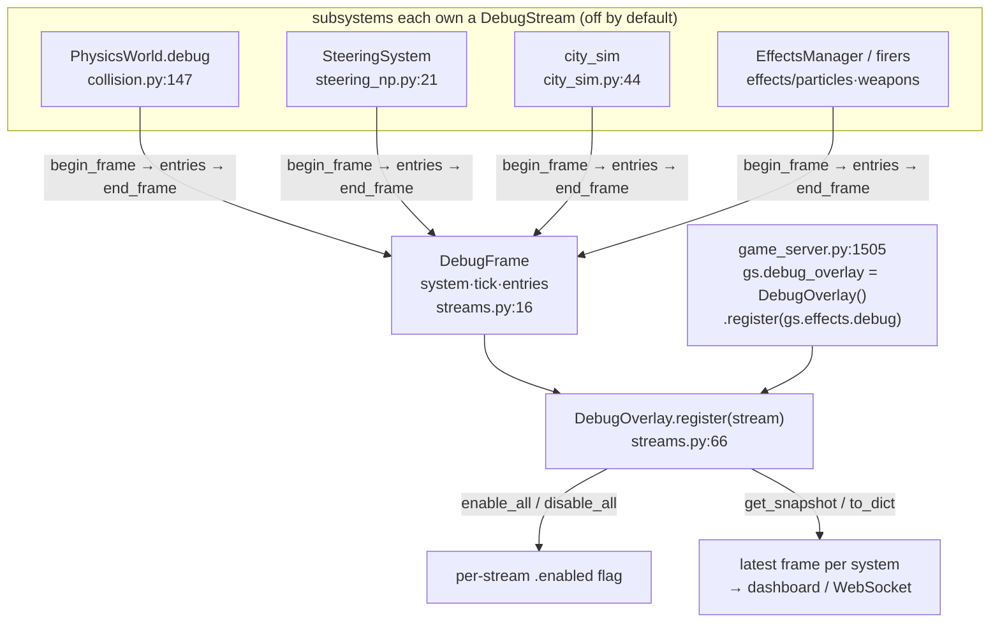

# sim_engine/debug/ — per-subsystem debug streams

**Parent:** [`../README.md`](../README.md) · **Family:** Simulation

An opt-in diagnostics channel. Any subsystem can own a `DebugStream` that
records one `DebugFrame` per tick; a `DebugOverlay` aggregates the latest frame
from every registered stream into one snapshot for a dashboard or WebSocket.
Off by default — when a stream is disabled, `begin_frame()` returns `None` and
the subsystem does zero work (`streams.py:37`).

## The aggregation model

## Files

| File | Key objects | What it does |
|------|-------------|--------------|
| `streams.py` | `DebugOverlay` (`:66`), `DebugStream` (`:24`), `DebugFrame` (`:16`) | `DebugStream` = one subsystem's ring buffer (`max_history=60`) of per-tick frames; `DebugOverlay` = the multi-system aggregator with `register`/`enable_all`/`disable_all`/`get_snapshot`/`to_dict` |

## Who wires it (verified)

`DebugStream` is embedded in `physics/collision.py` (`PhysicsWorld.debug`),
`ai/steering_np.py`, `ai/city_sim.py`, `effects/weapons.py`, and
`effects/particles.py` — each holds its own stream, disabled by default.
`demos/game_server.py` builds the `DebugOverlay` and registers streams into it
(`game_server.py:1505`).

## Palantir lens

- **Objects:** `DebugStream` (one subsystem's log), `DebugOverlay` (the
  aggregate view), `DebugFrame` (one tick's snapshot: `system`, `tick`,
  `timestamp`, `entries`).
- **Typed actions:** `stream.begin_frame() -> DebugFrame | None` /
  `end_frame(frame)`; `overlay.register(stream)`, `enable_all()`,
  `get_snapshot() -> dict[str, DebugFrame]`, `to_dict()`.
- **Links:** an overlay indexes streams by `system` name; a frame links back to
  the stream (and tick) that produced it.

## Dependencies

None — pure Python / stdlib.
