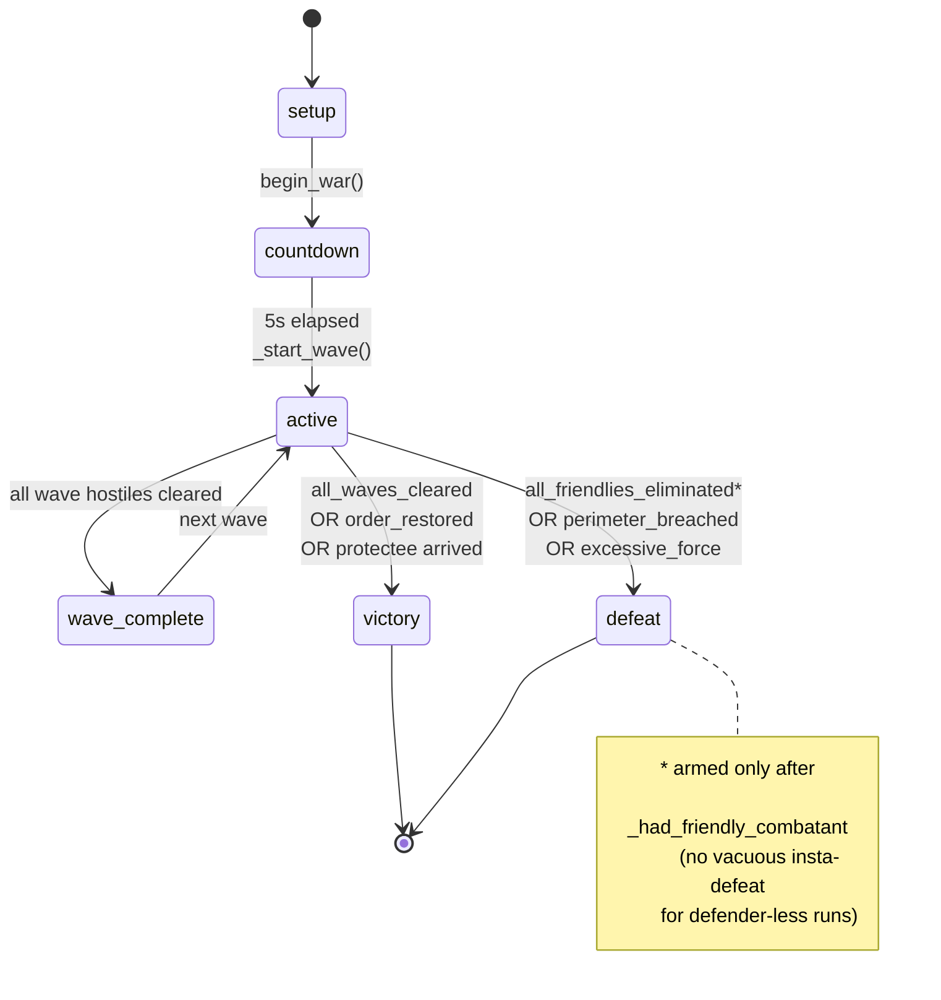

# sim_engine/game/

**Parent:** [`../README.md`](../README.md) · **Family:** Simulation

The **rules layer**. Everything in `combat/` and `behavior/` decides how a
unit *acts*; `game/` decides what a *session* means — when a wave spawns,
when the operator has won or lost, how hard the next wave hits, and how the
scoreboard reads. It is the mode/victory brain, deliberately engine-agnostic:
`GameMode` talks to a duck-typed engine, so the same rules drive the sim
BattleEngine, a headless replay, or a future live deployment.

## Files

| File | Key objects | Purpose |
|------|-------------|---------|
| `game_mode.py` | `GameMode` (@167), `WaveConfig` (@50), `WAVE_CONFIGS` (@76), `InfiniteWaveMode` | Session FSM, wave controller, victory/defeat rules, scoring |
| `difficulty.py` | `DifficultyScaler` (@80), `WaveRecord` (@71) | Adaptive enemy stat scaling from recent player performance |
| `stats.py` | `StatsTracker` (@153), `WaveStats` (@119), `UnitStats` (@46) | Per-unit and per-wave kill/accuracy tracking, K/D, game-over payload |
| `morale.py` | `MoraleSystem` (@45) | Per-unit morale, panic triggers, rally mechanics |
| `ambient.py` | `AmbientSpawner` (@206) | Background world life — animals, pedestrians on a street grid |
| `crowd_density.py` | `CrowdDensityTracker` (@111), `crowd_density_payload` (@57) | Civilian density heat map by zone |
| `bloc_dynamics.py` | `BlocDynamicsTracker` (@65) | Crowd-bloc cohesion/fracture for riot & civil-unrest modes |
| `riot_police.py` | `PoliceTacticsController` (@327) | Crowd-control doctrine — lines, kettling, dispersal for the civil-unrest mode |

## Palantir lens

- **Objects:** `GameMode` (the session), `WaveConfig` (one wave's recipe),
  `WaveStats` / `UnitStats` (the scoreboard records).
- **Links:** a wave links its spawned hostile ids (`_wave_hostile_ids`) to the
  session; the scaler links recent `WaveRecord`s to the next wave's multipliers.
- **Typed actions:** `begin_war()`, `tick(dt)`, `on_target_eliminated(id)`,
  `reset()`.
- **Decisions as data:** every state change publishes a `game_state_change`
  event, and the terminal decision is captured centrally as `end_reason` (a
  queryable string on `get_state()`, not only a one-shot `game_over` event a
  consumer might miss).

## The session FSM

`GameMode.tick(dt)` (`game_mode.py:364`) drives a linear state machine:

```
setup → countdown (5s) → active → wave_complete → active → … → victory | defeat
```

Ten hand-authored waves of rising difficulty (`WAVE_CONFIGS`, `game_mode.py:76`)
escalate from a 3-unit Scout Party to a 25-unit FINAL STAND with mixed
compositions and tactical spawn directions (pincer, surround); past wave 10,
`InfiniteWaveMode` generates them procedurally. The mode adapts by
`game_mode_type` — **battle, defense, escort, patrol, civil_unrest,
drone_swarm** — each with its own victory/defeat doctrine:

| `game_mode_type` | Win | Lose |
|------------------|-----|------|
| battle / defense | `all_waves_cleared` | `all_friendlies_eliminated`, `perimeter_breached` |
| escort | `protectee_reached_destination` | `protectee_lost` |
| civil_unrest | `order_restored` (de-escalation meter crosses target) | `excessive_force` |

Wave hostiles that slip past the defense are tracked as **leaks**
(`total_leaked`), so leaking has visible stakes instead of counting as a
clean wave. A stalemate guard force-culls a wave only when neither a kill nor
*damage* has occurred for the timeout — slow-but-real combat is not falsely
declared a stalemate.

## The annihilation-arming guard (`_had_friendly_combatant`)

The defeat rule "all friendly combatants eliminated" carries a golden-governance
guard so a scenario that fields **no defenders at all** (the `stress_test`
render scenario, or an operator who starts the battle before deploying) is not
*vacuously* insta-defeated at t≈5s:

- `_had_friendly_combatant` starts `False` (`game_mode.py:259`).
- `begin_war()` sets it `True` if any friendly combatant is on the field at war
  start (`game_mode.py:341-348`); `_tick_active` also arms it the moment the
  first friendly combatant ever appears — pre-placed or deployed mid-game
  (`game_mode.py:676-677`).
- The annihilation check only fires the defeat **once the rule is armed**
  (`game_mode.py:678-685`). An unarmed, defender-less run proceeds to a *real*
  terminal state (leaks / stalemate cull / hard timeout) instead of ending at
  the first active tick. Before this guard, the `stress_test` golden pinned a
  vacuous defeat at t=5.2s with 0 of 3 waves completed.

## Duck-typed engine contract

`GameMode(event_bus, engine, combat_system)` (`game_mode.py:167`) depends on
its engine only through a small duck-typed surface (documented at
`game_mode.py:33-38`): `get_targets()`, `spawn_hostile()`,
`spawn_hostile_typed()`, `add_target()`, `set_map_bounds()`, `hazard_manager`,
`stats_tracker`. The tritium-sc BattleEngine satisfies it
(`engine.py:354` `GameMode(event_bus, self, self.combat)`), and
`tritium-sc/src/engine/simulation/game_mode.py:11` simply re-exports this class
— the SC-side and lib-side `GameMode` are one and the same.



## Dependencies

Pure stdlib. `stats.py` and `morale.py` mix in `SimClockMixin` so their
timers advance on the game sim clock, keeping fast replay paced identically
to real-time play.
