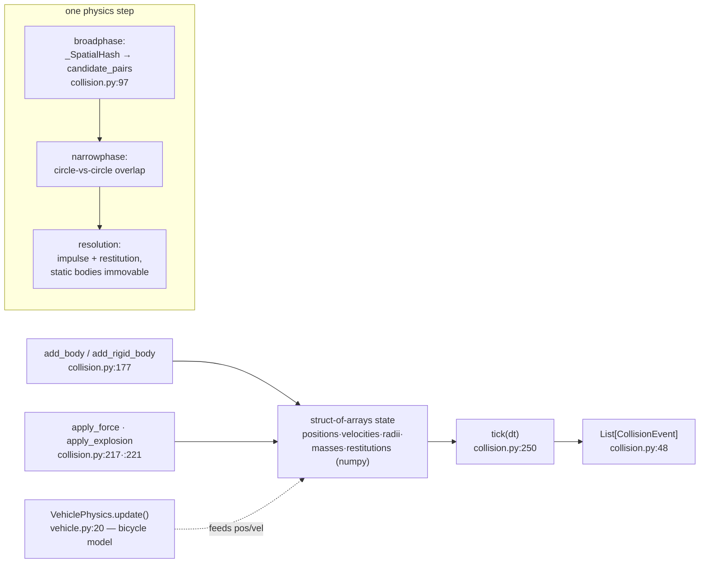

# sim_engine/physics/ — rigid-body collision & vehicle dynamics

**Parent:** [`../README.md`](../README.md) · **Family:** Simulation

A small, vectorized 2-D physics package: an N-body collision world and a
bicycle-model vehicle integrator. It is a **standalone building block** — the
standalone `World` does its own inline obstacle checks and uses the top-level
`vehicles.VehiclePhysicsEngine`, so `physics/` is composed on demand. The
`demos/game_server.py` car demo wires `VehiclePhysics` directly
(`game_server.py:1519`).

Unlike most of `sim_engine`, this package **requires `numpy`** — all body
state lives in flat struct-of-arrays so broadphase and integration vectorize
(`collision.py:120`).

## The collision tick

## Files

| File | Key objects | What it does |
|------|-------------|--------------|
| `collision.py` | `PhysicsWorld` (`:117`), `RigidBody` (`:33`), `CollisionEvent` (`:48`), `_SpatialHash` (`:64`) | N-body 2-D world: spatial-hash broadphase, circle narrowphase, impulse resolution, `apply_explosion` radial knockback |
| `vehicle.py` | `VehiclePhysics` (`:20`) | Bicycle-model car dynamics — turning arcs, acceleration, braking, drag; feeds position/velocity into `PhysicsWorld` |

## Palantir lens

- **Objects:** `PhysicsWorld` (the aggregate — owns every body's arrays),
  `RigidBody` (a descriptor for one body), `VehiclePhysics` (one car's dynamics
  state).
- **Typed actions:** `PhysicsWorld.tick(dt) -> List[CollisionEvent]` (`:250`) —
  the step; `add_body(...) -> int` (`:177`) returns a body index that indexes
  every parallel array; `apply_explosion(center, radius, force)` (`:221`) —
  radial impulse. `VehiclePhysics.update(throttle, steer, dt)` integrates one
  car and returns its new pose.
- **Links:** a `CollisionEvent` links two body indices; a `RigidBody` maps to a
  slot via the index returned from `add_body`. `VehiclePhysics` has no built-in
  link to `PhysicsWorld` — the caller feeds the car's pose into a body each tick.

## Debug

`PhysicsWorld` owns a `DebugStream("physics")` (`collision.py:147`), disabled by
default (zero overhead). Enable it to capture per-tick pair counts and
resolution data — see [`../debug/README.md`](../debug/README.md).

## Dependencies

- **Required:** `numpy` (this is the one `sim_engine` subpackage that hard-requires it).
