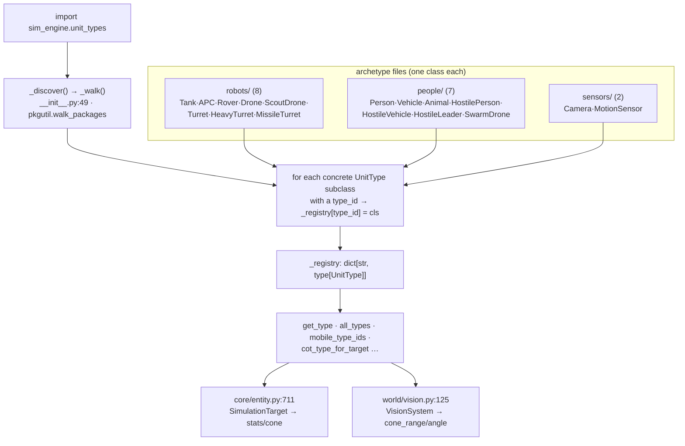

# sim_engine/unit_types/ — the archetype registry

**Parent:** [`../README.md`](../README.md) · **Family:** Simulation

The **type system** for units. Where `core/SimulationTarget` is the *instance*
(one unit's runtime state — position, health, inventory), a `UnitType` is the
*archetype*: the class-level stats every `tank` shares — speed, vision cone,
weapon profile, CoT symbol. One file per archetype; a self-populating registry
resolves `"tank"` → the `Tank` class on import.

This is the cleanest Palantir "object type" surface in the engine: an
**object-type registry** with typed lookups.

## How the registry works

Importing the package auto-discovers every concrete `UnitType` subclass by
walking the subpackages — no manual registration list to keep in sync.



## The two base classes

`base.py` defines the whole type language (`base.py:18`–`:98`):

- **`UnitType` (`base.py:38`)** — an archetype declared entirely with
  `ClassVar` fields: `type_id`, `display_name`, `icon`, `cot_type` (MIL-STD-2525
  / TAK symbol), `category` (`MovementCategory`), `speed`, `combat`
  (`CombatStats`), `drain_rate`, `cruising_altitude`, perception cone
  (`vision_radius`, `ambient_radius`, `cone_range`, `cone_angle`, `cone_sweeps`,
  `cone_sweep_rpm`), and `placeable`. Helper classmethods `is_mobile`,
  `is_flying`, `is_ground`, `is_foot`, `is_stationary` (`base.py:78`+) key off
  `category`.
- **`CombatStats` (`base.py:27`)** — a frozen weapon/health descriptor:
  `health`, `max_health`, `weapon_range`, `weapon_cooldown`, `weapon_damage`,
  `is_combatant`, `weapon_id`.
- **`MovementCategory` (`base.py:18`)** — `STATIONARY` / `GROUND` / `AIR` /
  `FOOT`, the axis every mobility query pivots on.

## Registry API (`__init__.py`)

| Call | Returns | Line |
|------|---------|------|
| `get_type(type_id)` | the `UnitType` subclass (honors `_ALIASES`) | `:76` |
| `all_types()` | every registered class, sorted | `:81` |
| `mobile_type_ids()` / `static_type_ids()` | ids by mobility | `:85` / `:89` |
| `flying_type_ids()` / `ground_type_ids()` / `foot_type_ids()` | ids by category | `:93`+ |
| `dispatchable_type_ids()` | mobile **and** `placeable` | `:130` |
| `get_cot_type(type_id)` | the archetype's CoT symbol | `:105` |
| `cot_type_for_target(type_id, alliance)` | CoT symbol with affiliation byte applied | `:112` |

`cot_type_for_target` is the bridge to TAK: it rewrites the affiliation nibble
(`a-f-…` friendly, `a-h-…` hostile, `a-n-…` neutral, `a-u-…` unknown) and maps
hostile variants (`person`→`hostile_person`) so a tracked target renders with
the correct MIL-STD-2525 symbol.

## Archetypes (17 classes, 3 domains)

| Domain | Classes |
|--------|---------|
| `robots/` (8) | `Rover`, `Turret`, `ScoutDrone`, `Tank`, `MissileTurret`, `HeavyTurret`, `APC`, `Drone` |
| `people/` (7) | `Person`, `Vehicle`, `Animal`, `HostilePerson`, `HostileVehicle`, `HostileLeader`, `SwarmDrone` |
| `sensors/` (2) | `Camera`, `MotionSensor` |

## Adding an archetype

Create `robots/my_bot.py` (or under `people/` / `sensors/`), subclass
`UnitType`, set its `ClassVar` fields including `type_id` and
`combat=CombatStats(...)`. That's it — `_discover()` finds it on next import; no
registry edit needed. Example (`robots/tank.py:7`):

```python
class Tank(UnitType):
    type_id = "tank"
    category = MovementCategory.GROUND
    speed = 1.5
    vision_radius = 45.0
    cone_range = 35.0; cone_angle = 90.0
    placeable = True
    combat = CombatStats(health=400, max_health=400,
                         weapon_range=100.0, weapon_cooldown=3.0,
                         weapon_damage=30, is_combatant=True)
```

## Palantir lens

- **Object type vs object:** `UnitType` = the type; `core.SimulationTarget` =
  an instance of that type. `SimulationTarget.asset_type` is the link
  (`get_type(asset_type)`).
- **Typed actions:** the registry lookups above — each is a pure, total
  function over the type set.
- **Links:** every archetype links to a `cot_type` (→ the tactical map / TAK)
  and a `CombatStats` (→ how `combat/` resolves its fire).

## Dependencies

None — pure Python / stdlib.
