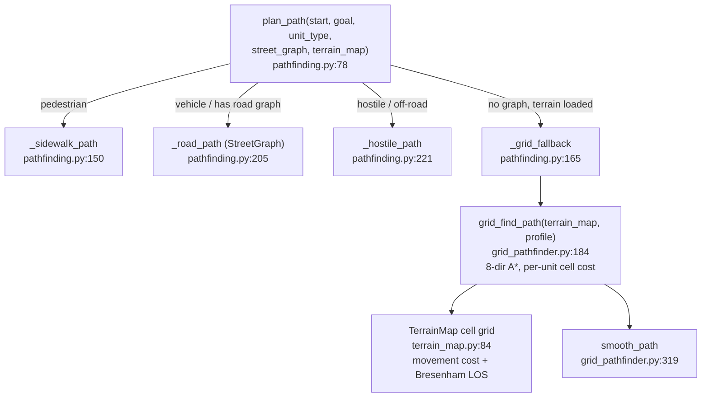

# sim_engine/world/ — the world model

**Parent:** [`../README.md`](../README.md) · **Family:** Simulation

Everything a unit needs to know about the ground it stands on: terrain and its
movement cost, what it can *see* (line-of-sight, fog-of-war), what covers it,
what its sensors detect, and how it navigates from A to B. Two things share this
package that read as one but are not:

1. **`_world.py` — the standalone `World`.** A self-contained sandbox with its
   own 13-step `tick()` (`_world.py:404`). It does **not** compose the rest of
   this package — it builds its terrain from the **top-level** `terrain.py`
   (`HeightMap`, `LineOfSight`, `MovementCost`, imported at `_world.py:71`) and
   its AI from `ai.tactics`. Used by `demos/game_server.py` and the demo scripts.
2. **The world-model building blocks** — `vision`, `cover`, `sensors`,
   `terrain_map`, `grid_pathfinder`, `pathfinding`, `hazards`, `lod`, `comms`,
   `intercept`, `pursuit`, `procedural_city`. These are reusable systems
   composed **mostly by the SC BattleEngine**
   (`tritium-sc/src/engine/simulation/engine.py`), not by the standalone `World`.

Keeping those two straight is the key to reading this package.

## Who composes what (verified)

| Building block | Class | Real consumer |
|----------------|-------|---------------|
| `cover.py` | `CoverSystem` (`:34`) | SC engine `engine.py:76` |
| `sensors.py` | `SensorSimulator` (`:38`) | SC engine `engine.py:91` |
| `vision.py` | `VisionSystem`, `SightingReport` (`:70`, `:42`) | SC `targets_unified.py:1397` |
| `pathfinding.py` | `plan_path`, `clearance_for_unit_type` (`:78`, `:66`) | SC `route_planning.py:57` |
| `hazards.py` | `HazardManager`, `Hazard` (`:57`, `:45`) | SC `sim_crowd.py:44`, SC `engine/simulation/hazards.py` |
| `terrain_map.py` | `TerrainMap`, `TerrainCell` (`:84`, `:61`) | grid A* target; SC route planning |
| `lod` / `comms` / `pursuit` / `intercept` / `procedural_city` | `LODSystem`, `UnitComms`, `PursuitSystem`, `predict_intercept`, `generate_demo_city` | exported building blocks (SC runs its own `lod`; these await composition) |

> Note: SC's BattleEngine imports `LODSystem` from its **own** local
> `engine/simulation/lod.py` (`engine.py:73`), not `world/lod.py`. The two are
> parallel implementations — `world/lod.py` is the library building block.

## The ground-navigation stack

Three files stack into one navigation pipeline, `plan_path` on top:

`profile_for_unit(asset_type, alliance)` (`grid_pathfinder.py:121`) picks a
`MovementProfile` so a `tank` and a `person` weight the same terrain
differently — the same idea as `ai/pathfinding.py`'s `RoadNetwork`/`WalkableArea`,
but on a terrain-cost grid instead of a road graph.

## Files

| File | Key objects | What it does |
|------|-------------|--------------|
| `_world.py` | `World`, `WorldConfig`, `WorldBuilder`, `WORLD_PRESETS` (`:127`, `:108`, `:1234`, `:1528`) | Self-contained sandbox: 13-step tick, builder DSL, 5 scenario presets |
| `terrain_map.py` | `TerrainMap`, `TerrainCell` (`:84`, `:61`) | Cell grid of terrain type, movement cost, point-in-polygon + Bresenham LOS |
| `grid_pathfinder.py` | `grid_find_path`, `MovementProfile`, `profile_for_unit`, `smooth_path` | 8-directional terrain-cost A* on the `TerrainMap` grid |
| `pathfinding.py` | `plan_path`, `clearance_for_unit_type` (`:78`, `:66`) | High-level route dispatcher: sidewalk / road / hostile / grid fallback |
| `vision.py` | `VisionSystem`, `VisibilityState`, `SightingReport` (`:70`, `:53`, `:42`) | Per-unit line-of-sight, fog-of-war state, sighting reports |
| `cover.py` | `CoverSystem`, `CoverObject` (`:34`, `:26`) | Cover objects, protected positions, suppression geometry |
| `sensors.py` | `SensorSimulator`, `SensorDevice` (`:38`, `:24`) | Detection radii, stealth modifier, reveal events |
| `hazards.py` | `HazardManager`, `Hazard`, `EventPublisher` (`:57`, `:45`, `:38`) | Fire/gas/IED hazard zones that publish events as they spread |
| `intercept.py` | `predict_intercept`, `lead_target`, `time_to_intercept` (`:42`, `:72`, `:101`) | Interception / lead-pursuit math for projectiles and chasers |
| `pursuit.py` | `PursuitSystem` (`:24`) | Pursuit/evasion controller built on the intercept math |
| `lod.py` | `LODSystem`, `LODTier`, `ViewportState` (`:91`, `:43`, `:76`) | Viewport-driven level-of-detail tiering for frame thinning |
| `comms.py` | `UnitComms`, `Signal`, `Message` (`:73`, `:40`, `:59`) | Range-limited unit-to-unit messaging model |
| `procedural_city.py` | `generate_demo_city` (`:22`) | Quick procedural city layout for demos |

## `World` composition (Palantir lens)

`World.__init__` (`_world.py:130`) composes: `HeightMap`/`MovementCost`/
`LineOfSight` (top-level `terrain.py`), `Environment` + `WeatherSimulator`,
`CrowdSimulator`, `ProjectileSimulator`, `AreaEffectManager`, `SimRenderer`,
`TacticsEngine` (`ai/`), and `DamageTracker`.

- **Objects:** `World` (the aggregate root), `WorldConfig` (its parameters),
  `TerrainMap`/`TerrainCell` (the terrain object graph).
- **Typed actions:** `World.tick(dt) -> frame dict` (`:404`),
  `World.spawn_unit/spawn_squad/fire_weapon` (`:203`, `:249`, `:349`),
  `WorldBuilder.build() -> World` (`:1338`).
- **Links:** `WorldBuilder` is a fluent DSL — each `set_*`/`enable_*`/`spawn_*`
  returns `self`, then `build()` links the config into a live `World`.
  `WORLD_PRESETS` (`:1528`) maps a name to a ready-made builder:
  `urban_combat`, `open_field`, `riot_response`, `convoy_ambush`, `drone_strike`.

## Dependencies

Pure Python / stdlib. `numpy` is not required by this package.
