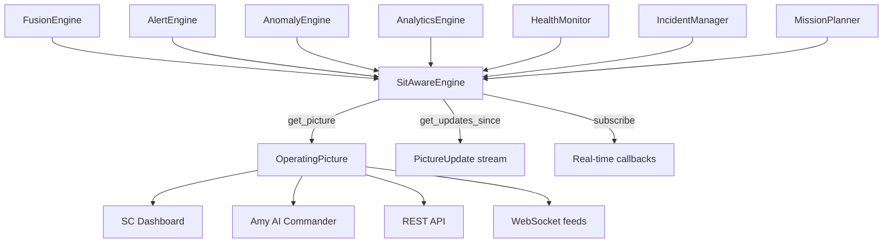

# tritium_lib.sitaware

Capstone situational awareness engine -- fuses tracking, intelligence, alerting, and operations into one unified operating picture.

**Where you are:** `tritium-lib/src/tritium_lib/sitaware/`

## How It Works



`SitAwareEngine` is pure orchestration. It creates nothing new -- it composes existing subsystems into a single `OperatingPicture` containing every target, zone, threat, alert, incident, mission, and health status at a point in time.

## Files

| File | Description |
|------|-------------|
| `__init__.py` | Exports `SitAwareEngine`, `OperatingPicture`, `PictureUpdate`, `UpdateType` |
| `engine.py` | The engine: composes 7 subsystems, produces snapshots and delta updates, thread-safe |

## Key Types

- **`OperatingPicture`** -- full state snapshot: targets, alerts, anomalies, incidents, missions, health, threat level
- **`PictureUpdate`** -- a single delta change (target_new, alert_fired, zone_breach, etc.)
- **`UpdateType`** -- enum of 14 update categories
- **`SitAwareEngine`** -- the orchestrator with `get_picture()`, `get_updates_since(ts)`, `subscribe(callback)`

## Usage

```python
from tritium_lib.sitaware import SitAwareEngine

engine = SitAwareEngine()
engine.fusion.ingest_ble({"mac": "AA:BB:CC:DD:EE:FF", "rssi": -55})
picture = engine.get_picture()
print(f"{picture.target_count} targets, threat={picture.threat_level}")
```

**Parent:** [../README.md](../README.md)
