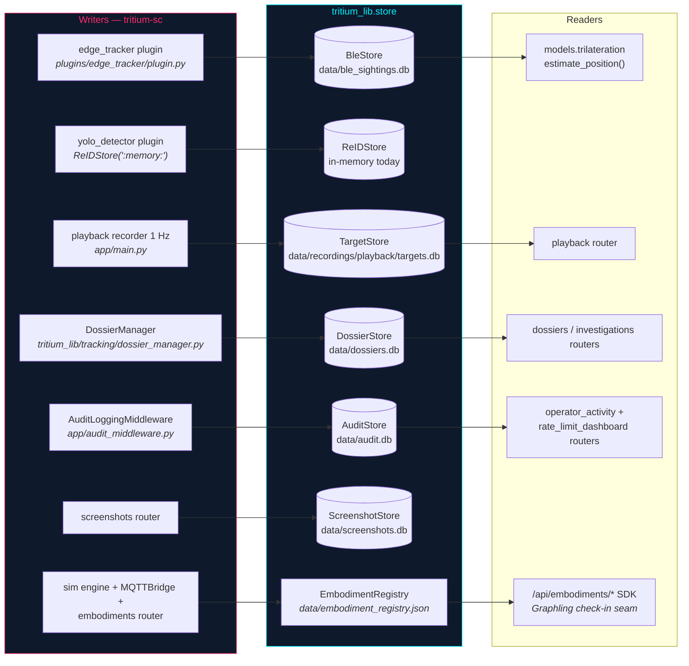

# tritium_lib.store — the persistence layer

**Where you are:** `tritium-lib/src/tritium_lib/store/` — every durable fact
Tritium keeps between restarts lives behind one of these classes.

**Parent:** [`../README.md`](../README.md) (package reference) ·
[`../../../CLAUDE.md`](../../../CLAUDE.md) (tritium-lib)

## The shape of the package

Live tactical state is in-memory (`tritium_lib.tracking.TargetTracker` and
friends); this package is where facts go to *survive*. The doctrine, stated
in `dossiers.py:158-160`: **the tracker is a read model; the stores are the
edits layer** — they join on deterministic target IDs (`ble_{mac}`,
`det_{class}_{n}`, …) so a re-detected entity reattaches to its history.

Twelve files, three kinds of thing:

- **Eight SQLite stores**, all subclassing `BaseStore` (WAL journal,
  `threading.Lock`, bounded `-wal` file, `checkpoint()`/`close()`).
- **One in-memory registry** — `embodiment_registry.py`, deliberately *not*
  SQLite. It is the shared truth for embodiment slots (which bodies exist,
  who is on shift) with opt-in JSON-file persistence.
- **One stateless utility** — `retention.py:sweep_dir`, the shared age+size
  sweep used by directory-shaped stores *outside* this package
  (`recording/`, `geo/gis/cache.py`).

Any Tritium service — command center, edge server, standalone tool — can
instantiate a store with nothing but a path; `":memory:"` gives an ephemeral
store for tests (the SC yolo_detector plugin runs a whole ReID pipeline on
one).

## Who writes and reads each durable fact (runtime-true, 2026-07-11)

Every edge above is a verified call site: `BleStore` at
`plugins/edge_tracker/plugin.py:131`, `ReIDStore(":memory:")` at
`plugins/yolo_detector/plugin.py:131`, `TargetStore` at sc
`app/main.py:682` (1 Hz snapshot of `tracker.get_all()` →
`record_sighting`), `DossierStore` + `DossierManager` at `app/main.py:1824-1846`,
`AuditStore` at `app/audit_middleware.py:40-42`, `ScreenshotStore` at
`app/routers/screenshots.py:42-43`, `EmbodimentRegistry` persistence at
`app/main.py:1491-1494` with the engine/bridge/router importing the same
singleton.

**Not wired today (honest gaps, verified 2026-07-11):**

- `EventStore` — sc's `engine/tactical/event_store.py` wrapper
  (`TacticalEventStore`) is never constructed at startup; three routers
  read `app.state.tactical_event_store` but nothing sets it, so
  `data/events.db` is not created by a running server. Lib's `reporting/`
  and `scheduler/builtin.py` query an `EventStore` when handed one.
- `ConfigStore` — no runtime constructor anywhere;
  `models/config.py:216-281` has `SystemConfigModel` round-trip helpers,
  also uncalled. Tested, working, waiting for a consumer.

## The stores

| File | Class | Durable fact | Retention |
|------|-------|--------------|-----------|
| `base.py` | `BaseStore` | (foundation — no tables of its own) | `checkpoint()` bounds the WAL |
| `ble.py` | `BleStore` | BLE + WiFi sightings, tracked MACs/BSSIDs, sensor-node positions (5 tables) | `prune_old_sightings(days=7)`, `prune_old_wifi_sightings(days=7)` |
| `targets.py` | `TargetStore` | Target upserts + position history, FTS5 search, co-location analytics | `prune_history(older_than)`; target rows never auto-pruned |
| `dossiers.py` | `DossierStore` | Entity intelligence: dossiers + signals + enrichments, FTS5 | Policy engine — see below |
| `reid.py` | `ReIDStore` | Appearance embeddings (float32 BLOBs) + cross-camera match records | `prune_old_embeddings(days=30)` |
| `event_store.py` | `EventStore` | Tactical events, geo-tagged, for replay/AAR | Count cap 500,000 via `cleanup()` |
| `audit_log.py` | `AuditStore` | Who did what, when (security compliance) | Count cap 100,000 via `cleanup()` |
| `config_store.py` | `ConfigStore` | Namespaced key-value settings (`set`/`get`, `set_json`/`get_json`) | None — bounded by nature |
| `screenshot_store.py` | `ScreenshotStore` | Tactical-map PNG captures (BLOB in-db) | None — explicit `delete()` only |
| `embodiment_registry.py` | `EmbodimentRegistry` | Embodiment slots + Graphling leaderboard | `reconcile_to_live()` prunes stale stand-in slots per tick |
| `retention.py` | `sweep_dir()` | (utility, not a store) | IS the retention: age pass + oldest-first size pass |

`__init__.py` re-exports all store classes plus the embodiment module-level
API (`register_embodiment`, `pop_pending_action`, `record_graphling_kill`, …,
with `REGISTRY` aliased to `EMBODIMENT_REGISTRY`). Not re-exported — import
directly: `store.retention.sweep_dir`, `store.reid.cosine_similarity`.

## BaseStore contract

Subclasses declare `_SCHEMAS` (executed on init) and optionally
`_FOREIGN_KEYS = True` (`dossiers`, `targets`). The base opens SQLite with
WAL journal mode, `sqlite3.Row` rows, a `threading.Lock`, and — hard-won —
`PRAGMA journal_size_limit` at 64 MB: without it SQLite never shrinks the
`-wal` file, and a long-running server once grew a **12 GB** `-wal` beside a
1.3 GB db (`base.py:49-53`, 2026-07-10). Long-running services should call
`checkpoint()` periodically (passive auto-checkpoints can be starved by
readers); `close()` checkpoints best-effort.

Lock discipline: the `_execute`/`_fetchall` helpers **require the caller to
hold `self._lock`** — they don't take it themselves.

## Retention — four styles, on purpose

1. **Age-based prune** (`BleStore` 7 d, `ReIDStore` 30 d, `TargetStore`
   history): caller-invoked, delete-older-than.
2. **Row-count cap** (`AuditStore` 100 k, `EventStore` 500 k): `cleanup()`
   deletes oldest above the cap.
3. **The dossier policy engine** (`dossiers.py:696-872`): `dossier_signals`
   is the high-volume table (5.3 GB observed, ~50 GB/90-day trajectory —
   the QUESTIONS.md 2026-04-29 incident). Signal rows carry a 30-day TTL
   (constructor > `TRITIUM_DOSSIER_SIGNAL_TTL_DAYS` env > default);
   dossiers that are `pinned` or tagged `'vip'` are TTL-exempt, but the
   10,000-signals-per-dossier hard cap applies to everyone. Deletes run in
   bounded batches so the writer lock never stalls. `maybe_prune()`
   self-limits to ~once/hour so write paths can call it unconditionally.
4. **File sweeps** (`retention.py:sweep_dir`): for directory stores
   (recordings, GIS tile cache). Suffix-allowlisted, symlink-safe (a
   candidate must resolve *inside* the swept dir), never raises.

None of these run on a timer inside lib — **the consumer owns the
schedule**. SC's actual wiring: `DossierManager` runs an hourly
`store.prune()` job (`tracking/dossier_manager.py:1500-1545`); an hourly
`sim-recordings-retention` daemon thread (sc `app/main.py:2317-2336`) plus
GC-on-write before each new AAR recording (sc
`engine/simulation/aar.py:228-233`) both call
`recording.sweep_recordings` → `sweep_dir`; the gis_layers plugin sweeps
its tile cache on start (sc `plugins/gis_layers/plugin.py:147-151`).

## The embodiment registry — the Graphling check-in seam

An *embodiment* is one controllable body: a simulated unit, a real MQTT
robot, a sensor node, a PTZ camera. Every slot starts driven by an in-repo
**stand-in** AI; a Graphling may check in to take the shift through the
public `/api/embodiments/*` SDK (see `tritium-sc/docs/EMBODIMENTS.md`),
then check out and go home with its memories.

The registry lives *here* — the lowest shared layer — so the SC HTTP router
and the sim engine/MQTT bridge import the **same singleton** instead of the
engine reaching up into a web router (the layering inversion this module
fixed; `embodiment_registry.py:12-18`). Across a restart, the JSON
persistence restores the slot inventory (as stand-in) and the per-Graphling
leaderboard, but **never** occupancy, perception, or pending actions — a
Graphling re-checks-in itself; the system asks, the Graphling decides.

## Ontology lens

In Palantir-Ontology terms this package is the object layer: **objects**
(dossiers, targets, embodiment slots, screenshots), **links** (signals and
enrichments to their dossier, history rows to their target, ReID matches
between embeddings, co-location edges from `get_co_located`), and **typed
actions** with real verbs (`record_sighting`, `add_signal`,
`merge_dossiers`, `update_classification` — monotonic-confidence fusion,
`register_embodiment`, `record_graphling_kill`). Decisions-as-data is
literal: `AuditStore` records the operator's actions, `EventStore` records
the world's.

## Name collisions and gotchas (verified 2026-07-11)

- **Two `DossierStore` classes exist.** This package's
  `store.dossiers.DossierStore` is the SQLite edits layer;
  `tracking/dossier.py` defines an unrelated *in-memory* `DossierStore`
  (identity/UUID resolution) used by `fusion/engine.py` and
  `tracking/person_reid.py`. `DossierManager` accepts either and degrades
  gracefully when `prune` is absent (`dossier_manager.py:1524`).
- **Two `ReIDStore` classes exist.** This package's SQLite one (used
  in-memory by sc's yolo_detector plugin) vs sc's own lightweight
  `engine/intelligence/reid_store.py` used by the `/api/reid` router.
- `audit/trail.py` (`AuditTrail`) is a *parallel* audit log with its own
  `audit_trail` table and its own `AuditEntry`/`AuditSeverity` — it does
  not share this package's `AuditStore` or its `audit_log` table.
- **Timestamp split:** `ble.py` and `reid.py` store ISO-8601 TEXT
  timestamps (compared lexicographically — works because ISO sorts);
  every other store uses REAL unix epochs.
- `BleStore` read methods don't take the lock; only writes do.
- `TargetStore.record_sighting` upsert is race-hardened (`INSERT OR
  IGNORE` + `changes()` fallback, `targets.py:172-190`) and *merges*
  metadata dicts rather than replacing.
- The new `TrackedTarget.health`/`max_health` (2026-07-11 hit-feedback
  contract) lives in the tracker and the `/api/targets` payload only — no
  store persists it; `targets` has no health columns (`targets.py:27-44`).
- `graph/store.py` (`TritiumGraph`, KuzuDB) is **SHELFWARE — do not build
  against** (its own header, `graph/store.py:4-6`); it is not part of this
  package and not wired to any live API.

## Tests

`tests/store/` (7 files) plus loose `tests/test_*store*.py`,
`test_audit_log.py`, `test_ble_store.py`, `test_event_store.py`,
`test_reid.py` — **417 tests, all passing in ~3 s** (verified 2026-07-11).

## Related

- Live state: [`../tracking/`](../tracking/) — `TargetTracker` (read model),
  `DossierManager` (EventBus → DossierStore bridge, extracted from SC
  2026-07)
- Contracts: [`../models/`](../models/) — Pydantic models the stores
  serialize to/from
- File-store consumers of `sweep_dir`: [`../recording/`](../recording/),
  [`../geo/`](../geo/)
