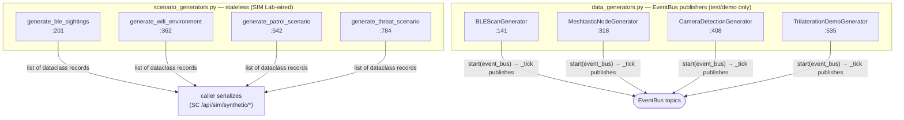

# tritium_lib.synthetic

**Synthetic data generators** — fabricate realistic sensor data so the full
pipeline can be exercised with zero hardware. Two distinct flavors in one
package: *stateless functions* that return lists of records on demand, and
*background threads* that publish a live stream to an `EventBus`.

**Where you are:** `tritium-lib/src/tritium_lib/synthetic/`
**Parent:** [`../`](../) — the tritium-lib package map

## What it's for

Demo mode and tests need believable data shapes without cameras or radios.
`synthetic` provides two answers to that, and the split is the thing to
understand:

- **`scenario_generators.py` — stateless, functional.** Call
  `generate_ble_sightings(...)` and get back a plain list of dataclasses.
  No threads, no bus, no side effects — any consumer (SC router, addon,
  demo, test) can call it directly and serialize the result. This is the
  half wired into SIM Lab.
- **`data_generators.py` — background EventBus publishers.** Long-lived
  `_BaseGenerator` threads that tick on an interval and *push* fake events
  onto an `EventBus` (`fleet.ble_presence`, `meshtastic:nodes_updated`,
  `detection:camera`), simulating live sensors feeding the fusion pipeline.

Both depend only on `tritium_lib.geo` (`approx_distance_m`) for movement
math.

## How it works

## Files

| File | What's in it |
|------|--------------|
| `scenario_generators.py` | Four stateless generators + their record dataclasses: `generate_ble_sightings` (`:201`, `BLESightingRecord`), `generate_wifi_environment` (`:362`, `WiFiAPRecord`/`WiFiEnvironment`), `generate_patrol_scenario` (`:542`, `PatrolWaypoint`/`PatrolEvent`/`PatrolUnit`/`PatrolScenario`), `generate_threat_scenario` (`:784`, `ThreatActor`/`ThreatDetection`/`GeofenceDefinition`/`ThreatScenario`). RSSI/movement helpers (`_compute_rssi`, `_move_position`). |
| `data_generators.py` | Four `_BaseGenerator` (`:100`) subclasses — `start(event_bus)`/`stop()`/`_tick()` threaded publishers: `BLEScanGenerator` (`:141`, → `fleet.ble_presence`), `MeshtasticNodeGenerator` (`:318`, → `meshtastic:nodes_updated`), `CameraDetectionGenerator` (`:408`, → `detection:camera`), `TrilaterationDemoGenerator` (`:535`). |
| `__init__.py` | Re-exports both halves; `__all__` groups them (background generators / scenario records / stateless generators). |

## Core objects & typed actions (Palantir lens)

- **Objects (records):** `BLESightingRecord`, `WiFiAPRecord` /
  `WiFiEnvironment`, `PatrolUnit`/`PatrolScenario`,
  `ThreatActor`/`ThreatScenario` — the fabricated ground-truth.
- **Objects (actors):** the four `_BaseGenerator` threads — each a running
  fake sensor.
- **Typed actions:** `generate_*()` (produce a batch) vs
  `start(event_bus)` / `stop()` (drive a live stream).

## How it's consumed (verified 2026-07-11)

**Only the stateless half is wired to the operator; the EventBus half is
test/demo-only.** This is the honest headline for this package.

- `tritium-sc/src/app/routers/sim_synthetic.py` mounts
  **`/api/sim/synthetic/*` (4 routes: `/ble`, `/wifi`, `/patrol`,
  `/threat`)** at `main.py:2831`. Its imports (`sim_synthetic.py:31`) are
  **exactly the four `generate_*` functions** — the stateless half. It
  serializes the returned dataclasses (`_to_jsonable`) to the SIM Lab UI.
- The four **EventBus generators** (`BLEScanGenerator` &c.) have **no live
  consumer** — a dated grep for `from tritium_lib.synthetic` across
  non-test sc/edge/addons finds only `sim_synthetic.py`, which does not
  import them. They are exercised only by tests/demos. (Contrast the older
  `city_sim`/demo mode, which drives its own generators.) Documented as
  ready-but-unwired, not overclaimed.
- Frontend: `panels/sim-lab.js` calls all four `/api/sim/synthetic/*`
  routes.
- **No other `tritium_lib` package imports `synthetic`.** 2 test files.

## Related

- [../scenarios/](../scenarios/) — full-topology scenarios (vs ad-hoc data shapes here)
- [../events/](../events/) — the `EventBus` the threaded generators publish onto
- [../geo/](../geo/) — `approx_distance_m`, the one dependency
- `tritium-sc/src/app/routers/sim_synthetic.py` — the SIM Lab wiring (stateless half only)
