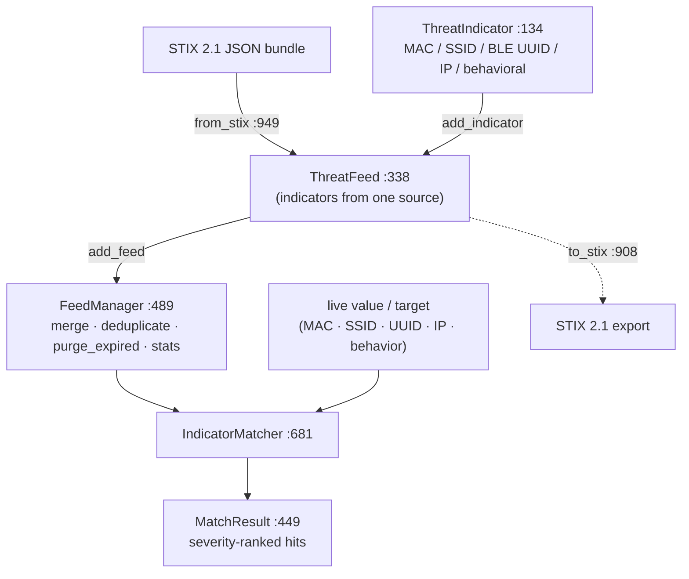

# tritium_lib.threat_intel

A **STIX 2.1 threat-intelligence engine** — parse, manage, and match
indicators of compromise against live targets. Keep watchlists of bad MACs,
suspicious SSID patterns, BLE service UUIDs, bad IPs/OUIs, and behavioral
patterns; import/export them as STIX 2.1 JSON bundles; and match a live
sighting against every loaded feed in one call.

**Where you are:** `tritium-lib/src/tritium_lib/threat_intel/`
**Parent:** [`../`](../) — the tritium-lib package map

## What it's for

The fusion pipeline produces a stream of identities (MACs, SSIDs, UUIDs,
IPs, movement patterns). `threat_intel` is the standing library of "things
we already know are bad" and the matcher that flags a live target the
moment it lines up with one. It speaks **STIX 2.1** so watchlists can be
exchanged with external intel sources — but implements only the minimal
subset needed (`to_stix`/`from_stix`), with **no external STIX dependency**.

`FeedManager` holds many `ThreatFeed`s (one per source), can merge and
deduplicate them, and purges expired indicators. `IndicatorMatcher` runs a
value (or a whole target) against every feed and returns a `MatchResult`
with severity-ranked hits.

## How it works

## Files

| File | What's in it |
|------|--------------|
| `__init__.py` | The whole package. `IndicatorType` (`:100`, `MAC_WATCHLIST`/`SSID_PATTERN`/`BLE_UUID`/`BEHAVIORAL`/`IP_WATCHLIST`/`OUI_WATCHLIST`) + `Severity` (`:110`) enums; `ThreatIndicator` (`:134`, with `matches_mac`/`matches_ssid`/`matches_ble_uuid`/`matches_ip`, `is_expired`, `to_stix_object`/`from_stix_object`); `ThreatFeed` (`:338`); `MatchResult` (`:449`); `FeedManager` (`:489`); `IndicatorMatcher` (`:681`); and the module-level `to_stix`/`from_stix` bundle codecs (`:908`/`:949`). |

## Core objects & typed actions (Palantir lens)

- **Objects:** `ThreatIndicator` (one IOC), `ThreatFeed` (a named
  collection from one source), `MatchResult` (the outcome of a match, with
  hits), `FeedManager` (the library of feeds), `IndicatorMatcher` (the
  query engine).
- **Links:** feed → indicators; `MatchResult` → the indicators + feed names
  that hit (`add_hit`, `:463`); indicator ↔ STIX object (round-trip codecs).
- **Typed actions:**
  - Curate: `FeedManager.add_feed`/`remove_feed`, `merge_feed` (`:628`),
    `deduplicate` (`:584`), `purge_expired` (`:620`).
  - Match: `IndicatorMatcher.match_mac`/`match_ssid`/`match_ble_uuid`/
    `match_ip`/`match_behavior`/`match_target` (`:691-795`) → `MatchResult`.
  - Exchange: `to_stix(feed)` / `from_stix(json)` and the per-indicator
    `to_stix_object`/`from_stix_object`.
  - Score: `severity_from_score(score)` (`:118`) maps a float to `Severity`.

## How it's consumed (verified 2026-07-11)

**Wired to the operator via SIM Lab.**

- `tritium-sc/src/app/routers/sim_threat_intel.py` mounts
  **`/api/sim/threat_intel/*` (7 routes: `/feeds`, `/stats`, `/feeds/seed`,
  `/match/{mac,ssid,uuid,ip}`)** at `main.py:2837`. It holds a
  **module-level singleton** `_mgr = FeedManager()` + `_matcher =
  IndicatorMatcher(_mgr)` (`sim_threat_intel.py:88`), **empty until**
  `POST /feeds/seed` loads a small demo feed (a known-bad MAC, SSID
  pattern, BLE UUID, IP).
- Frontend: `panels/sim-lab.js` calls `/feeds/seed`, `/match/mac`,
  `/match/ssid`, `/stats`.
- **Relationship to the `threat_feeds` SC plugin:** they are *separate*.
  The plugin keeps its own manager; this router (per its own docstring,
  `sim_threat_intel.py:9`) exists to expose the lib's STIX-aware matching
  directly for ad-hoc operator checks — a parallel surface, not the
  plugin's backend.
- **No other `tritium_lib` package imports `threat_intel`** (the only
  in-package hit is the docstring usage example) — a fully standalone leaf.
  1 test file.

## Related

- [../tracking/](../tracking/) — supplies the live MAC/SSID/UUID/IP values to match
- [../classifier/](../classifier/) — the sibling "what *kind* of device" classifier (not "is it bad")
- `tritium-sc/plugins/threat_feeds/` — the separate plugin with its own feed manager
- `tritium-sc/src/app/routers/sim_threat_intel.py` — the SIM Lab wiring
